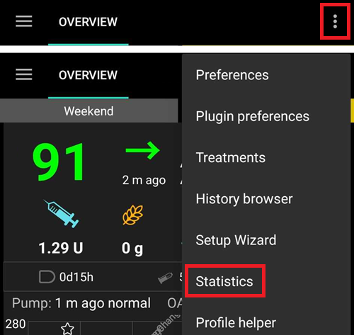
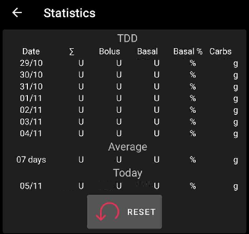
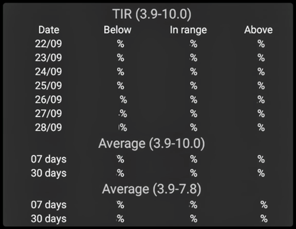
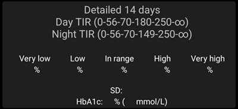
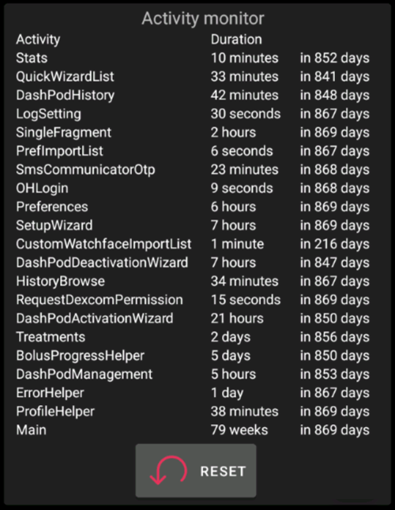

# Reviewing your data

## AAPS History Browser

**AAPS** stores all the user’s history (__**BG**__, treatments, basal, targets, **Profile Switch**,…) in its own database, that cannot be exported or copied and might require clean up after a while. In order to clean up, a review of 'older history’ is required in **AAPS**. This can be done by uploading to Nightscout.

**AAPS** history can be reviewed in the **History browser**: open the **menu** (☰) and select **History browser**.

- Tap the **date card** to pick the day you want to review.
- The graphs open zoomed out to show the **whole selected day**. Pinch to zoom in on part of it.
- Use the **<** and **>** arrows to move one day back or forward, and **Now** to return to the current day.
- The graphs show the same data as the main screen graphs (BG, treatments, basal, IOB, COB, activity, deviations...).

(reviewing-statistics)=
## AAPS Statistics

**AAPS** provides basic monitoring statistics.

Most values are referenced by ADA 2023 [recommendations](https://diabetesjournals.org/care/article/46/Supplement_1/S97/148053/6-Glycemic-Targets-Standards-of-Care-in-Diabetes).

### Total Daily Dose

**TDD** displays one week information on:

- Σ: the Total Daily Dose of insulin (**TDD**), the sum of bolus and basal insulin delivered during the day.
- Bolus: the sum of bolus treatments and SMBs.
- Basal: only basal.
- Basal%: the proportion of basal insulin in the sum (**TDD**).
- Carbs: declared carbs and eCarbs treatments.

TDD section is calculated on the go when you display the page, and takes a few seconds to compute.

### Time in Range

Time In Range (**TIR**): 70-180 mg/dL or 3.9-10 mmol/L.

**TIR** information is available for 7 and 30 days, depending on the amount of data available within the **AAPS** database.

Time In Tight Range (TITR) 70-140 mg/dL or 3.9-7.8 mmol/L statistics are available below.

**Discuss targets with your endo**

Your diabetes may vary. Any suggested targets should be discussed with your endocrinologist or supporting medical team. If used correctly, AAPS’ statistics can be an effective tool to follow __BG__ trends and monitor progress .

Detailed 14 days **TIR** statistics.

**SD**: Standard Deviation, an [indicator](https://www.ncbi.nlm.nih.gov/pmc/articles/PMC3125941/) of BG variability (the highest = the worst).

HbA1c: the estimate of the resulting glycated hemoglobin, based on the average of CGM measurements. This is an indicative value that might not match blood HbA1c tests.

### Activity monitor

Activity monitor captures the time spent on each **AAPS** activity.

------

## What is the difference between Nightscout vs Tidepool?

Nightscout can facilitate the user’s storage of **AAPS’** data and offers a wide range of [reporting tools](https://nightscout.github.io/nightscout/reports/).

Whereas, Tidepool allows the user to [review their data](https://www.tidepool.org/viewing-your-data) and provides [simple sharing with your endo team](https://www.tidepool.org/providers/how-it-works#tidepool-data-platform).