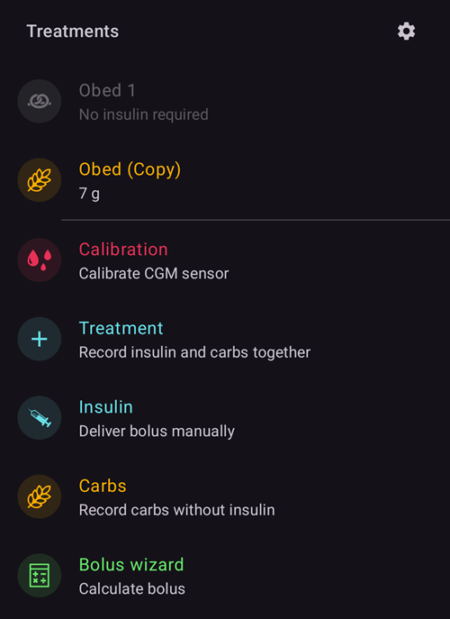
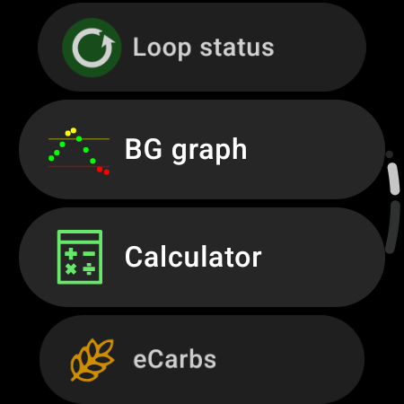
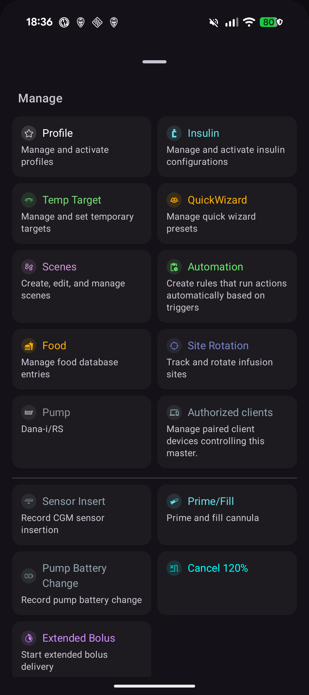

(v4-changes)=
# What changed in AAPS v4

This page collects the notable **changes in behavior** between **AAPS** v3 and v4 — things that work differently, have moved, or have been removed — so existing users know what to expect when they update. See also the [Release Notes](ReleaseNotes.md) and the [update manual](UpdateToNewVersion.md).

```{contents} Table of contents
:depth: 2
:local: true
```

---

## NSClient v1 has been removed

**AAPS** v3 shipped **two** Nightscout synchronization plugins:

- **NSClient** — the legacy client (the old Nightscout REST / socket.io API, also called *“v1”*), and
- **NSClientV3** — the client for the newer Nightscout **API v3**.

In **AAPS** v4 the legacy **NSClient (v1)** plugin has been **removed**. Only **NSClientV3** remains for synchronizing with Nightscout.

```{admonition} What you need to do
:class: important
If you (or your **AAPSClient** follower) were still synchronizing with the old **NSClient (v1)** plugin, switch to **NSClientV3** before/after updating:

- Open **[Configuration](../SettingUpAaps/ConfigBuilder.md) → Communication → NSClientV3**.
- Enter your **Nightscout URL** and an **access token** (NSClientV3 uses an access token, *not* the old API secret — see [creating a token](https://nightscout.github.io/nightscout/security/#create-a-token)).
- Your Nightscout site must support the **API v3** (Nightscout 15 or newer).
- If you use **websockets**, enable or disable them on **both** the master and the follower — never on only one.
```

This affects only how the app talks to Nightscout; your data on Nightscout is unchanged.

---

## The bottom navigation: Treatments, Scenes and Manage

In **AAPS** v3 you moved around the app with a row of **tabs** (Overview, Actions, Treatments, …), and several features were **plugins** you enabled in the Config Builder (**Actions**, **Automation**, **Food**, …).

In **AAPS** v4 the tabs are gone. The main screen is the **Overview**, and a **bottom navigation** gives you three sheets. **Actions, Automation and Food are no longer plugins** — there is nothing to enable in [Configuration](../SettingUpAaps/ConfigBuilder.md) (the renamed Config Builder); their functions now live in these sheets.

(v4changes-treatments)=
### Treatments — enter and deliver

The **Treatments** sheet is where you record or deliver a treatment: **Bolus wizard**, **Insulin** (manual bolus), **Carbs**, **Treatment** (insulin + carbs together), **Calibration**, **CGM** (open your CGM app, when one is configured), and your **[QuickWizards](../DailyLifeWithAaps/QuickWizards.md)**.



On a **Wear OS watch** the same treatments are entered from the watch's **AAPS menu** (Bolus wizard / Calculator, eCarbs, Treatment, …):



### Scenes

Your situation presets — see [Scenes](../DailyLifeWithAaps/Scenes.md).

(v4changes-manage)=
### Manage — manage and activate

The **Manage** sheet is where you manage and activate everything else: **[Profile](../DailyLifeWithAaps/ProfileSwitch-ProfilePercentage.md)**, **Insulin** configurations, **[Temp Target](../DailyLifeWithAaps/TempTargets.md)**, **[QuickWizard](../DailyLifeWithAaps/QuickWizards.md)** presets, **[Scenes](../DailyLifeWithAaps/Scenes.md)**, **Automation**, **Food**, **Site Rotation**, **Pump**, **[Authorized clients](../RemoteFeatures/ClientMasterControl.md)** — plus the pump actions that used to be on the *Actions* tab (**Extended Bolus**, **cancel temp basal**, **Prime/Fill**, **Sensor Insert**, **Pump Battery Change**).



All of your existing automation rules and food entries are kept; only the way you reach these features has changed.

---

<!-- =====================================================================
     This page is a growing list of v4 behavioral changes.
     Add new changes as their own "## " section, newest grouping as agreed.
     Maintainers: relocate page + images and fix cross-links as needed.
     ===================================================================== -->
