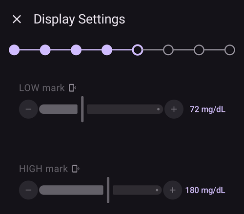
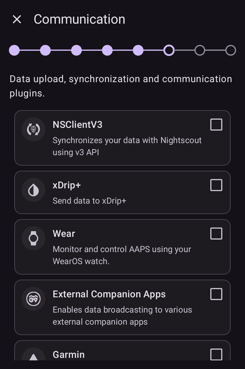
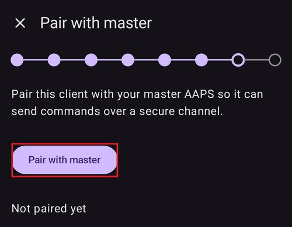
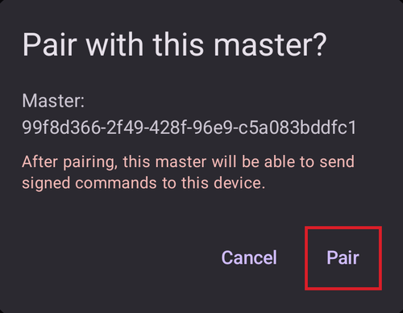
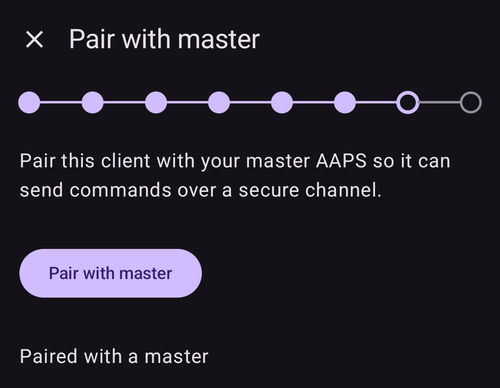
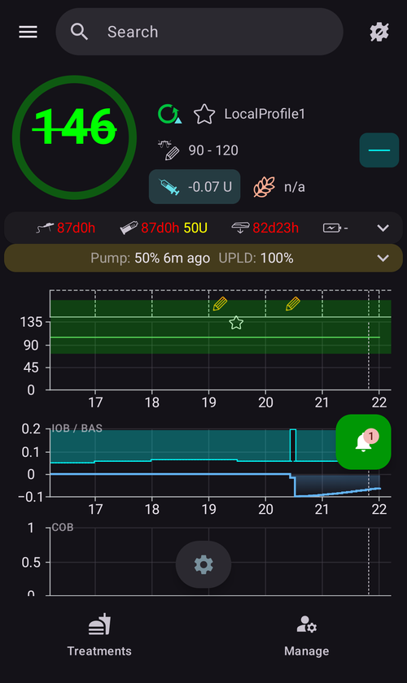
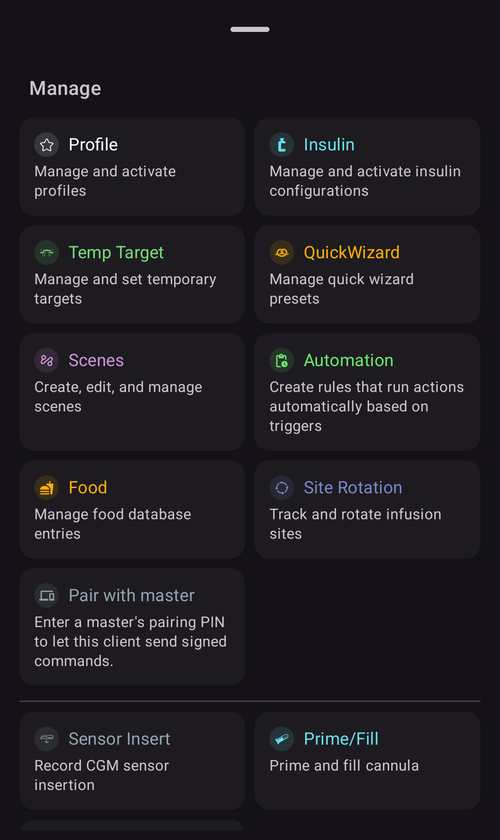

(aapsclient-app)=
# The AAPSClient app

**AAPSClient** is the accessory app of **AAPS**: a companion app for a second phone — typically a caregiver's — that **follows** the person looping with **AAPS** and, from **AAPS** version 4, can also **control** their loop remotely through signed commands. Both phones communicate through your **Nightscout** site; no direct connection between the phones is needed.

```{contents} Table of contents
:depth: 2
:local: true
```

## What AAPSClient is (and is not)

**AAPSClient** looks and feels like **AAPS**, but it has **no loop of its own**:

- It contains **no APS algorithm**, no **Objectives**, and **no pump drivers** — it never doses on its own.
- The plugins used only by the main app (**SMS Communicator**, **Tidepool**, **Open Humans**) are not included either.
- What it *does* contain: **NSClientV3** synchronization, the BG-source plugins, **xDrip+** broadcasting, and the **Wear OS** / **Garmin** connectors — everything needed to follow and to relay commands.

Everything you trigger from **AAPSClient** is checked, capped, confirmed and **executed by the master** (the phone with the pump). How that works — pairing, master-authored confirmations, bolusing from the client, what happens when the master is offline — is described on the dedicated [Master ↔ Client control](ClientMasterControl.md) page.

## Versions: AAPSClient, AAPSClient2 and AAPSClient3

Up to three client apps can be installed side by side on the same follower phone, each following a **different** person: **AAPSClient** (yellow owl icon), **AAPSClient2** (blue owl) and — new in **AAPS** version 4 — **AAPSClient3** (green owl). They are functionally identical; only the name and icon color differ so you can tell them apart. See [About AAPSClient and AAPSClient2](#remotecontrol-aapsclient-versions) for details.

## Getting the app

**AAPSClient** is obtained the same way as **AAPS** — see [Download and installation of AAPSClient](#RemoteControl_aapsclient), and install it like the main app ([Transferring and installing](../SettingUpAaps/TransferringAndInstallingAaps.md)).

## First start: a shorter Setup Wizard

On first start **AAPSClient** runs the same **Setup Wizard** you know from **AAPS**, but with far fewer steps — there is no profile, insulin, pump, APS or objectives configuration on a follower:

1. **Welcome**, **license agreement**, **permissions** and **master password** — identical to the main app, see the [AAPS Setup Wizard](../SettingUpAaps/SetupWizard.md).
2. **Units** and **display settings** — also identical. Note the small **phone icon** next to the low/high marks: on a client these values are [synchronized with the main phone](#client-master-config-prefs) and can only be edited while the master is reachable.

   

3. **Communication** — the plugin list only offers what a follower needs (NSClientV3, xDrip+, Wear, External Companion Apps, Garmin). Enable **NSClientV3** and enter the **same Nightscout URL and access token** as on the main phone, with **websockets** enabled — exactly as described in [Synchronization](#RemoteControl_aapsclient).

   

4. **Pair with master** — this step exists **only** on the client. It connects this device to the master over the secure command channel. You can do it now or at any time later from **Manage → Pair with master**.

   

5. **Name** — a name identifying this instance in reports and synchronization.

## Pairing with the master

Pairing is started from the wizard step above (or later from **Manage → Pair with master**): on the **master**, open **Manage → Authorized clients**, add a client and read the one-time PIN; on the **client**, type the PIN and press "**Pair**". The client then shows who it is about to trust — confirm with "**Pair**":



The wizard step changes to "*Paired with a master*", and on the master the client appears as **Active** in the [Authorized clients](#client_master_master_setup) list:

 The full pairing procedure, security details and troubleshooting are on [Master ↔ Client control](#client_master_client_setup).

## The home screen

The client's home screen mirrors the followed loop:



- **BG, graphs, IOB/COB and profile** come from Nightscout, just as the master uploaded them.
- The **loop status** shown is the **master's** (a client has no loop of its own).
- The **status card** shows the **followed pump's** reservoir and battery and the uploader battery, taken from the Nightscout device status — a client has no pump, so there is no local pump status and no pump management anywhere in the app.
- The bottom bar only offers **Treatments** and **Manage** — there are no pump or objectives tabs.

## Treatments and actions

Everything under **Manage** works like on the main app, with one important difference: on a client, actions that would change therapy (bolus, carbs, temp targets, profile switch, scenes…) are **hidden until the device is paired**, and once paired they are **relayed to the master** for confirmation and execution — see [Using remote control](#client-master-control).



There is **no Pump entry** — a client has no pump. If the master is not reachable, these actions are blocked before anything is sent.

## Settings synchronized with the master

The active plugin **configuration** and many **preferences** are kept in sync between the master and its paired clients; synced items are marked with a small **phone icon** and are disabled (with a "*Master device unreachable*" banner) while the master cannot be reached. This is described in [Changing configuration and preferences](#client-master-config-prefs).

## AAPSClient on a smartwatch

A Wear OS watch can be paired with the **client** phone; its actions are relayed through the client to the master. See [Wear OS](../WearOS/WearOsSmartwatch.md) and the [smartwatch options in Remote control](#RemoteControl_smartwatches).
