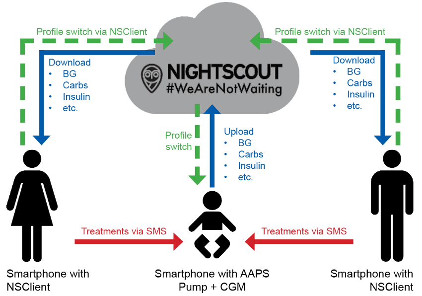

# Remote monitoring

__AAPS__ offers several features for remote monitoring of type 1 diabetic children, and also facilitates remote commands which send instructions to __AAPS__ remotely. Similarly, __AAPSClient__ can also be used for remote monitoring to follow your partner's or friend's __AAPS__.

## Functions

- Kid's pump is controlled by kid's phone using __AAPS__.
- Caregivers can remotely follow viewing all relevant data such as glucose levels, carbs on board, insulin on board etc. using **AAPSClient apk** on their phone which must be an Android phone. Settings amended in __AAPS__ will synchronize with __AAPSClient__ and vice versa.
- Caregivers can be alarmed by using **xDrip app in follower mode** on their Android phone if xdrip companion mode is set up.
- Remote control of __AAPS__ using [SMS Commands](../RemoteFeatures/SMSCommands.md) is secured by two-factor authentication.
- Remote control through __AAPSClient__ uses the signed command channel introduced in **AAPS** 4: the client must first be **paired** with the master, and every command is confirmed and executed by the master — see [Master ↔ Client control](#client-master-control).

## Tools and apps for remote monitoring

- [Nightscout](https://nightscout.github.io/) in web browser (mainly data display).
- [__AAPSClient__](AapsClient.md) is a stripped down version of __AAPS__ capable of following the master __AAPS__ and, once **paired**, sending remote commands: carbs, __Temp Targets__, __Profile Switches__ and even boluses (see [Master ↔ Client control](#client-master-control)). There are 3 apps: [AAPSClient, AAPSClient2 & AAPSClient3 to download](https://github.com/nightscout/AndroidAPS/releases/), so a caregiver can follow up to three different persons from the same phone (e.g. two children with type 1, each with their own Nightscout account and master __AAPS__).
- Dexcom follow if you are using original Dexcom app (BG values only).
- [xDrip](../CompatibleCgms/xDrip.md) in follower mode (mainly BG values and **alarms**).
- [Sugarmate](https://sugarmate.io/) or [Spike](https://spike-app.com/) on iOS (mainly BG values and **alarms**).
- Some users find a full remote access tool like [TeamViewer](https://www.teamviewer.com/) to be helpful for advanced remote troubleshooting.

## Smartwatch options

A smartwatch can be a very useful tool in helping manage __AAPS__ with T1D kids. A couple of different options are possible:

- Option 1 - If __AAPSClient__ is installed on the caregiver's phone, the [AAPSClient WearOS app](https://github.com/nightscout/AndroidAPS/releases/) can be installed on a compatible smartwatch connected to the caregiver's phone. This will show current __BG__, loop status and bolus history, and allow carb entry, __Temp Targets__ and __Profile__ changes. If the client is **paired** with the master, the watch can also start a **bolus**: the command is relayed through the client to the master, which confirms and delivers it (see [Master ↔ Client control](#client-master-control)).
- Option 2 - The [AAPS WearOS app](../WearOS/WearOsSmartwatch.md) can also be built and installed on a compatible smartwatch, connected to the kid's phone but worn by the caregiver. This includes all the functions listed above as well as the ability to bolus insulin directly, without the need to remove the kid's phone from their person.

## Things to consider

- Consider time gap between master and follower due to time for up and download as well as the fact that __AAPS__ master phone will only upload after loop run.
- What is your emergency plan for when remote control does not work (_e.g._ network problems or lost Bluetooth connection)? Always consider what will happen with **AAPS** if you suddenly can’t send a new command. **AAPS** overwrites the pump basal, ISF and ICR with the current profile values. Only use temporary profile switches (_i.e._ with a set time duration) if switching to a stronger insulin profile, in case your remote connection is disrupted. Then the pump will revert to the original profile when the time expires.
