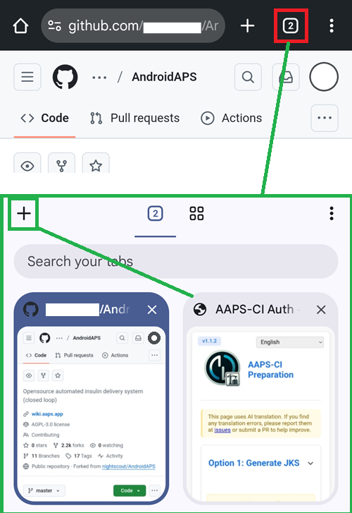

(browser-build)=

# Browser build

Building AAPS with GitHub Actions.

**Minimum AAPS version supported is 3.3.2.1.**

## Build yourself instead of download

**The AAPS app (an apk file) is not available for download, due to regulations around medical devices. It is legal to build the app for your own use, but you must not give a copy to others!**

See [FAQ page](../UsefulLinks/FAQ.md) for details.

(Building-APK-without-a-computer)=

## Choose how to build

Pick the method that matches the device you build from:

### On an Android phone: AAPS Builder (recommended)

A setup page walks you through creating your own private build repository in GitHub. Nothing to install, no preparation file, and new AAPS versions are built automatically every week. You download the app directly from GitHub. Google Drive is optional.

This also works from a computer browser.

**→ [Build with AAPS Builder](BrowserBuildAapsBuilder.md)**

### On a computer or an iPhone / iPad: fork and preparation file

You make a copy (fork) of the AAPS source code in GitHub, create your keystore with a preparation file, and the built app is saved to your Google Drive. Follow the four steps below.

You will need to use multiple tabs in your browser, and switch from one to the other. Example Chrome:



```{note}
You will need to jump from tab to tab: start with all tabs closed to avoid losing yourself when switching from one to another.
```

#### What you'll need

- A **Google account**, so the built app can be saved to your Google Drive.
- A **GitHub account** (free) – you create this in Step 1.
- A **web browser** that can keep several tabs open at once (Chrome is assumed below).
- A small **helper to run the preparation file**. Which one you need depends on the device you build from – there is nothing to install now, Step 2 walks you through it for your device:
  - **Computer (Windows / Mac / Linux):** Simple Web Server.
  - **iPhone / iPad:** no extra app – you use the built-in Files app and browser.

#### The steps

The browser build is a series of choices. Follow these steps in order:

1. **[Create your GitHub fork](BrowserBuildFork.md)** – make your personal copy of the AAPS source code.
2. **[Create your signing keystore](BrowserBuildKeystore.md)** – the key decision: generate a new keystore (Option 1) or upload your existing one (Option 2), then follow the page for your device.
3. **[Authorize Google Drive](BrowserBuildGoogleDrive.md)** – let GitHub save the built app to your Google Drive.
4. **[Build the APK](BrowserBuildAPK.md)** – run the GitHub Actions workflow and pick your version and variant.

If you run into trouble, see **[Browser build troubleshooting](../GettingHelp/BrowserBuildTroubleshooting.md)**. For optional operations, see [exporting your keystore](#ci-keystore-export) or [cherry-picking a commit](#github-cherry-pick).

----

**Start with [Step 1 – Create your GitHub fork](BrowserBuildFork.md) →**

```{toctree}
:hidden:

AAPS Builder <BrowserBuildAapsBuilder.md>
Step 1: Create your fork <BrowserBuildFork.md>
Step 2: Create your keystore <BrowserBuildKeystore.md>
Step 3: Authorize Google Drive <BrowserBuildGoogleDrive.md>
Step 4: Build the APK <BrowserBuildAPK.md>
```
