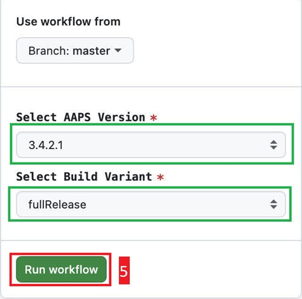

(github-build-apk)=

# Browser build – Step 4: Build the APK

```{note}
This is **Step 4** of the [Browser build](BrowserBuild.md). First complete [Step 3 – Authorize Google Drive](BrowserBuildGoogleDrive.md).
```

## AAPS-CI GitHub Actions to Build the AAPS APK
 - Suitable for general users.

```{tab-set}

:::{tab-item} Wiki
### Run the Workflow to Build the Signed APK

1. In your GitHub copy of AndroidAPS, select Actions.
2. Expand All Workflows.
3. Select AAPS-CI


4. Scroll down and tap Run Workflow.


5. Select the branch you want to deploy (master), the [variant](#browserbuild-variant) (fullRelease) and tap Run Workflow.




6. You will see the message Workflow run was successfully requested. Refresh your browser page and you will be able to monitor the build progress. When the action completes, the AAPS CI action will show a green tick mark. You have successfully built the updated version of Android APS.


### Install the AAPS APK

1. Open your Google Drive
2. Browse into AAPS, select the new version folder and you will find both the phone and Android Wear versions.


:::

:::{tab-item} Video
<div align="center" style="max-width: 360px; margin: auto; margin-bottom: 2em;">
  <div style="position: relative; width: 100%; aspect-ratio: 9/16;">
    <iframe
      src="https://www.dailymotion.com/embed/video/x9rdwms?autoplay=0&queue-enable=false&loop=1&mute=1"
      loading="lazy"
      style="position: absolute; top: 0; left: 0; width: 100%; height: 100%;"
      frameborder="0"
      allowfullscreen>
    </iframe>
  </div>
</div>
:::

```

## Build Version selection

**Only AAPS versions from 3.3.2.1 and above will build with the Browser method.**


(browserbuild-variant)=

## Build Variants selection

*Note: both Android and Android Wear apps will be built automatically.*

  - Select the variant you need:
    - fullRelease: For regular pump usage with full functionality.
    - [aapsclientRelease, aapsclient2Release](#RemoteControl_aapsclient): For caregivers (requires [Nightscout](../SettingUpAaps/Nightscout.md))。
    - pumpcontrolRelease: To replace your pump app/controller


Variants ending with “Debug” indicates that the APK will be built in debug mode, which is useful for developers for troubleshooting.

<!-- If you want to test the items in a pull request has been moved to dev page /AdvancedOptions/DevBranch.md -->

----

Once the build succeeds, the apk is saved to your Google Drive. Continue with [Transferring and Installing AAPS](TransferringAndInstallingAaps.md).

If anything goes wrong, see [Browser build troubleshooting](../GettingHelp/BrowserBuildTroubleshooting.md). To include a specific commit in your build, see [cherry-pick a commit](#github-cherry-pick).
