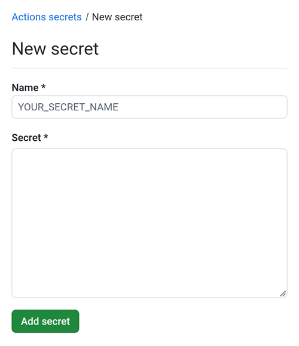
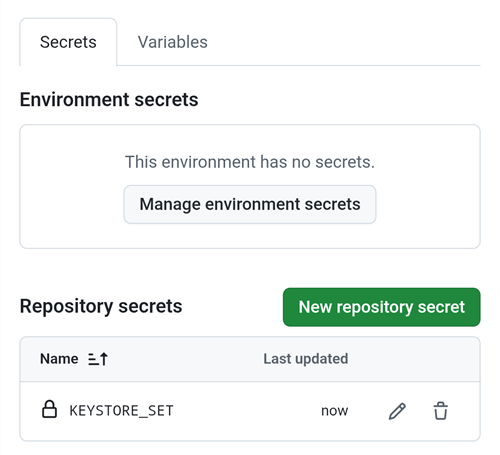
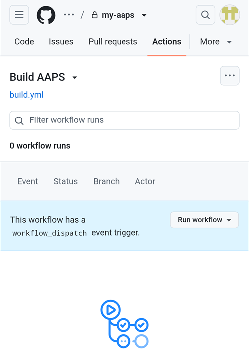
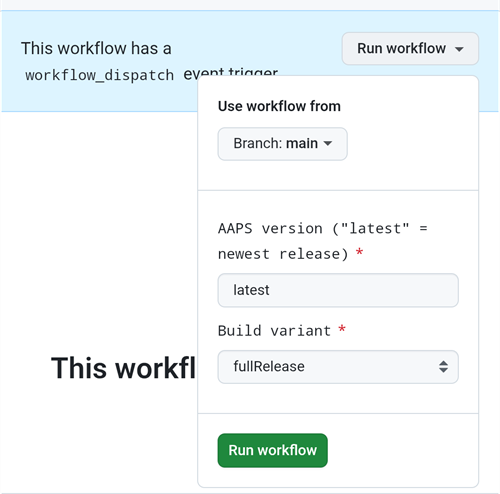
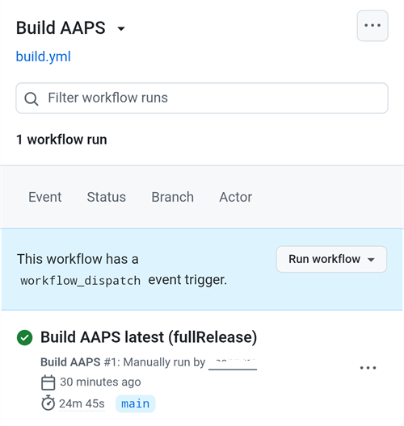
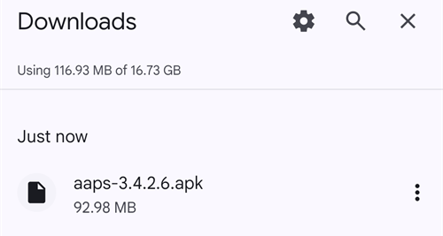

(aaps-builder)=

# Browser build with AAPS Builder

```{note}
This is the recommended way to build AAPS from an **Android phone**. It also works from any computer browser. For the other ways to build from a computer or an iPhone, see the [Browser build](BrowserBuild.md) overview.
```

```{contents} In this page
:backlinks: entry
:depth: 2
```

**AAPS Builder** builds the AAPS app for you in GitHub, the free code-hosting website. There is nothing to install on your phone, and no preparation file to open.

A setup page on this site walks you through it. It takes about 10 minutes the first time:

1. Create an empty **private** repository in your GitHub account.
2. Add the **build workflow**, the file that tells GitHub how to build AAPS.
3. Create or upload your **signing key** (the keystore).
4. Give the key to your repository as a GitHub **secret**.
5. **Build** the app. One build takes 15 to 30 minutes.
6. **Download and install** the app on your phone.

You do **not** need to fork AndroidAPS: the AAPS source code is downloaded from the official AndroidAPS repository at every build. You also do **not** need Google Drive: you download the app directly from GitHub.

```{admonition} Where the code comes from
:class: note

The setup page and the build workflow are part of this documentation: they are maintained and reviewed together with it, and you can <a href="../aaps-builder-build.yml">read the workflow</a> before you use it. When it builds, the workflow downloads only the official AAPS source code and GitHub's own build tools. Your keystore never leaves your browser and your private repository.
```

(aaps-builder-before-you-start)=

## Before you start

You will need:

- A **GitHub account** (free). If you don't have one, create it on [github.com](https://github.com/signup) first.
- A **web browser**: Chrome on your phone, or any browser on a computer. Log in to github.com in that browser before you start.
- Your **existing keystore** (`.jks` file), its password and its alias, if you built AAPS before and want to update it without reinstalling.

```{warning}
**Your build repository must stay private.** Everything a build produces is visible to anyone who can see the repository. The setup page creates a private repository for you. Never change it to public.

A private repository gets 2000 free GitHub Actions minutes per month, which is enough for several builds.
```

```{warning}
**New key or existing key: this decides whether you can update AAPS.**

- **You already have AAPS on your phone, built with a keystore you still have**: choose **I already have a keystore** on the setup page and upload it. Your next build will update AAPS in place.
- **You build AAPS for the first time, or you lost your keystore or its password**: choose **Create a new key**. An app signed with a new key **cannot update** an AAPS signed with another key. You must [export your settings](#ExportImportSettings-Automating-Settings-Export), copy the file off your phone, uninstall the old AAPS, install the new one, then [import your settings](#ExportImportSettings-restoring-from-your-backups-on-a-new-phone-or-fresh-installation-of-aaps).

Always keep using the same key afterwards. When you create a new key, download the backup the page offers and store it with its password somewhere safe, off your phone.
```

## Open the setup page

**→ <a href="../aaps-builder.html">Open the AAPS Builder setup page</a>**

Keep this documentation page open in another tab: the steps below explain each part of the setup page in more detail.

The setup page runs entirely in your browser: your key and passwords are never sent anywhere, except into the GitHub secret you paste them into yourself. It remembers your GitHub username and repository name, so you can come back to it at any time to reopen your secrets page or your builds.

(aaps-builder-step1)=

## Step 1 – Create your private build repository

This step creates an empty private repository in your GitHub account. Only you can see it and the apps it builds.

1. Make sure you are logged in to github.com in this browser.
2. In **Your GitHub username**, type your GitHub username.
3. In **Name of your repository**, keep the suggestion `my-aaps`. If you already created your repository with another name, type that exact name.
4. Check the line **Your repository:** it shows `github.com/<your username>/my-aaps`.
5. Tap **Create my private repository**. GitHub opens in a new tab with the name you chose and **Private** selected. Don't change anything, and don't add a README or other files.
6. Tap the green **Create repository** button.

Go back to the setup page tab.

(aaps-builder-step2)=

## Step 2 – Add the build workflow

The build workflow is a text file that tells GitHub how to build AAPS. You copy it from the setup page into your repository, once.

1. Tap **Copy workflow**. The page confirms **Workflow copied** and shows its version number.
2. Tap **Open the new file page**. GitHub opens a new, empty file in your repository, already named `.github/workflows/build.yml`.
3. Check the file name at the top: it must be exactly `.github/workflows/build.yml`.
4. Paste the workflow into the big text area (long press on a phone).
5. Tap **Commit changes…**, then **Commit changes** again in the window that opens.

```{warning}
Only use the workflow from this setup page. Don't copy a build workflow from another website or repository: the workflow runs next to your signing key.
```

(aaps-builder-step3)=

## Step 3 – Your signing key

The app must be signed with your own key. Choose one of the two tabs. Read the [new key or existing key warning](#aaps-builder-before-you-start) first.

### I already have a keystore

1. Tap **I already have a keystore**.
2. In **Keystore file**, choose your `.jks` file (or `.keystore`, `.p12`, `.pfx`). On a phone, copy the file to your phone or to Google Drive first.
3. In **Keystore password**, type the keystore password.
4. In **Key alias**, pick your alias from the list. For keystores made with Android Studio it is usually `key0`.
5. If your key password is different from the keystore password, untick **Key password is the same as the keystore password** and type the key password.
6. Tap **Check and continue**.

The page checks the password and the alias on your device. **Keystore OK! Continue with step 4.** means everything is right. If it says the password will be checked when you build, continue anyway: the build tells you if something is wrong.

### Create a new key

1. Tap **Create a new key**.
2. Choose a password and type it twice. Rules: at least 8 characters, only the letters a–z and A–Z, the digits 0–9 and symbols such as `! ? #`. No spaces, no accented letters, and not the `|` character.
3. Tap **Create key**. It takes a few seconds. **Key created** appears.
4. Tap **Download backup (aaps-keystore.jks)** and store the file, together with its password, somewhere safe off your phone (for example your own cloud storage). You need it if you ever build AAPS another way. The alias of this key is `aaps`.

(aaps-builder-step4)=

## Step 4 – Give the key to your repository

Step 4 unlocks when step 3 is done. Your key, its passwords and its alias are packed into one value, the `KEYSTORE_SET` secret.

1. Tap **Open the secrets page**. GitHub opens the **New secret** page of your repository. On a phone, it is below the settings menu: scroll down.

   

2. In the **Name** field, type `KEYSTORE_SET`. You can use the **Copy** button next to it on the setup page.
3. On the setup page, tap **Copy secret**. In the **Secret** field on GitHub, paste it (long press on a phone).
4. Tap **Add secret**. `KEYSTORE_SET` now shows under **Repository secrets**.

   

You only need to do this once.

```{tip}
GitHub shows **Page not found** (404)? The username or repository name in step 1 doesn't match your repository. Check the name on github.com, correct it in step 1, and tap the button again.
```

(aaps-builder-step5)=

## Step 5 – Build the app

1. On the setup page, tap **Open the build page**. GitHub opens the **Build AAPS** page of your repository.

   

2. If GitHub asks, tap the green button to enable workflows.
3. Tap **Run workflow**. A small form opens:
   - **Version**: keep `latest` to build the newest AAPS release, or type a release number such as `3.3.2.1`.
   - **Variant**: keep `fullRelease` for normal use with a pump. The other variants are explained in [build variants](#browserbuild-variant).

   

4. Tap the green **Run workflow** button. The build starts and shows **In progress**.
5. Wait 15 to 30 minutes. A green check means the build is done. A red cross means it failed: open the build to read the message, then see [troubleshooting](#aaps-builder-troubleshooting).

   

If there is no **Build AAPS** or **Run workflow** button:

- Open your repository and check that the file `.github/workflows/build.yml` is there. If it is missing or has another name, do [step 2](#aaps-builder-step2) again.
- Open the **Actions** tab. If it says workflows are disabled, tap the green button to enable them, then tap **Build AAPS** in the list.

(aaps-builder-step6)=

## Step 6 – Install the app on your phone

```{warning}
**Before every update**, [export your settings](#ExportImportSettings-Automating-Settings-Export) in AAPS and copy the file **off the phone** (Google Drive, Dropbox…). Keep several older exports and the APK files there too, so you can always go back.
```

1. On your phone, open the setup page in **Chrome**, not in the GitHub app: the GitHub app cannot download builds. Log in to github.com if asked.
2. Tap **Open my builds**, then the newest build with a green check.
3. Tap the **Download AAPS** link in the build summary. You can also scroll down to **Artifacts** and tap `aaps-….apk`.

   ```{tip}
   On a phone, GitHub may show only the status, duration and number of artifacts, without the summary or the download link. Open Chrome's menu **⋮** and tick **Desktop site**: the full build page appears.
   ```

4. When the download is done, open Chrome's menu **⋮** → **Downloads**, tap `aaps-….apk` and choose **Install**. If asked, allow installing apps from this source.

   

`aaps-wear-….apk` is the smartwatch app. Skip it if you don't use one.

The app is kept on the build page for **14 days**. It is not shown under **Code** in your repository. Copy it somewhere safe, off your phone, together with your settings exports.

For more ways to install the app, see [Transferring and Installing AAPS](TransferringAndInstallingAaps.md).

```{note}
From September 2026, Google's [Android developer verification](#android-developer-verification) may block installing the APK by tapping the file, depending on your country. Free workarounds are explained on that page.
```

(aaps-builder-google-drive)=

## Step 7 (optional) – Also save the app in Google Drive

You can also have each build saved to your Google Drive, in the folder `AAPS/<version>`. This is optional: the app is always available on the build page.

It needs one more secret, `GDRIVE_OAUTH2`. You get its value with the preparation file used by the other browser build methods:

1. On a **computer**, download the preparation file and open it as described in [Option 1 – Computer](BrowserBuildO1Computer.md). Skip the keystore part: you already have your key.
2. Follow [Step 3 – Authorize Google Drive](#aaps-ci-google-drive-auth) to get the `GDRIVE_OAUTH2` value.
3. On the setup page, step 7 opens your secrets page. Create a secret named `GDRIVE_OAUTH2` (the **Copy** button copies the name), paste the value, and tap **Add secret**.

From the next build, the APKs are also saved in Google Drive.

Google stops the access if you don't build for 6 months, or if you change your Google password. The build then tells you so: redo these steps. See [Google refresh token expired](#aaps-ci-google-token-expired).

(aaps-builder-updates)=

## Updating AAPS

Before every update, [back up your settings](#aaps-builder-step6) as explained in step 6.

You don't need to do anything to get new AAPS versions. Once a week (Monday night), your repository checks for a new AAPS release and builds it automatically. A version that was already built is never built again. Download and install it as in [step 6](#aaps-builder-step6). You can also build by hand at any time, as in [step 5](#aaps-builder-step5).

To turn off automatic builds: in your repository, open **Settings** → **Secrets and variables** → **Actions** → **Variables**, and add a repository variable `AUTO_BUILD` with the value `false`.

Automatic builds use `fullRelease`. To build another variant automatically, add a repository variable `AUTO_VARIANT` with its name, for example `aapsclientRelease`.

**Updates of the build workflow:** your repository never downloads a new workflow by itself. When the workflow changes, the [Docs updates & changes](../Maintenance/DocumentationUpdate.md) page says so. To update, open `.github/workflows/build.yml` in your repository, tap the pencil (**Edit**), replace the whole text with a fresh copy from the setup page (**Copy workflow** in step 2), and tap **Commit changes**. The first line of the file shows its version.

(aaps-builder-troubleshooting)=

## Troubleshooting

- **The build stops with "This repository is PUBLIC"**: in your repository, open **Settings** → **General** → **Danger Zone** → **Change visibility** → **Private**, then build again.
- **"Secret KEYSTORE_SET is missing"** or **"KEYSTORE_SET is not valid"**: redo steps 3 and 4 of the setup page, and copy the secret again.
- **"Keystore, password or alias is wrong"**: check your keystore's password and alias, then redo steps 3 and 4 of the setup page.
- **"Version … does not exist"**: the version you typed is not an AAPS release. Use `latest`, or check the release number.
- **"Page not found" (404) when the setup page opens GitHub**: the repository name in step 1 of the setup page does not match your repository. Type the exact name.
- **"Could not read the workflow file"** on the setup page: reload the page and tap **Copy workflow** again. The setup page must be opened from this documentation site.
- **"Google Drive access has expired or was revoked"**: redo [step 7](#aaps-builder-google-drive) and update the `GDRIVE_OAUTH2` secret.

For other GitHub and Google Drive issues, see [Browser build troubleshooting](../GettingHelp/BrowserBuildTroubleshooting.md).
