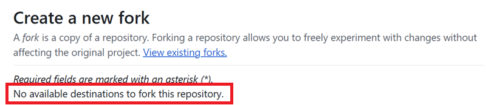
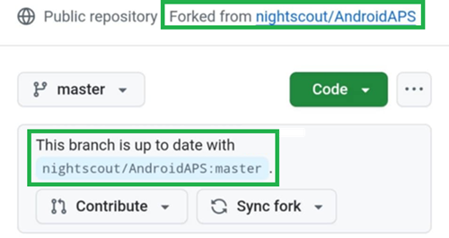

(github-fork)=

# Browser build – Step 1: Create your GitHub fork

```{note}
This is **Step 1** of the [Browser build](BrowserBuild.md).
```

You will need to secretly store your personal Android Java Key and Google Drive information in GitHub (later in the process, we will explain how).

Since this cannot be done inside the public repository of AndroidAPS, you need to make your personal copy of the source code (called a fork).

## GitHub account

You need to [create a GitHub account](https://github.com/signup) if you don't have one yet.  
You can sign up with your email, or you can sign up with Google. Follow the registration and verification process.

When you have an account, [sign in to GitHub](https://github.com/login).

## Fork AndroidAPS

Open the official AndroidAPS repository following [this link](https://github.com/nightscout/AndroidAPS).

Tap on the fork icon. This will create a copy inside your own account.


Scroll down the next screen and tap **Create Fork**.


*Note: you can **unselect** "Copy the main branch only" if you will want to build developers versions or customizations.*


```{note}
You cannot fork and you see this?</br></br>
**`No available destinations to fork this repository.`**</br></br>
</br></br>
This means you already have an existing fork of AndroidAPS.</br>
Make sure it's up to date and continue to Preparation Steps.
```

```{warning}
**Never delete your fork without having done a backup of your secrets!**
```

GitHub now displays your personal copy of AndroidAPS. Leave this web browser tab open.



----

**Next: [Step 2 – Create your signing keystore](BrowserBuildKeystore.md) →**
