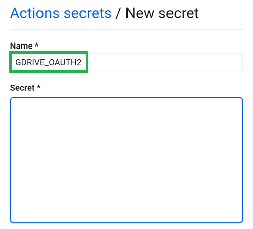

(aaps-ci-google-drive-auth)=

# Browser build – Step 3: Authorize Google Drive

```{note}
This is **Step 3** of the [Browser build](BrowserBuild.md). First complete [Step 2 – Create your signing keystore](BrowserBuildKeystore.md).
```

```{warning}
No matter which of the prior sets of instructions you followed (Option 1 or Option 2), you MUST add the Google Drive authorization to successfully use the Browser Build.
```

Note: If you already followed this part in the video, you can now skip to [Step 4 – Build the APK](BrowserBuildAPK.md).

```{warning}
The preparation page relies on a local server started by File Manager Plus, which **times out after about 10 minutes**. If the Google authorization does not start or the page fails, close **both** the preparation page and File Manager Plus, reopen `aaps-ci-preparation.html` from File Manager Plus, and start this step again. See [troubleshooting](#aaps-ci-preparation-web).
```

Return to the File Explorer Plus tab.

Scroll down to the Google Drive Auth section and tap Start Auth.


Select your Google account.


Scroll down and accept the access. The web page needs it to obtain the Google Drive authentication key.

Tap Continue.


The `GDRIVE_OAUTH2` field will populate, tap the top Copy button.


Switch back to the GitHub tab.

Scroll down to Repository secrets and tap New repository secret.

If you followed Option 1 you should see this:


If you followed Option 2 there will be more keys:


In the Name field, paste the text you just copied. Use a long touch on the text box to show the paste menu.



Switch to the File Explorer Plus tab.

Tap the second Copy button.


Switch back to the GitHub tab.

1. In the Secret field, paste the text you just copied. Use a long touch on the text box to show the paste menu.

2. Tap Add secret.


You should have either two (option 1) or five (option 2) secrets entries now.


GitHub will now be able to store the AAPS apk file in your Google Drive, once built.

----

**Next: [Step 4 – Build the APK](BrowserBuildAPK.md) →**
