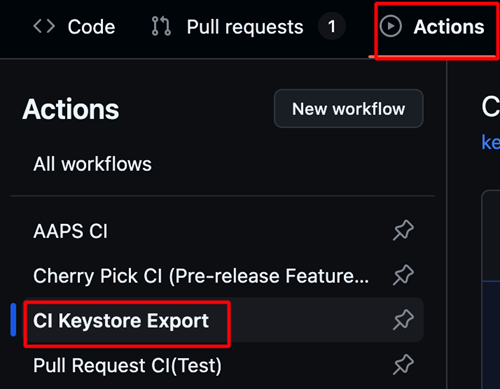
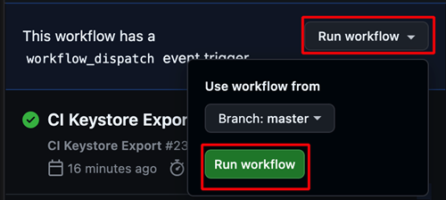

(aaps-ci-preparation)=

# Browser build – Step 2: Create your signing keystore

```{note}
This is **Step 2** of the [Browser build](BrowserBuild.md). First complete [Step 1 – Create your GitHub fork](BrowserBuildFork.md).
```

AndroidAPS must be signed with private keys stored in a **Java KeyStore (JKS)**. This is the most important decision of the whole process, because it determines whether you will be able to **upgrade** AAPS later without reinstalling.

## Choose your keystore strategy

Read both options and pick the one that matches your situation.

### Option 1 – Generate a new keystore

Choose this if **any** of these is true:

- This is your **first time** building AAPS.
- You don't have a keystore from a previous Android Studio (computer) build.
- You have forgotten your keystore password or alias.

```{warning}
Building AAPS with **Option 1** creates a brand-new keystore, so it **will not allow you to upgrade your existing AAPS** in place. To move to this new build you will need to:
1. [Export settings](#ExportImportSettings-Automating-Settings-Export) on your phone.
2. Copy or upload the settings file from your phone to an external location (i.e. your computer, cloud storage service…).
3. Generate a new version of the signed apk as described in Option 1 and transfer it to your phone.
4. Uninstall previous AAPS version on your phone.
5. Install new AAPS version on your phone.
6. [Import settings](#ExportImportSettings-restoring-from-your-backups-on-a-new-phone-or-fresh-installation-of-aaps) to restore your objectives and configuration.
7. Restore your data from Nightscout.
```

**→ [Continue with Option 1 – Generate a new keystore](BrowserBuildO1.md)**

### Option 2 – Upload your existing keystore

Choose this if you **already have** the `.jks` keystore you used on a previous build of AAPS from a computer in Android Studio, **and** you know its password and alias (usually `key0`).

This keeps your current AAPS install upgradeable: future updates will use the same keystore.

**→ [Continue with Option 2 – Upload your existing keystore](BrowserBuildO2.md)**

----

```{note}
On the next page you will pick your device (Android, computer or iPhone). Each device page then walks you through downloading and opening the preparation file the right way for that device, and creating your keystore. The built AAPS app will be saved in your Google Drive.
```

**Next: choose [Option 1](BrowserBuildO1.md) or [Option 2](BrowserBuildO2.md) above, then follow the page for your device.**

----

(ci-keystore-export)=

## Export your keystore (optional)

If you want to export your stored keystore, use this method.

This script will export your previously configured keystore information (from Option 1 or Option 2) as a password-protected ZIP file to the `/AAPS/KeyStore` directory in your Google Drive.

```{warning}
Before using this export method, make sure your keystore and Google Drive settings have been completed.
```

### Steps:

1. **Add ZIP Password Secret:**
   - Go to your repository's **Settings** → **Secrets and variables** → **Actions**
   - Click **New repository secret**
   - In the **Name** field, enter: `ZIP_PASSWORD`
   - In the **Secret** field, enter your custom ZIP encryption password
   - Use only English letters and numbers for the password (no special symbols)
   - Click **Add secret**

   

2. **Run Export Workflow:**
   - Go to the **Actions** tab in your repository
   - Select **CI KeyStore Export**
   - Click **Run workflow**
   - The exported keystore ZIP file will be saved to your Google Drive

   

   

```{toctree}
:hidden:

Option 1 – Generate a new keystore <BrowserBuildO1.md>
Option 2 – Upload your existing keystore <BrowserBuildO2.md>
```
