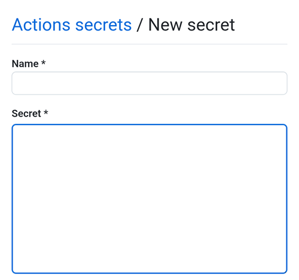

### Open the CI preparation help file

With File Manager+, open the file `aaps-ci-preparation-html` you downloaded above.

Select Downloads.

And search for this file, tap it to open it, open it with Chrome, tap Just once.

It will open like this.

Select Generate JKS. The field below will populate with characters.

Keep this tab open.

### Create a new secret in GitHub

Return to your GitHub browser tab: your own AndroidAPS copy.

1. Top right, tap the `...` button
2. Select Settings in the list

Scroll down to Security and select Secrets and variables.

Now select Actions

Scroll down to Repository secrets and tap New repository secret

You will see this dialog (scroll down if it's not visible).

Leave the tab opened like this.

Switch to the File Explorer Plus tab.

Tap the top Copy button.

Switch back to the GitHub tab.

In the Name field, paste the text you just copied. Use a long touch on the text box to show the paste menu.

Switch to the File Explorer Plus tab.

Tap the second Copy button.

Switch back to the GitHub tab.

1. In the Secret field, paste the text you just copied. Use a long touch on the text box to show the paste menu.

2. Tap Add secret.

Check the secret has been added, scroll down to verify.

