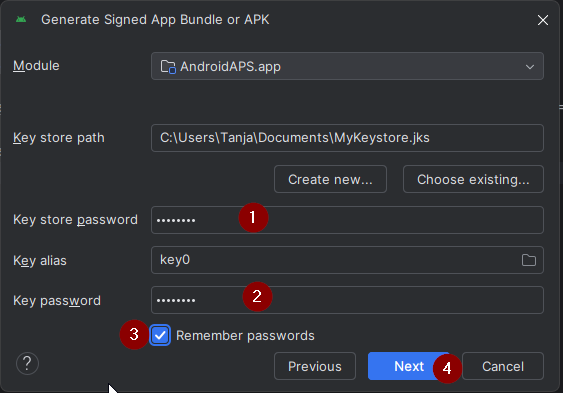

(aaps-ci-option2)=

# Option 2 – Upload your existing keystore

```{note}
This is part of [Step 2 – Create your signing keystore](BrowserBuildKeystore.md) of the [Browser build](BrowserBuild.md). Make sure you have read the [Option 1 vs Option 2 decision](#aaps-ci-preparation) and downloaded the preparation file.
```

Option 2 reuses the JKS you already created on a previous build of AAPS from a computer in Android Studio. It is suitable for users who already have a JKS and know the JKS password and alias.

For `KEYSTORE_PASSWORD`, `KEY_ALIAS`, and `KEY_PASSWORD`, enter your actual password and alias in GitHub – those from Android Studio, see below where you used them.

```{admonition} KEY + PASSWORDS
:class: dropdown


```

## Choose your device

Follow the page that matches the device you are building from:

- **[Android](BrowserBuildO2Android.md)** – the recommended choice.
- **[Computer](BrowserBuildO2Computer.md)** – Windows, Mac or Linux.

```{tip}
You can switch device at any time – just open the matching page.
```

```{toctree}
:hidden:

Android <BrowserBuildO2Android.md>
Computer <BrowserBuildO2Computer.md>
```
