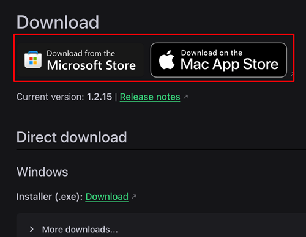
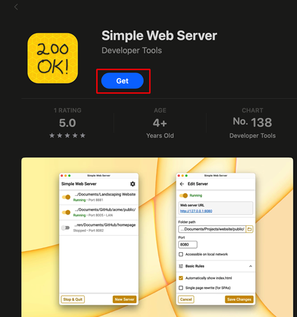
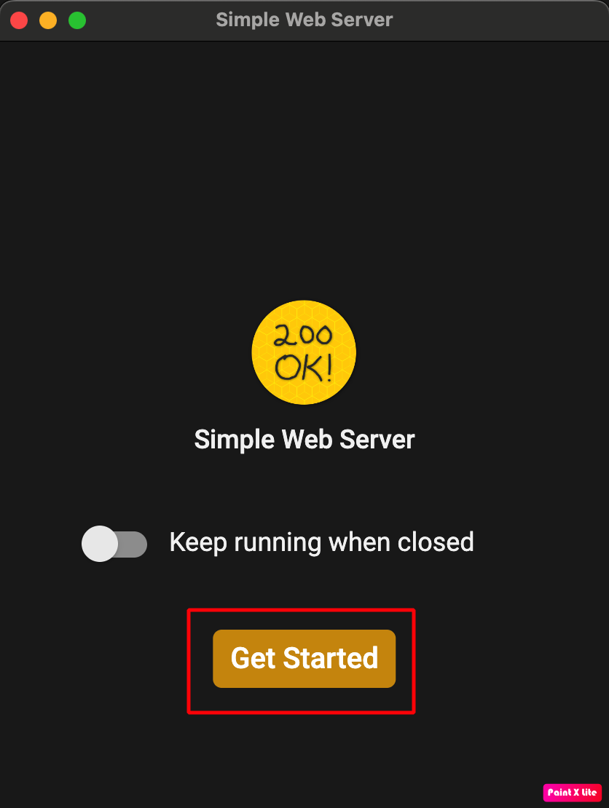
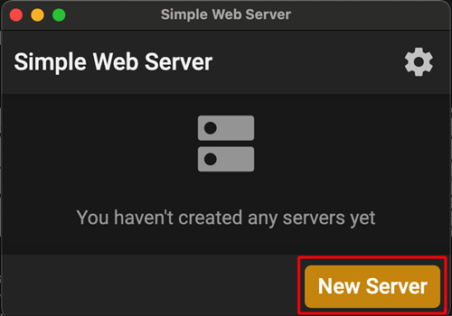
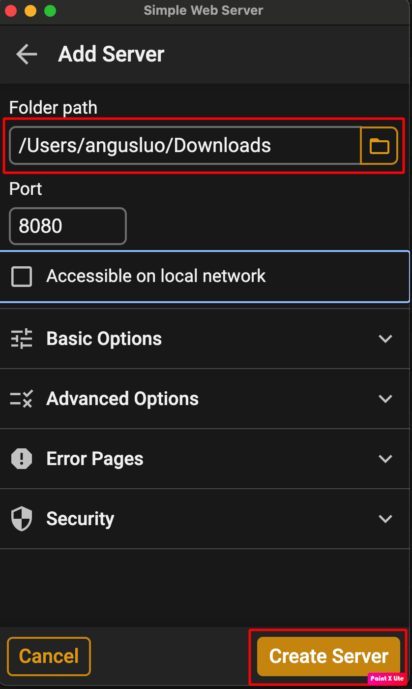
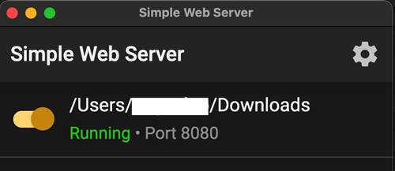

(aaps-ci-option2-computer)=

# Option 2 · Computer – Upload your existing keystore

```{note}
[Option 2](BrowserBuildO2.md) (upload an existing keystore) on a **computer** (Windows / Mac / Linux).
```

## 1. Download the preparation file

:::{include} BrowserBuildDownloadPrep.md
:::

## 2. Start a local server and upload the keystore

Use a computer (supports Windows/Mac/Linux)

<!--crowdin: exclude-->
<div align="center" style="max-width: 360px; margin: auto; margin-bottom: 2em;">
  <div style="position: relative; width: 100%; aspect-ratio: 9/16;">
    <iframe
      src="https://geo.dailymotion.com/player/x9rdyc6.html?video=x9rdyc6&loop=true&mute=true"
      loading="lazy"
      style="position: absolute; top: 0; left: 0; width: 100%; height: 100%;"
      frameborder="0"
      allowfullscreen>
    </iframe>
  </div>
</div>

Install Simple Web Server</br></br>
If you are a Windows or Mac user, you can install it from the Microsoft Store or the Mac App Store.
If your browser asks whether to open the store app, allow it.</br></br>
</br></br>

Example on Mac:

- get → install → open</br></br>
</br></br>

- Click Get Started</br></br>
</br></br>

- Click New Server</br></br>
</br></br>

- In Folder Path, select the folder where aaps-ci-preparation.html is located, and then click Create Server.</br></br>
</br></br>

- Seeing this screen means the server has been started.</br></br>
</br></br>

- Do not close Simple Web Server. Please switch to your browser and open</br></br>
[http://127.0.0.1:8080/aaps-ci-preparation.html](http://127.0.0.1:8080/aaps-ci-preparation.html)</br></br>

- For the subsequent steps, please refer to the video below, starting from 2 minute 18 seconds.</br></br>
  <!--crowdin: exclude-->
  <div align="center" style="max-width: 360px; margin: auto; margin-bottom: 2em;">
    <div style="position: relative; width: 100%; aspect-ratio: 9/16;">
      <iframe
        src="https://geo.dailymotion.com/player/x9rdvt0.html?video=x9rdvt0&startTime=138&loop=true&mute=true"
        loading="lazy"
        style="position: absolute; top: 0; left: 0; width: 100%; height: 100%;"
        frameborder="0"
        allowfullscreen>
      </iframe>
    </div>
  </div>

----

**Next: [Step 3 – Authorize Google Drive](BrowserBuildGoogleDrive.md) →**
