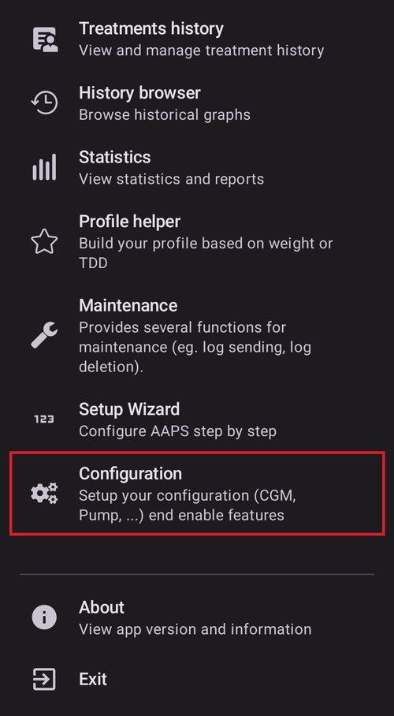
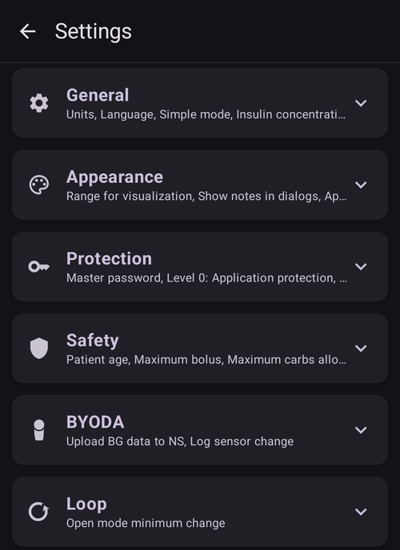
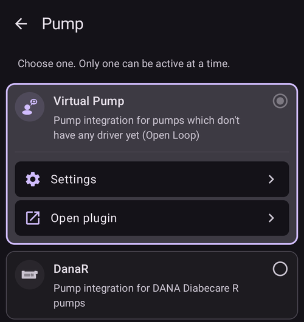

# Making changes to your AAPS' configuration

After you have completed the **[Setup Wizard](../SettingUpAaps/SetupWizard.md)**, you don't need to run the entire Wizard again if you want to only change parts of your **AAPS**' configuration.

There are three routes to change **AAPS**' configuration. As to which route you take, it is simply a matter of convenience or personal preference, as each route leads to the same settings.

These are as follows:

1. The **Configuration** screen,
2. The **Settings** screen or
3. A plugin's **Settings**, opened from its category in **Configuration**.

Here we explain which option is most convenient for each situation:

## Configuration

Open the **menu** (☰) in the top-left corner of the main screen and choose **Configuration**:

**Configuration** is used to **choose which plugins are active** — your CGM, pump, APS algorithm, sensitivity detection, synchronization and more, grouped by category. It is the same screen the Setup Wizard configured for you.

The documentation of the Configuration screen is available [here](../SettingUpAaps/ConfigBuilder.md).

## Settings

Tap the **Settings** (gear) icon in the top-right corner of the main screen. This opens the settings of **all enabled plugins in a single place**, grouped into expandable sections:

This is a good route if you are not really sure where to look for a configuration option, but it can be a bit tedious if you know you want to change the configuration for just one specific plugin.

The documentation of the settings is available [here](../SettingUpAaps/Preferences.md).

## A plugin's Settings

Inside **Configuration**, open a category and tap "**Settings**" underneath the active plugin. You are taken directly to the settings of **that plugin only**:

For example, this is a good route if you know that you want to change the configuration for your pump: open **Configuration → Pump**, then tap "**Settings**" under the selected pump.

This is a "shortcut" to the same settings shown on the general **Settings** screen.
