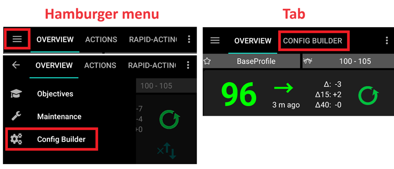
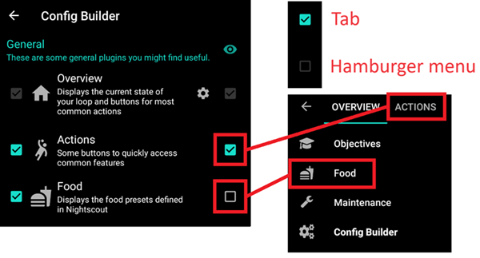
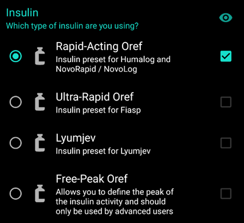
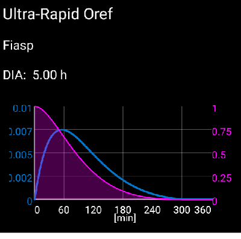
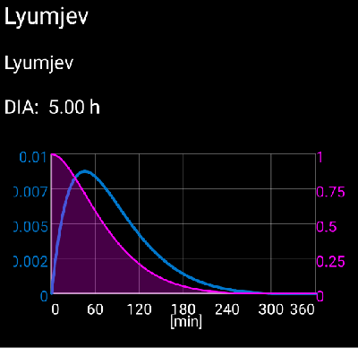
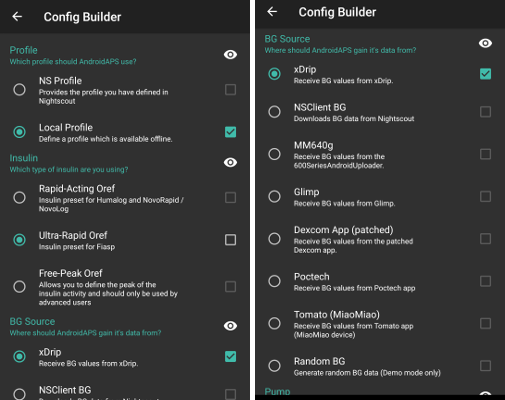

# Config Builder

Depending on your settings you can open Config Builder through a tab at the top of the screen or through hamburger menu.

The **Config Builder** is the tab where you turn the modular features on and off. On the picture below, the boxes on the left-hand side (A) allow you to select which modules you want activated, the boxes on the right-hand side (C) allow you to view these as a tab (E) in **AAPS**. In case the right box is not activated, you can reach the function by using the hamburger menu (D) on the top left of the screen. See [Tab or hamburger menu](#tab-or-hamburger-menu) below.

When there are additional settings available within the module, you can click on the cog wheel (B) which will take you to the specific settings within preferences.

## Tab or hamburger menu

With the checkbox under the eye symbol you can decide how to open the corresponding program section.

## Profile

This module can not be disabled as it is a core part of **AAPS**.

* See [Your AAPS Profile](../SettingUpAaps/YourAapsProfile.md) for a basic understanding of what goes inside your **Profile**.
* See [AAPS Screens > Profile](../DailyLifeWithAaps/AapsScreens.md#profile) for more information about managing your profiles.

## Insulin

Select the type of insulin you are using.

More information to understand the Insulin Profile as shown in **AAPS** [here](../DailyLifeWithAaps/AapsScreens.md#insulin-profile).

### Insulin type differences

* The options 'Rapid-Acting Oref', Ultra-Rapid Oref', 'Lyumjev' and 'Free-Peak Oref' all have an exponential shape.
* For 'Rapid-Acting', 'Ultra-Rapid' and 'Lyumjev' the DIA is the only variable you can adjust by yourself, the time to peak is fixed. 
* Free-Peak allows you to adjust both the DIA and the time to peak, and must only be used by advanced users who know the effects of these settings. 
* The [insulin curve graph](../DailyLifeWithAaps/AapsScreens.md#insulin-profile) helps you to understand the different curves.

#### Rapid-Acting Oref

* recommended for Humalog, Novolog and Novorapid
* DIA = at least 5.0h
* Max. peak = 75 minutes after injection (fixed, not adjustable)

#### Ultra-Rapid Oref

* recommended for FIASP
* DIA = at least 5.0h
* Max. peak = 55 minutes after injection (fixed, not adjustable)

#### Lyumjev

* special insulin profile for Lyumjev
* DIA = at least 5.0h
* Max. peak = 45 minutes after injection (fixed, not adjustable)

#### Free Peak Oref

* With the "Free Peak 0ref" profile you can individually enter the peak time. To do so click to cogwheel to enter advanced settings.
* The DIA is automatically set to 5 hours if it is not specified higher in the profile.
* This effect profile is recommended if an unbacked insulin or a mixture of different insulins is used.

## BG Source
Select the blood glucose source you are using. See [BG Source](../Getting-Started/CompatiblesCgms.md) page for more setup information.

* [xDrip+](../CompatibleCgms/xDrip.md)
* [NSClient BG](../CompatibleCgms/CgmNightscoutUpload.md) - not recommended as closed loop relies on mobile data / Wi-Fi coverage in this case. CGM data will only be received if there is an online connection to your NS site. Better use local broadcast from one of the other CGM data sources.
* [MM640g](../CompatibleCgms/MM640g.md)
* [Glimp](../CompatibleCgms/Libre1.md#2-using-glimp) - only version 4.15.57 and newer are supported
* [Build Your Own Dexcom App (BYODA)](../CompatibleCgms/DexcomG6.md#if-using-g6-with-build-your-own-dexcom-app).
* [Poctech](../CompatibleCgms/PocTech.md)
* [Tomato App](../CompatibleCgms/Libre1.md#3-using-tomato) for MiaoMiao device
* [Glunovo App](https://infinovo.com/) for Glunovo CGM system
* Random BG: Generates random BG data (Demo mode only)

## Smoothing

See [Smoothing blood glucose data](../CompatibleCgms/SmoothingBloodGlucoseData.md).

## Pump
Select the pump you are using. See [Compatible pumps](../Getting-Started/CompatiblePumps.md) page for more setup information.

* [Dana R](../CompatiblePumps/DanaR-Insulin-Pump.md)
* Dana R Korean (for domestic DanaR pump)
* Dana Rv2 (DanaR pump with unofficial firmware upgrade)
* [Dana-i/RS](../CompatiblePumps/DanaRS-Insulin-Pump.md)
* [Accu Chek Insight](../CompatiblePumps/Accu-Chek-Insight-Pump.md)
* Accu Chek Combo
  * [Driver using Ruffy](../CompatiblePumps/Accu-Chek-Combo-Pump.md) (requires ruffy installation)
  * [Driver with no additional requirement](../CompatiblePumps/Accu-Chek-Combo-Pump-v2.md), added in [AAPS v.3.2](../Maintenance/ReleaseNotes.md#version-3200-dedicated-to-philoul)
* Omnipod for [Omnipod Eros](../CompatiblePumps/OmnipodEros.md)
* Dash for [Omnipod DASH](../CompatiblePumps/OmnipodDASH.md)
* [Medtronic](../CompatiblePumps/MedtronicPump.md)
* [Diaconn G8](../CompatiblePumps/DiaconnG8.md)
* [EOPatch2](../CompatiblePumps/EOPatch2.md)
* [Medtrum](../CompatiblePumps/MedtrumNano.md)
* Virtual pump: open loop - **AAPS** suggestions only
  * as you make you first steps with **AAPS*, during the first [objectives](../SettingUpAaps/CompletingTheObjectives.md)
  * for pump which doesn't have any driver yet

## Sensitivity Detection
Select the type of sensitivity detection. For more details of different designs please [read on here](../DailyLifeWithAaps/SensitivityDetectionAndCob.md). This will analyze historical data on the go and make adjustments if it recognizes that you are reacting more sensitively (or conversely, more resistant) to insulin than usual.  More details about the Sensitivity algorithm can be read in the [OpenAPS docs](https://openaps.readthedocs.io/en/latest/docs/Customize-Iterate/autosens.html).  

You can view your sensitivity on the homescreen in an [additional graph](../DailyLifeWithAaps/AapsScreens.md#section-g---additional-graphs).

### Absorption settings
If you use Oref1 with SMB you must change <b>min_5m_carbimpact</b> to 8. The value is only used during gaps in CGM readings or when physical activity "uses up" all the blood glucose rise that would otherwise cause **AAPS** to decay COB. At times when [carb absorption](../DailyLifeWithAaps/CobCalculation.md) can't be dynamically worked out based on your bloods reactions it inserts a default decay to your carbs. Basically, it is a failsafe.

## APS
Select the desired APS algorithm for therapy adjustments. You can view the active detail of the chosen algorithm in the OpenAPS(OAPS) tab.
* OpenAPS AMA
  * Advanced Meal Assist: older algorithm not recommended anymore.
  * In simple terms, the benefits are after you give yourself a meal bolus, the system can high-temp more quickly IF you enter carbs reliably.
* [OpenAPS SMB](../DailyLifeWithAaps/KeyAapsFeatures.md)
  * Super Micro Bolus: most recent algorithm recommended for all users.
  * In contrast to AMA, SMB does not use temporary basal rates to control glucose levels, but mainly small **Super Micro Boluses**.
  * Note : It is recommended to use this algorithm from the beginning, even though you will not actually get SMBs delivered until [Objective 9](../SettingUpAaps/CompletingTheObjectives.md#objective-9-enabling-additional-oref1-features-for-daytime-use-such-as-super-micro-bolus-smb).

If switching from AMA to SMB algorithm, _min_5m_carbimpact_ must be changed manually to **8** (default value for SMB) in [Preferences > Sensitivity detection > Sensitivity Oref1 settings](../SettingUpAaps/Preferences.md).

## Loop

This module should not be disabled as it is a core part of **AAPS**.

## Constraints

### Objectives

**AAPS** has a learning program (a series of objectives) that you have to fulfill step by step. This should guide you safely through setting up a closed loop system. It guarantees that you have set everything up correctly and understand what the system does exactly. This is the only way you can trust the system.

See [Objectives](../SettingUpAaps/CompletingTheObjectives.md) page for more information.

## Synchronization

In this section, you can choose if/where you want **AAPS** to send your data to.

### NSClient or NSClientV3

Can be used as a [reporting server](../SettingUpAaps/SettingUpTheReportingServer.md) and/or for [remote monitoring](../RemoteFeatures/RemoteMonitoring.md), [remote control](../RemoteFeatures/RemoteControl.md). 

See [Synchronization with the reporting server](../SettingUpAaps/SetupWizard.md#synchronization-with-the-reporting-server-and-more) to help you choose between NSClient (v1) and NSClientV3.

### Tidepool

Can be used as a [reporting server](../SettingUpAaps/SettingUpTheReportingServer.md).

See [Tidepool](../SettingUpAaps/Tidepool.md).

### xDrip

Used to **send** data such as treatments to xDrip+.

### Open Humans

See [Open Humans](../SupportingAaps/OpenHumans.md).

### Wear
Monitor and control **AAPS** using your Android WearOS watch (see [page Watchfaces](../UsefulLinks/WearOsSmartwatch.md)).

### Samsung Tizen

Broadcast data to Samsung's G-Watch Wear App (Tizen OS).

### Garmin

Connection to Garmin device (Fenix, Edge...)

## General

### Overview

This is the [main screen](../DailyLifeWithAaps/AapsScreens.md#the-homescreen) of **AAPS** and can not be disabled.

### Actions

A tab offering multiple buttons to take [actions](../DailyLifeWithAaps/AapsScreens.md#action-tab) in **AAPS**.

### Automation

A tab for managing your [Automations](../DailyLifeWithAaps/Automations.md), starting at [Objective 10](../SettingUpAaps/CompletingTheObjectives.md#objective-10-automation).

### SMS Communicator
Allows remote caregivers to control some **AAPS** features via SMS, see [SMS Commands](../RemoteFeatures/SMSCommands.md) for more setup information.

### Food
Displays the food presets defined in the Nightscout food database, see [Nightscout Readme](https://github.com/nightscout/cgm-remote-monitor#food-custom-foods) for more setup information.

Note: Entries cannot be used in the **AAPS** calculator. (View only)

### Maintenance

Access this tab to export / import settings.

### Config Builder

This current tab.