# Configuration (Config Builder)

```{admonition} Renamed in AAPS v4
:class: note
In **AAPS** v4 the **Config Builder** has been renamed **Configuration** and moved into the **top-left menu** (☰). It is still the place where you choose which plugins are active (CGM, pump, APS algorithm, sensitivity, sync, …) and open each plugin and its settings. The [v4 walkthrough](#configuration-v4) is below; the rest of this page describes each section in detail.
```

Depending on your settings you can open Config Builder through a tab at the top of **AAPS**' screen or through the hamburger menu.

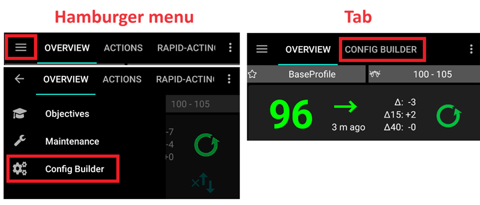

The **Config Builder** is the tab where you turn the modular features on and off. In the picture below, the boxes on the left-hand side (A) allow you to select which modules you want activated. By default, when opening the Config Builder, sections are collapsed to only show the active plugins. Click on the arrow (G) to show all available options. The boxes on the right-hand side (C) allow you to view the active modules as a tab (E) in **AAPS**. In case the right box is not activated, you can reach the function by using the hamburger menu (D) on the top left of the screen. See [Tab or hamburger menu](#tab-or-hamburger-menu) below.

When there are additional settings available within the module, you can click on the cog wheel (B) which will take you to the specific settings within preferences.

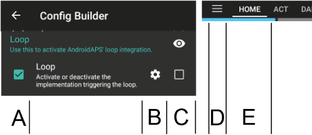

(configuration-v4)=
## Configuration in AAPS v4

In **AAPS** v4, tap the **menu** (☰) in the **top-left** corner of the main screen and choose **Configuration** (*“Set up your configuration (CGM, pump, …) and enable features”*).

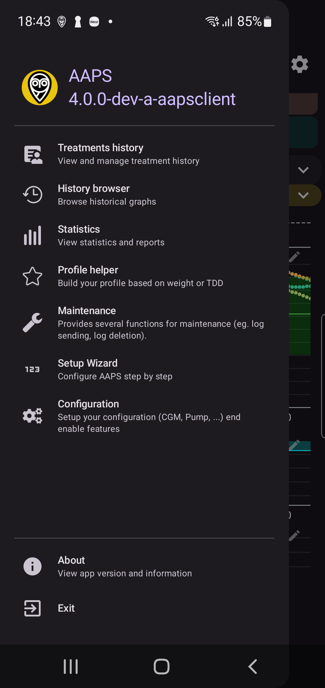

Plugins are grouped by **category** — for example *Smoothing*, *Calibration*, *Sensitivity detection*, *APS*, *Communication* and *General*. Each row shows the category name and the **currently active** plugin (e.g. *APS → OpenAPS SMB*). Tap a row to open a category.

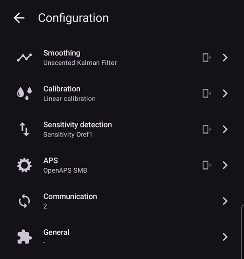

Inside a category you see the plugins available for it. For single-choice categories you pick the active one; some categories are multi-select (*“Choose any that apply”*). Each plugin offers two actions:

- **Open plugin** — opens the plugin's own screen (its tab/content).
- **Settings** — opens the plugin's preferences (settings may be grouped into expandable sections).

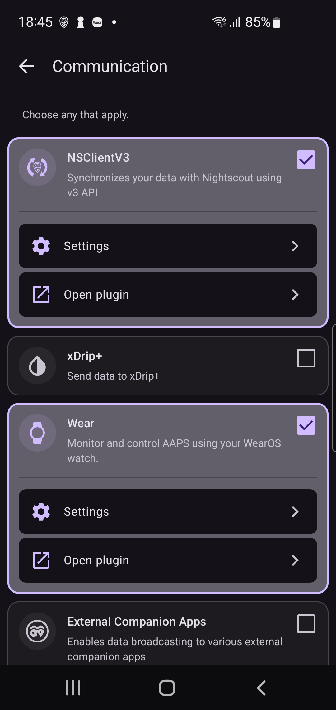

(configuration_sync_icon)=
### The mobile icon — “synced from the master”

A small **mobile (phone) icon** next to a category or setting means that item is **synchronized from the master** — its value/selection is delivered to this device over the NSClient (Nightscout) channel.

On a **client** (**AAPSClient**) these items are **kept in sync with the master**: in the screenshot above the icon appears on *Smoothing*, *Calibration*, *Sensitivity detection* and *APS*. Exactly how the master and clients stay aligned — and which settings you can change from either side — is covered under [Master ↔ Client control](#client-master-config-prefs).

The same icon also appears **inside a plugin's settings**, next to the individual preferences that are synced. In the example below *Use dynamic sensitivity* and *DynamicISF adjustment factor* carry the icon, while device-local settings such as *Maximum basal rate* and *Max IOB for SMB* do not:

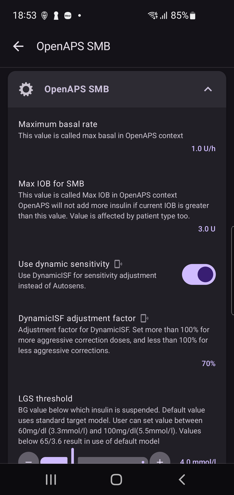

Items **without** the icon are configured **per device**. The most important example is the **NSClient (Communication)** connection itself — the **Nightscout URL**, **access token** and **websockets** are set on each phone individually, so they do **not** show the mobile icon.

---

(Config-Builder-tab-or-hamburger-menu)=
## Tab or hamburger menu

With the checkbox under the eye symbol you can decide how to open the corresponding program section.


```{contents}
:backlinks: entry
:depth: 2
```

(ConfigBuilder_Profile)=

## Profile

This module cannot be disabled as it is a core part of **AAPS**.

See [Your AAPS Profile](../SettingUpAaps/YourAapsProfile.md) for a basic understanding of what goes inside your **Profile**.

(Config-Builder-insulin)=
## Insulin

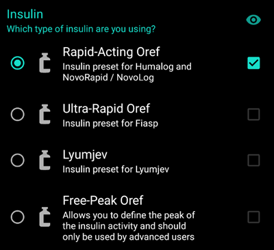

Select the type of insulin you are using.

Once a type is selected, the insulin profile editor lets you:

* give the profile an **Insulin nickname** so it is easy to recognise,
* set the **Peak** (time to maximum insulin activity, in minutes) and the **DIA** (Duration of Insulin Activity, in hours), either by typing the value or using the **–** / **+** buttons,
* tap a **Load peak from** preset button — **Novorapid** (75 min), **Fiasp** (55 min) or **Lyumjev** (45 min) — to fill in the standard peak time for that insulin in one step.

The **IOB** (insulin on board) and **Activity** curves shown at the bottom of the editor update as you change the values, so you can see straight away how your settings shape the insulin action.

More information to understand the Insulin Profile as shown in **AAPS** [here](#AapsScreens-insulin-profile).

### Insulin type differences

* The options 'Rapid-Acting Oref', 'Ultra-Rapid Oref', 'Lyumjev' and 'Free-Peak Oref' all have an exponential shape.
* You can adjust both the DIA and the time to peak. The **Load peak from** presets set the peak to the value recommended for Novorapid, Fiasp or Lyumjev, and the peak values listed below are these recommended defaults.
* Only change the peak away from its recommended value if you understand the effect of doing so. 'Free-Peak Oref' is intended for advanced users entering a custom peak.
* The [insulin curve graph](#AapsScreens-insulin-profile) helps you to understand the different curves.

#### Rapid-Acting Oref

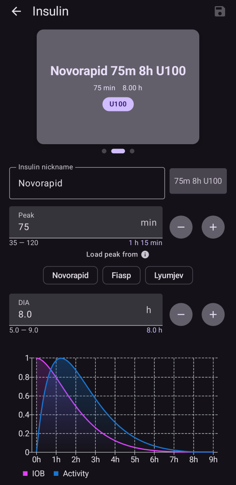

* recommended for Humalog, Novolog and Novorapid
* DIA = at least 5.0h
* Peak = 75 minutes after injection (recommended default; loaded by the **Novorapid** preset)

#### Ultra-Rapid Oref

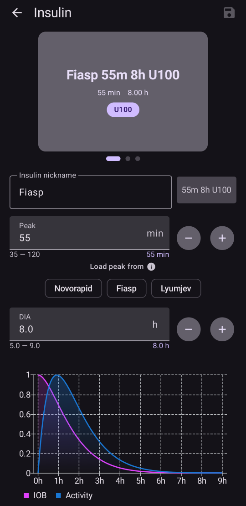

* recommended for FIASP
* DIA = at least 5.0h
* Peak = 55 minutes after injection (recommended default; loaded by the **Fiasp** preset)

(Config-Builder-lyumjev)=
#### Lyumjev

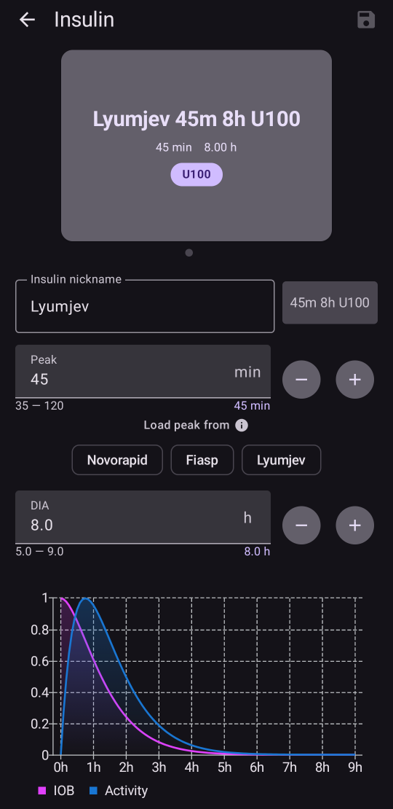

* special insulin profile for Lyumjev
* DIA = at least 5.0h
* Peak = 45 minutes after injection (recommended default; loaded by the **Lyumjev** preset)

#### Free Peak Oref


* With the "Free Peak 0ref" profile you can individually enter the peak time. To do so click to cogwheel to enter advanced settings.
* The DIA is automatically set to 5 hours if a higher value is not entered.
* This effect profile is recommended if an unbacked insulin or a mixture of different insulins is used.

(Config-Builder-insulin-dia)=
### Duration of insulin action (DIA) and peak

```{warning}
Decreasing DIA or peak will always increase administered insulin. DIA has different logic to it in AAPS compared to commercial AID systems. Uninformed changes to these settings can change insulin dosing in a way which is much larger or smaller than expected.
```

AAPS models insulin action with a mathematical function, configured using **DIA** and the closely related  **peak** settings. DIA represents a theoretical duration until IOB reaches zero and peak represents timepoint after insulin activity is strongest. Insulin activity and rate of IOB decay is one and the same.

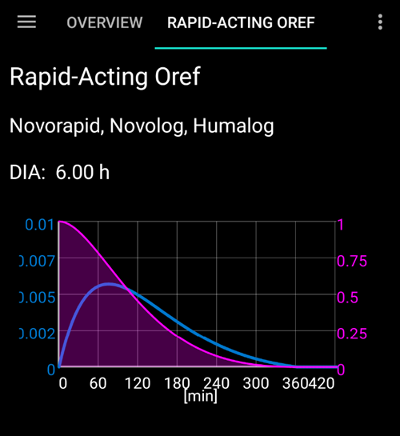

In the above chart, in theory, half the IOB is decayed after ~110 minutes. The blue activity curve shows that at 120 minutes, IOB is decaying at a rate of 0.5 percentage points per minute.

Recall that as AAPS applies TBR below profile basal rate, IOB is subtracted. Therefore, in the typical hybrid closed-loop AAPS use, positive IOB from meal bolus will in practice reach zero many hours earlier than the configured DIA. For the same reason, positive IOB from a small SMB will decay to zero very quickly after zero-temping.

To configure DIA and peak, tap **Manage** in the main screen, and then tap **Insulin**. Due to the influence of TBR explained above and the mathematical formula used for IOB decay in AAPS, most users set a clearly higher DIA than in commercial systems. In general, many people find that a **DIA** of 9h works well for them. After you have more experience with AAPS and have a well-tuned profile, you can try to determine a personalized DIA and peak configuration with the information presented in the next section.

#### Additional details on the impact of DIA and peak configuration

Since the basal rate has an indirect influence to IOB decay in AAPS, it follows that too high basal rates can mask too high DIA, and vice versa. It makes sense to first carefully tune basal rates before adjusting DIA and peak. Additionally, consider that the DIA and peak settings interact in sense that the effect of DIA depends on peak, and vice versa.

The following charts show the exact impact of DIA and peak to the IOB curves.

Adjusting DIA:

```{image} ../images/iob_remaining_static_peak.png
:width: 400px
```

Adjusting peak:

```{image} ../images/iob_remaining_static_dia.png
:width: 400px
```

Finally, a comparison adjusting DIA and peak in parallel. The logic here is that both values are adjusted in same relative amounts, so that `49/35 ~ 7/5`. Or similarly, `120/93 ~ 9/7`. The intervals will be consistent regardless of the baseline DIA or peak, as long as the relative change is same for both.

```{image} ../images/iob_remaining_uniform.png
:width: 400px
```

Note that when DIA and peak are adjusted in this fashion, every point in the curve will shift by the same relative amount.

#### Further reading on DIA and peak configuration

* [Technical details and historical background from the AAPS predecessor, OpenAPS](https://openaps.readthedocs.io/en/latest/docs/While%20You%20Wait%20For%20Gear/understanding-insulin-on-board-calculations.html#understanding-the-new-iob-curves-based-on-exponential-activity-curves).
* [Why we are regularly wrong in the duration of insulin action (DIA) times we use, and why it matters…](https://www.diabettech.com/insulin/why-we-are-regularly-wrong-in-the-duration-of-insulin-action-dia-times-we-use-and-why-it-matters/) on Diabettech.
* [Exponential Insulin Curves + Fiasp](https://web.archive.org/web/20220630154425/http://seemycgm.com/2017/10/21/exponential-insulin-curves-fiasp/) on See My CGM (archive).
* [Revised Humalog model in a closed loop](https://bionicwookiee.com/2022/04/13/revised-humalog-model-in-a-closed-loop/) and other articles on Bionic Wookie, recommending a DIA of 9h for Lyumjev, Fiasp, NovoRapid, Humalog.

(Config-Builder-bg-source)=
## BG Source
Select the blood glucose source you are using. See [BG Source](../Getting-Started/CompatiblesCgms.md) page for more setup information.


* [xDrip](../CompatibleCgms/xDrip.md)
* [NSClient BG](../CompatibleCgms/CgmNightscoutUpload.md) - only if you know what you are doing, see [BG Source](../Getting-Started/CompatiblesCgms.md).
* [MM640g](../CompatibleCgms/MM640g.md)
* Glimp - only version 4.15.57 and newer are supported
* [Build Your Own Dexcom App (BYODA)](#DexcomG6-if-using-g6-with-build-your-own-dexcom-app).
* [Poctech](../CompatibleCgms/PocTech.md)
* Tomato App for MiaoMiao device
* [Glunovo App](https://infinovo.com/) for Glunovo CGM system
* [Ottai](../CompatibleCgms/OttaiM8.md)
* [Syai Tag](../CompatibleCgms/SyaiTagX1.md)
* MicroTech CGM App - for the Aidex CGM
* Intelligo App
* SI App - patched app for Sibionics CGM
* Sino App - patched app for Sinocare CGM
* Random BG: Generates random BG data (Demo mode only)

## Smoothing

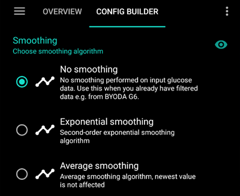

See [Smoothing blood glucose data](../CompatibleCgms/SmoothingBloodGlucoseData.md).

(Config-Builder-pump)=
## Pump
Select the pump you are using. See [Compatible pumps](../Getting-Started/CompatiblePumps.md) page for more setup information.


* [Dana R](../CompatiblePumps/DanaR-Insulin-Pump.md)
* Dana R Korean (for domestic DanaR pump)
* Dana Rv2 (DanaR pump with unofficial firmware upgrade)
* [Dana-i/RS](../CompatiblePumps/DanaRS-Insulin-Pump.md)
* [Accu Chek Insight](../CompatiblePumps/Accu-Chek-Insight-Pump.md)
* [Accu Chek Combo](../CompatiblePumps/Accu-Chek-Combo-Pump-v2.md)
* Omnipod for [Omnipod Eros](../CompatiblePumps/OmnipodEros.md)
* Dash for [Omnipod DASH](../CompatiblePumps/OmnipodDASH.md)
* [Medtronic](../CompatiblePumps/MedtronicPump.md)
* [Diaconn G8](../CompatiblePumps/DiaconnG8.md)
* [EOPatch2](../CompatiblePumps/EOPatch2.md)
* [Medtrum](../CompatiblePumps/MedtrumNano.md)
* [Equil 5.3](../CompatiblePumps/Equil5.3.md)
* Virtual pump: open loop - **AAPS** suggestions only
  * as you make you first steps with **AAPS**, during the first [objectives](../SettingUpAaps/CompletingTheObjectives.md)
  * for pump which doesn't have any driver yet

(Config-Builder-sensitivity-detection)=

## Sensitivity Detection
Select the type of sensitivity detection. For more details of different designs please [read on here](../DailyLifeWithAaps/SensitivityDetectionAndCob.md). This will analyze historical data on the go and make adjustments if it recognizes that you are reacting more sensitively (or conversely, more resistant) to insulin than usual. More details about the Sensitivity algorithm can be read in the [OpenAPS docs](https://openaps.readthedocs.io/en/latest/docs/Customize-Iterate/autosens.html).  

You can view your sensitivity on the homescreen in an [additional graph](#AapsScreens-section-g-additional-graphs).
You can view your sensitivity on the homescreen by selecting SEN and watching the white line.  Note, you need to be in [Objective 8](#objectives-objective8) in order to let Sensitivity Detection/[Autosens](#Open-APS-features-autosens) automatically adjust the amount of insulin delivered. Before reaching that objective, the Autosens percentage / the line in your graph is displayed for information only.

### Absorption settings
If you use Oref1 with **SMB** you must change **min_5m_carbimpact** to 8. The value is only used during gaps in **CGM** readings or when physical activity "uses up" all the blood glucose rise that would otherwise cause **AAPS** to decay COB. At times when [carb absorption](../DailyLifeWithAaps/CobCalculation.md) can't be dynamically worked out based on your blood's reactions it inserts a default decay to your carbs. Basically, it is a failsafe.

(Config-Builder-aps)=
## APS
Select the desired APS algorithm for therapy adjustments. You can view the active detail of the chosen algorithm in the OpenAPS(OAPS) tab.
* OpenAPS AMA
  * Advanced Meal Assist: older algorithm not recommended anymore.
  * In simple terms, the benefits are after you give yourself a meal bolus, the system can high-temp more quickly IF you enter carbs reliably.
* [OpenAPS SMB](#Open-APS-features-super-micro-bolus-smb)
  * Super Micro Bolus: most recent algorithm recommended for all users.
  * In contrast to AMA, SMB does not use temporary basal rates to control glucose levels, but mainly small **Super Micro Boluses**.
  * Note : It is recommended to use this algorithm from the beginning, even though you will not actually get SMBs delivered until [Objective 9](#objectives-objective9).

If switching from AMA to SMB algorithm, _min_5m_carbimpact_ must be changed manually to **8** (default value for SMB) in [Preferences > Sensitivity detection > Sensitivity Oref1 settings](../SettingUpAaps/Preferences.md).

## Loop

This module should not be disabled as it is a core part of **AAPS**.

## Constraints

### Objectives

**AAPS** has a learning program (a series of objectives) that you have to fulfill step by step. This should guide you safely through setting up a closed loop system. It guarantees that you have set everything up correctly and understand what the system does exactly. This is the only way you can trust the system.

See [Objectives](../SettingUpAaps/CompletingTheObjectives.md) page for more information.

## Synchronization

In this section, you can choose if/where you want **AAPS** to send your data to.

### NSClientV3

Can be used as a [reporting server](../SettingUpAaps/SettingUpTheReportingServer.md) and/or for [remote monitoring](../RemoteFeatures/RemoteMonitoring.md), [remote control](../RemoteFeatures/RemoteControl.md). 

See [Synchronization with the reporting server](#SetupWizard-synchronization-with-the-reporting-server-and-more) to set up NSClient synchronization.

### Tidepool

Can be used as a [reporting server](../SettingUpAaps/SettingUpTheReportingServer.md).

See [Tidepool](../SettingUpAaps/Tidepool.md).

### xDrip

Used to **send** data such as treatments to xDrip.

### Open Humans

See [Open Humans](../SupportingAaps/OpenHumans.md).

### Wear
Monitor and control **AAPS** using your Android WearOS watch (see [page Watchfaces](../WearOS/WearOsSmartwatch.md)).

### Samsung Tizen

Broadcast data to Samsung's G-Watch Wear App (Tizen OS).

### Garmin

Connection to Garmin device (Fenix, Edge...)
## Treatments
If you view the Treatments (Treat) tab, you can see the treatments that have been uploaded to Nightscout. Should you wish to edit or delete an entry (e.g. you ate less carbs than you expected) then select 'Remove' and enter the new value (change the time if necessary) through the [carbs button on the home screen](#screens-bolus-carbs).

## General

### Overview

This is the [main screen](#AapsScreens-the-homescreen) of **AAPS** and cannot be disabled.

#### Show notes field in treatment dialogs
Choose if you want to have a notes field when entering treatments or not.

#### Status lights
Choose if you want to have [status lights](#Preferences-status-lights) on overview for cannula age, insulin age, sensor age, battery age, reservoir level or battery level. When warning level is reached, the color of the status light will switch to yellow. Critical age will show up in red.

#### Advanced settings
**Deliver this part of bolus wizard result**: When using SMB, many people do not meal-bolus 100% of needed insulin, but only a part of it (e.g. 75 %) and let the SMB with UAM (unattended meal detection) do the rest. In this setting, you can choose a default value for the percentage the bolus wizard should calculate with. If this setting is 75 % and you had to bolus 10u, the bolus wizard will propose a meal bolus of only 7.5 units. 

**Enable super bolus functionality in wizard** (It is different from *super micro bolus*!): Use with caution and do not enable until you learn what it really does. Basically, the basal for the next two hours is added to the bolus and a two hour zero-temp activated. **AAPS looping functions will be disabled - so use with care! If you use SMB AAPS looping functions will be disabled according to your settings in ["Max minutes of basal to limit SMB to"](#Open-APS-features-max-minutes-of-basal-to-limit-smb-to), if you do not use SMB looping functions will be disabled for two hours.** Details on super bolus can be found [here](https://www.diabetesnet.com/diabetes-technology/blue-skying/super-bolus).

(Config-Builder-actions)=
### Actions

A tab offering multiple buttons to take [actions](#screens-action-tab) in **AAPS**.

### Automation

A tab for managing your [Automations](../DailyLifeWithAaps/Automations.md), starting at [Objective 10](#objectives-objective10).

(Config-Builder-sms-communicator)=
### SMS Communicator
Allows remote caregivers to control some **AAPS** features via SMS, see [SMS Commands](../RemoteFeatures/SMSCommands.md) for more setup information.

### Food
Displays the food presets defined in the Nightscout food database, see [Nightscout Readme](https://github.com/nightscout/cgm-remote-monitor#food-custom-foods) for more setup information.

Note: Entries cannot be used in the **AAPS** calculator. (View only)

(Config-Builder-wear)=
### Wear
Monitor and control AAPS using your Android Wear watch (see [page Watchfaces](../WearOS/WearOsSmartwatch.md)). Use settings (cog wheel) to define which variables should be considered when calculating a bolus given through your watch (e.g. 15min trend, COB...).

If you want to bolus etc. from the watch then within "Wear settings" you need to enable "Controls from Watch".


Through Wear tab or hamburger menu (top left of screen, if tab is not displayed) you can
* Resend all data.
Might be helpful if watch was not connected for some time and you want to push the information to the watch.
* Open settings on your watch directly from your phone.

### Autotune

You can enable Autotune, see [here](../AdvancedOptions/Autotune.md).

### Maintenance

Access this tab to export / import settings.

### Config Builder

This current tab.