# Configuration (Config Builder)

```{admonition} Renamed in AAPS v4
:class: note
In **AAPS** v4 the **Config Builder** has been renamed **Configuration** and moved into the **top-left menu** (☰). It is still the place where you choose which plugins are active (CGM, pump, APS algorithm, sensitivity, sync, …) and open each plugin and its settings. The [v4 walkthrough](#configuration-v4) is below; the rest of this page describes each section in detail.
```

(configuration-v4)=
## Configuration in AAPS v4

In **AAPS** v4, tap the **menu** (☰) in the **top-left** corner of the main screen and choose **Configuration** (*“Set up your configuration (CGM, pump, …) and enable features”*).

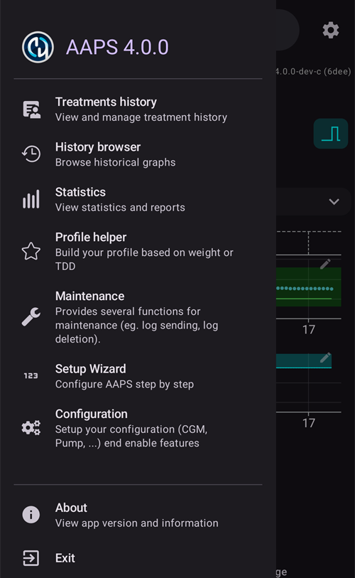

Plugins are grouped by **category** — for example *Smoothing*, *Calibration*, *Sensitivity detection*, *APS*, *Communication* and *General*. Each row shows the category name and the **currently active** plugin (e.g. *APS → OpenAPS SMB*). Tap a row to open a category.

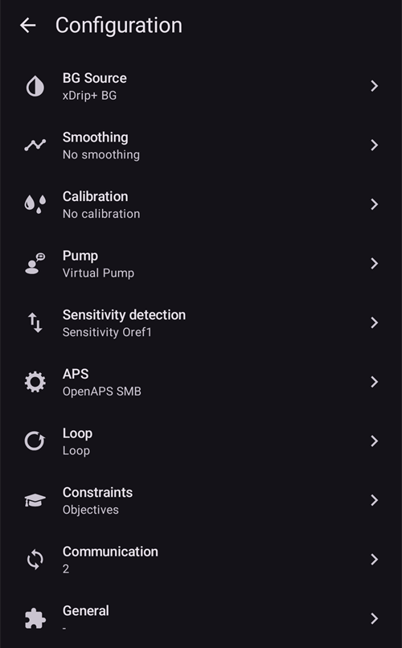

Inside a category you see the plugins available for it. For single-choice categories you pick the active one; some categories are multi-select (*“Choose any that apply”*). Each plugin offers two actions:

- **Open plugin** — opens the plugin's own screen (its tab/content).
- **Settings** — opens the plugin's preferences (settings may be grouped into expandable sections).

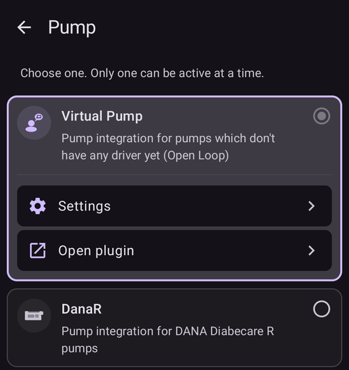

(configuration_sync_icon)=
### The mobile icon — “synced from the master”

A small **mobile (phone) icon** next to a category or setting means that item is **synchronized from the master** — its value/selection is delivered to this device over the NSClient (Nightscout) channel.

On a **client** (**AAPSClient**) these items are **kept in sync with the master**. The icon is only shown on a client, so it does not appear in the screenshot above, which was taken on the main **AAPS** app. On a client it typically appears on *Smoothing*, *Calibration*, *Sensitivity detection* and *APS*. Exactly how the master and clients stay aligned — and which settings you can change from either side — is covered under [Master ↔ Client control](#client-master-config-prefs).

The same icon also appears **inside the settings**, next to the individual preferences that are synced. In the example below *Absorption cutoff* carries the icon; settings without the icon are configured per device:

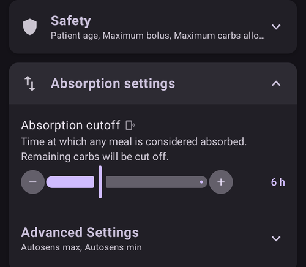

Items **without** the icon are configured **per device**. The most important example is the **NSClient (Communication)** connection itself — the **Nightscout URL**, **access token** and **websockets** are set on each phone individually, so they do **not** show the mobile icon.

---

(Config-Builder-tab-or-hamburger-menu)=
## Tab or hamburger menu

**AAPS** 4 no longer has tabs at the top of the screen, and the checkbox under the eye symbol of **AAPS** 3.x is gone. Each plugin screen is opened in one of these ways:

- **Configuration** → the plugin's category → **Open plugin**,
- the **Manage** sheet of the bottom navigation, for the screens you use most (Profile, Insulin settings, Pump, Automation, Food...),
- a [QuickLaunch](../DailyLifeWithAaps/QuickLaunch.md) button that you add yourself,
- the **search bar** on the main screen.

```{contents}
:backlinks: entry
:depth: 2
```

(ConfigBuilder_Profile)=

## Profile

This module cannot be disabled as it is a core part of **AAPS**.

See [Your AAPS Profile](../SettingUpAaps/YourAapsProfile.md) for a basic understanding of what goes inside your **Profile**.

(Config-Builder-insulin)=
## Insulin

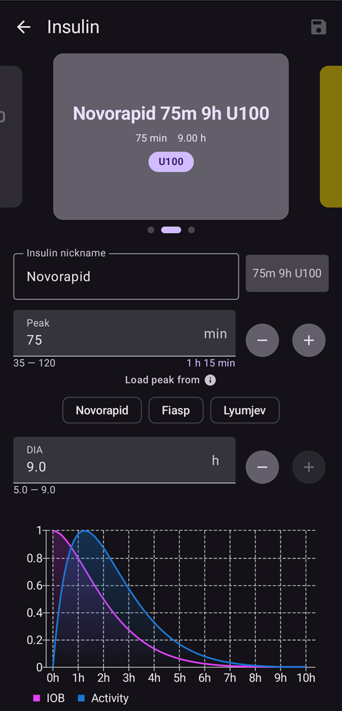

In **AAPS** 4 the insulin is no longer a plugin selected in **Configuration**. Open **Manage → Insulin settings** to set up the insulin you are using.

The insulin editor lets you:

* give the profile an **Insulin nickname** so it is easy to recognise,
* set the **Peak** (time to maximum insulin activity, in minutes) and the **DIA** (Duration of Insulin Activity, in hours), either by typing the value or using the **–** / **+** buttons,
* tap a **Load peak from** preset button — **Novorapid** (75 min), **Fiasp** (55 min) or **Lyumjev** (45 min) — to fill in the standard peak time for that insulin in one step.

The **IOB** (insulin on board) and **Activity** curves shown at the bottom of the editor update as you change the values, so you can see straight away how your settings shape the insulin action.

More information to understand the Insulin Profile as shown in **AAPS** [here](#AapsScreens-insulin-profile).

### Insulin type differences

* The options 'Rapid-Acting Oref', 'Ultra-Rapid Oref', 'Lyumjev' and 'Free-Peak Oref' all have an exponential shape.
* You can adjust both the DIA and the time to peak. The **Load peak from** presets set the peak to the value recommended for Novorapid, Fiasp or Lyumjev, and the peak values listed below are these recommended defaults.
* Only change the peak away from its recommended value if you understand the effect of doing so. 'Free-Peak Oref' is intended for advanced users entering a custom peak.
* The [insulin curve graph](#AapsScreens-insulin-profile) helps you to understand the different curves.

#### Rapid-Acting Oref

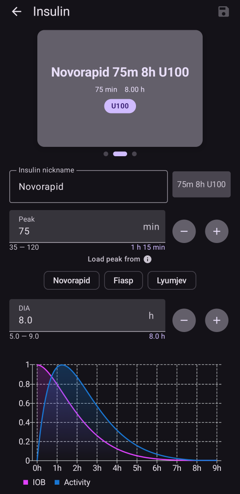

* recommended for Humalog, Novolog and Novorapid
* DIA = at least 5.0h
* Peak = 75 minutes after injection (recommended default; loaded by the **Novorapid** preset)

#### Ultra-Rapid Oref

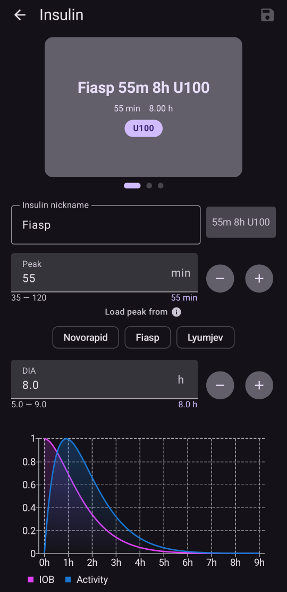

* recommended for FIASP
* DIA = at least 5.0h
* Peak = 55 minutes after injection (recommended default; loaded by the **Fiasp** preset)

(Config-Builder-lyumjev)=
#### Lyumjev

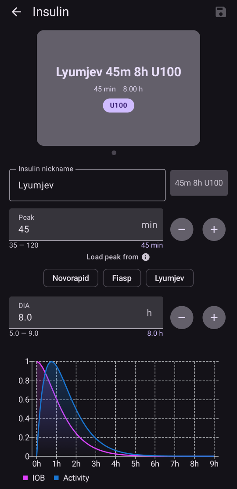

* special insulin profile for Lyumjev
* DIA = at least 5.0h
* Peak = 45 minutes after injection (recommended default; loaded by the **Lyumjev** preset)

#### Free Peak Oref

* In **AAPS** 4 there is no separate "Free-Peak Oref" insulin type: you can enter any **Peak** (35 to 120 minutes) directly in the [insulin editor](#Config-Builder-insulin), without using a **Load peak from** preset.
* The DIA can be set between 5 and 9 hours.
* A custom peak is recommended if an unbacked insulin or a mixture of different insulins is used.

(Config-Builder-insulin-dia)=
### Duration of insulin action (DIA) and peak

```{warning}
In looping, decreasing DIA or peak will always increase administered insulin. DIA works differently in AAPS than in commercial AID systems, and careless changes to these settings can change insulin dosing in a way which is much larger or smaller than expected.
```

AAPS models the timeline of insulin action with a mathematical formula, configured using **DIA** and the closely related **peak** settings. DIA is the theoretical duration until IOB reaches zero and peak is the point in time when the effect of insulin is strongest. This yields an IOB curve and an activity curve, which is simply the **rate** of IOB decay.

Consider that when AAPS is looping, it's normal to have periods of [zero-temping](#Open-APS-features-super-micro-bolus-smb). This missing basal insulin is fully subtracted from the IOB, explaining why IOB will in practice reach zero many hours earlier than the configured DIA. You can inspect [bolus IOB and basal IOB](#aaps-screens-iob-cob-basal-sens) separately from the main screen.

To configure DIA and peak, tap **Manage** in the main screen, and then tap **Insulin settings**. AAPS displays the active insulin configuration like this:

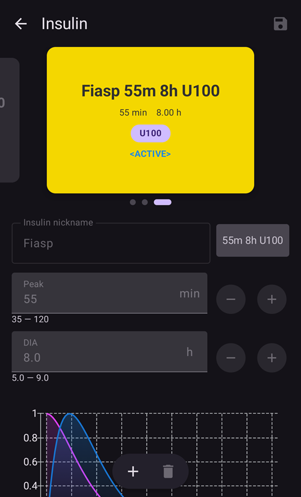

In this example, the peak setting is 55 minutes, DIA is 8 hours and [insulin concentration](#Insulin-Concentration) is the standard 100 IU/mL.

Due to the influence of zero-temping explained above and the formula used for IOB decay in AAPS, most users set a clearly higher DIA than in commercial systems. In general, many people find that a **DIA** of 9h works well for them. After you have more experience with AAPS and have a well-tuned profile, you can try to find personalized DIA and peak settings with the information below.

````{admonition} Details on the impact of DIA and peak configuration
:class: dropdown

Since the basal rate has an indirect influence on IOB decay in AAPS, it follows that too high basal rates can mask too high DIA, and vice versa. It makes sense to first carefully tune basal rates before adjusting DIA and peak. Additionally, consider that the DIA and peak settings interact, in the sense that the effect of DIA depends on peak, and vice versa.

These charts show the exact impact of DIA and peak on the IOB curves, across the range of allowed values.

Adjusting DIA:

```{image} ../images/iob_remaining_static_peak.png
:width: 400px
```

Adjusting peak:

```{image} ../images/iob_remaining_static_dia.png
:width: 400px
```

Finally, a comparison adjusting DIA and peak in parallel. The logic here is that both values are adjusted in the same relative amounts, so that `49/35 ~ 7/5`. Or similarly, `120/93 ~ 9/7`. The intervals will be consistent regardless of the baseline DIA or peak, as long as the relative change is the same for both.

```{image} ../images/iob_remaining_uniform.png
:width: 400px
```

Note that when DIA and peak are adjusted in this fashion, every point in the curve will shift by the same relative amount.

````

#### Further reading on DIA and peak configuration

* [Technical details and historical background from the AAPS predecessor, OpenAPS](https://openaps.readthedocs.io/en/latest/docs/While%20You%20Wait%20For%20Gear/understanding-insulin-on-board-calculations.html#understanding-the-new-iob-curves-based-on-exponential-activity-curves).
* [Why we are regularly wrong in the duration of insulin action (DIA) times we use, and why it matters…](https://www.diabettech.com/insulin/why-we-are-regularly-wrong-in-the-duration-of-insulin-action-dia-times-we-use-and-why-it-matters/) on Diabettech.
* [Exponential Insulin Curves + Fiasp](https://web.archive.org/web/20220630154425/http://seemycgm.com/2017/10/21/exponential-insulin-curves-fiasp/) on See My CGM (archive).
* [Revised Humalog model in a closed loop](https://bionicwookiee.com/2022/04/13/revised-humalog-model-in-a-closed-loop/) and other articles on Bionic Wookie, recommending a DIA of 9h for Lyumjev, Fiasp, NovoRapid, Humalog.

(Config-Builder-bg-source)=
## BG Source
Select the blood glucose source you are using. See [BG Source](../Getting-Started/CompatiblesCgms.md) page for more setup information.

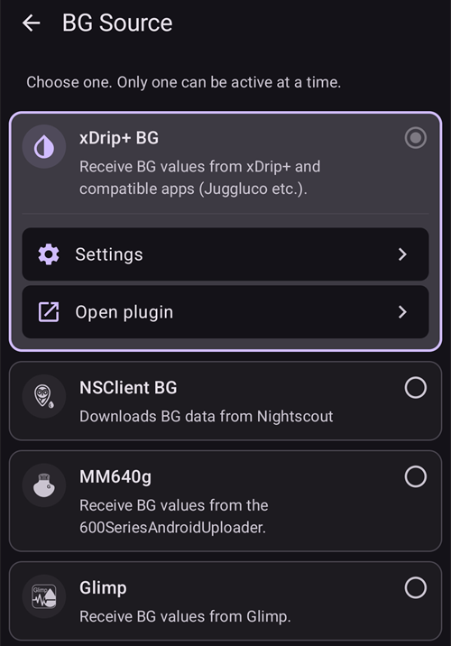

Scroll down to see the other sources:

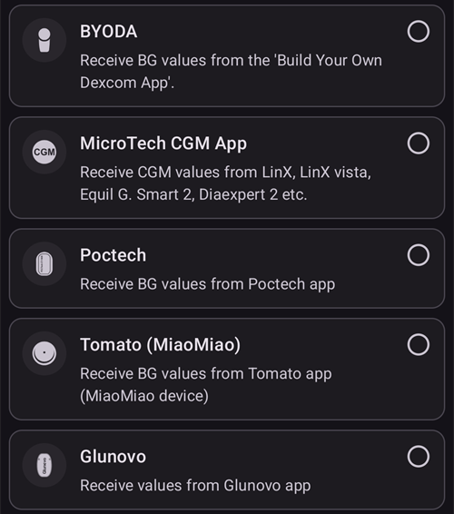

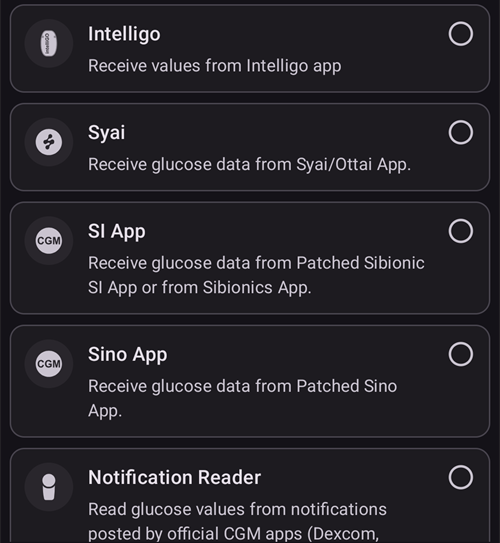

* [xDrip+ BG](../CompatibleCgms/xDrip.md) - also for compatible apps such as [Juggluco](../CompatibleCgms/Juggluco.md)
* [NSClient BG](../CompatibleCgms/CgmNightscoutUpload.md) - only if you know what you are doing, see [BG Source](../Getting-Started/CompatiblesCgms.md).
* [MM640g](../CompatibleCgms/MM640g.md)
* Glimp - only version 4.15.57 and newer are supported
* [BYODA (Build Your Own Dexcom App)](#DexcomG6-if-using-g6-with-build-your-own-dexcom-app).
* MicroTech CGM App - for the Aidex / LinX CGM
* [Poctech](../CompatibleCgms/PocTech.md)
* Tomato (MiaoMiao) - Tomato App for MiaoMiao device
* [Glunovo](https://infinovo.com/) - Glunovo App for Glunovo CGM system
* Intelligo - Intelligo App
* Syai - for the Syai and Ottai apps (see [Syai Tag](../CompatibleCgms/SyaiTagX1.md) and [Ottai](../CompatibleCgms/OttaiM8.md))
* SI App - patched SI App or Sibionics App for Sibionics CGM
* Sino App - patched app for Sinocare CGM
* Notification Reader - reads glucose values from the notifications shown by official CGM apps (Dexcom, Medtronic, Eversense, etc.)
* Instara - Instara App
* Random BG - generates random BG data for testing. It can only be enabled in an engineering (developer) build with the **Virtual Pump**, so in a normal **AAPS** installation it cannot be used.

## Smoothing

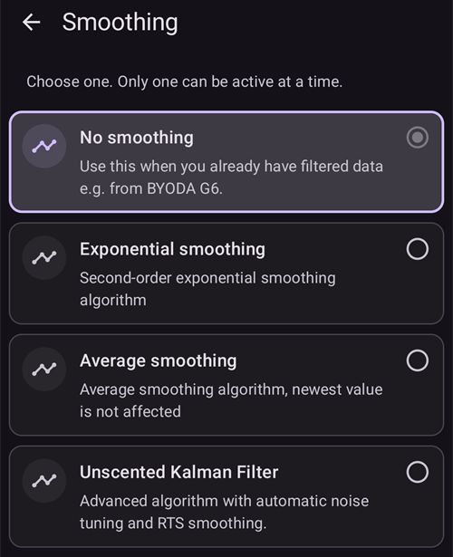

See [Smoothing blood glucose data](../CompatibleCgms/SmoothingBloodGlucoseData.md).

## Calibration

Choose how **AAPS** treats the values it receives from your sensor:

- **No calibration**: the sensor values are used as they are. Use this when the sensor is already factory-calibrated and accurate. This is the default.
- **Linear calibration**: **AAPS** corrects the sensor values with a slope and an offset that it computes from your fingerstick entries.

How **Linear calibration** works:

- It needs a **sensor change** to be logged, so that it knows when the sensor session started. The first 2 hours of a session are skipped as warm-up.
- It needs at least **2 fingerstick entries**. Recent entries count more than old ones.
- The correction is only applied when the result is in a safe range. If your entries are too close together, only the offset is corrected.
- **Open plugin** shows the status of the calibration, the slope and correction in use, and the list of fingerstick entries. You can add an entry with **Add calibration** and remove a wrong one.

```{admonition} Calibrate with care
:class: warning
A wrong fingerstick value leads to wrong glucose values and therefore to wrong insulin dosing. Wash your hands before measuring, and do not calibrate while your glucose is changing fast.
```

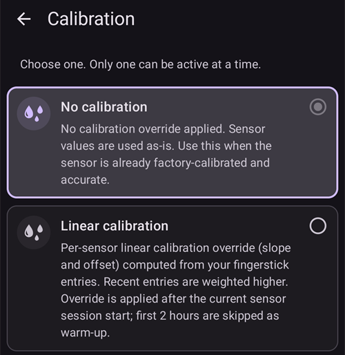

(Config-Builder-pump)=
## Pump
Select the pump you are using. See [Compatible pumps](../Getting-Started/CompatiblePumps.md) page for more setup information.

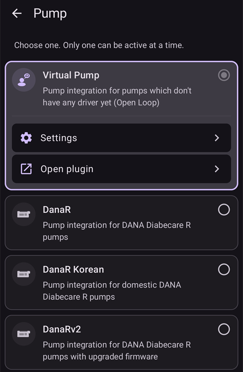

Scroll down to see all the pump drivers:


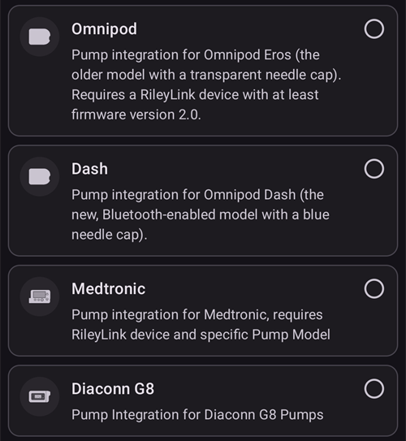

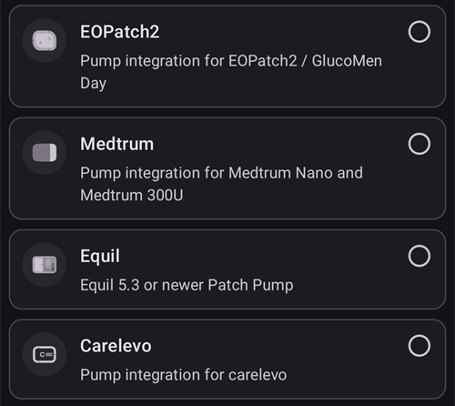

When you select another pump, **AAPS** asks you to confirm the change:

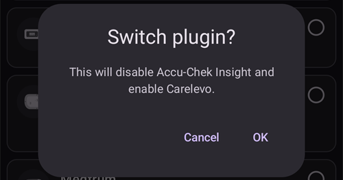

* [Dana R](../CompatiblePumps/DanaR-Insulin-Pump.md)
* Dana R Korean (for domestic DanaR pump)
* Dana Rv2 (DanaR pump with unofficial firmware upgrade)
* [Dana-i/RS](../CompatiblePumps/DanaRS-Insulin-Pump.md)
* [Accu Chek Insight](../CompatiblePumps/Accu-Chek-Insight-Pump.md)
* [Accu Chek Combo](../CompatiblePumps/Accu-Chek-Combo-Pump-v2.md)
* Omnipod for [Omnipod Eros](../CompatiblePumps/OmnipodEros.md)
* Dash for [Omnipod DASH](../CompatiblePumps/OmnipodDASH.md)
* [Medtronic](../CompatiblePumps/MedtronicPump.md)
* [Diaconn G8](../CompatiblePumps/DiaconnG8.md)
* [EOPatch2](../CompatiblePumps/EOPatch2.md)
* [Medtrum](../CompatiblePumps/MedtrumNano.md)
* [Equil 5.3](../CompatiblePumps/Equil5.3.md)
* [Carelevo](../CompatiblePumps/CareLevo.md)
* Virtual pump: open loop - **AAPS** suggestions only
  * as you make you first steps with **AAPS**, during the first [objectives](../SettingUpAaps/CompletingTheObjectives.md)
  * for pump which doesn't have any driver yet

(Config-Builder-sensitivity-detection)=

## Sensitivity Detection

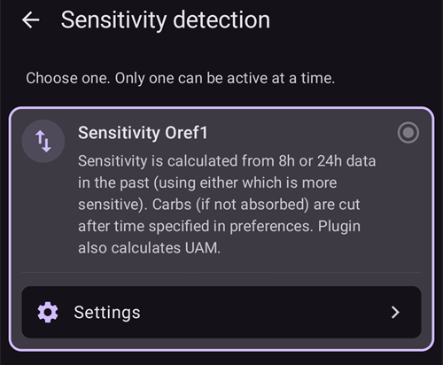

Select the type of sensitivity detection. For more details of different designs please [read on here](../DailyLifeWithAaps/SensitivityDetectionAndCob.md). This will analyze historical data on the go and make adjustments if it recognizes that you are reacting more sensitively (or conversely, more resistant) to insulin than usual. More details about how the sensitivity ratio itself is calculated can be found in [Key AAPS Features > Autosens](#Open-APS-features-autosens).

You can view your sensitivity on the main screen in an [additional graph](#AapsScreens-section-g-additional-graphs), by selecting SEN and watching the white line. Note, you need to be in [Objective 8](#objectives-objective8) in order to let Sensitivity Detection/[Autosens](#Open-APS-features-autosens) automatically adjust the amount of insulin delivered. Before reaching that objective, the Autosens percentage / the line in your graph is displayed for information only.

### Absorption settings
If you use Oref1 with **SMB** you must change **min_5m_carbimpact** to 8. The value is only used during gaps in **CGM** readings or when physical activity "uses up" all the blood glucose rise that would otherwise cause **AAPS** to decay COB. At times when [carb absorption](../DailyLifeWithAaps/CobCalculation.md) can't be dynamically worked out based on your blood's reactions it inserts a default decay to your carbs. Basically, it is a failsafe.

(Config-Builder-aps)=
## APS

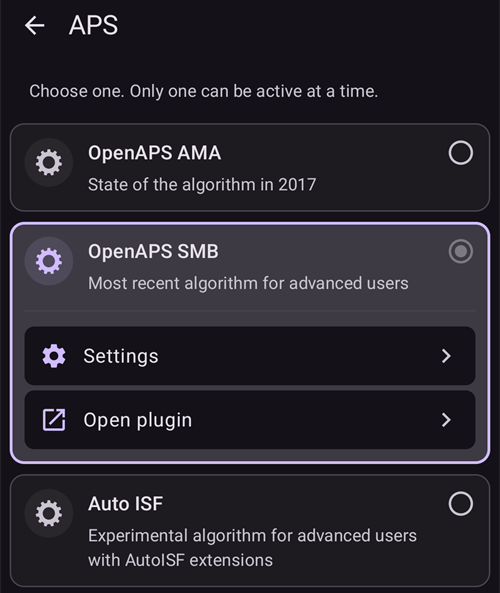

Select the desired APS algorithm for therapy adjustments. You can view the active detail of the chosen algorithm with **Open plugin**.
* OpenAPS AMA
  * Advanced Meal Assist: older algorithm not recommended anymore.
  * In simple terms, the benefits are after you give yourself a meal bolus, the system can high-temp more quickly IF you enter carbs reliably.
* [OpenAPS SMB](#Open-APS-features-super-micro-bolus-smb)
  * Super Micro Bolus: most recent algorithm recommended for all users.
  * In contrast to AMA, SMB does not use temporary basal rates to control glucose levels, but mainly small **Super Micro Boluses**.
  * Note : It is recommended to use this algorithm from the beginning, even though you will not actually get SMBs delivered until [Objective 9](#objectives-objective9).
* [Auto ISF](#Open-APS-features-auto-isf)
  * Experimental algorithm for advanced users. It is only listed once the objectives are completed.

If switching from AMA to SMB algorithm, _min_5m_carbimpact_ must be changed manually to **8** (default value for SMB) in [Preferences > Sensitivity detection > Sensitivity Oref1 settings](../SettingUpAaps/Preferences.md).

## Loop

This module should not be disabled as it is a core part of **AAPS**.

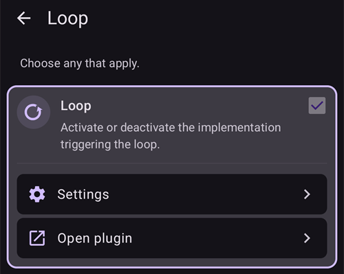

## Constraints

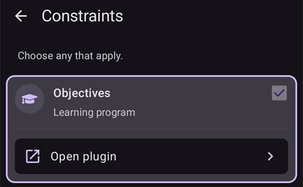

### Objectives

**AAPS** has a learning program (a series of objectives) that you have to fulfill step by step. This should guide you safely through setting up a closed loop system. It guarantees that you have set everything up correctly and understand what the system does exactly. This is the only way you can trust the system.

See [Objectives](../SettingUpAaps/CompletingTheObjectives.md) page for more information.

## Synchronization

In this section, you can choose if/where you want **AAPS** to send your data to. In **AAPS** 4 this category is called **Communication**.

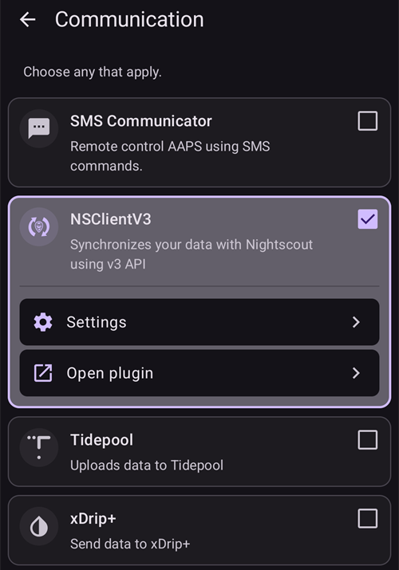

Scroll down to see the rest of the list:

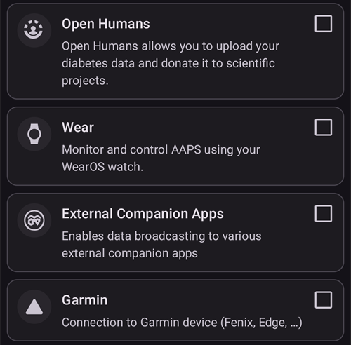

### NSClientV3

Can be used as a [reporting server](../SettingUpAaps/SettingUpTheReportingServer.md) and/or for [remote monitoring](../RemoteFeatures/RemoteMonitoring.md), [remote control](../RemoteFeatures/RemoteControl.md). 

See [Synchronization with the reporting server](#SetupWizard-synchronization-with-the-reporting-server-and-more) to set up NSClient synchronization.

### Tidepool

Can be used as a [reporting server](../SettingUpAaps/SettingUpTheReportingServer.md).

See [Tidepool](../SettingUpAaps/Tidepool.md).

### xDrip

Used to **send** data such as treatments to xDrip.

### Open Humans

See [Open Humans](../SupportingAaps/OpenHumans.md).

### Wear
Monitor and control **AAPS** using your Android WearOS watch (see [page Watchfaces](../WearOS/WearOsSmartwatch.md)).

### External Companion Apps

Broadcasts **AAPS** status data on the phone so that other apps installed on it can display it — for example watch or widget companion apps. The broadcast includes glucose and trend, IOB, COB, basal and temp basal, profile name, loop status, phone and pump battery, reservoir level and bolus progress. Enable it only if a companion app you use asks for this data.

In earlier versions this plugin was called **Samsung Tizen**, after the [Samsung Tizen watch app](#Watchfaces-tizen) it was first made for.

### Garmin

Connection to Garmin device (Fenix, Edge...)
## Treatments
Open the **menu** (☰) and select [Treatments history](#aaps-screens-treatments) to see the treatments that have been recorded. Should you wish to edit or delete an entry (e.g. you ate less carbs than you expected) then select 'Remove' and enter the new value (change the time if necessary) through the [carbs button on the main screen](#screens-bolus-carbs).

## General

In **AAPS** 4 the **General** category of **Configuration** only lists **Autotune**. The other features described below are always available and no longer need to be enabled here; each paragraph says where to find them.

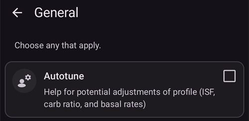

### Overview

This is the [main screen](#AapsScreens-the-homescreen) of **AAPS** and cannot be disabled.

#### Show notes field in treatment dialogs
Choose if you want to have a notes field when entering treatments or not.

#### Status lights
Choose if you want to have [status lights](#Preferences-status-lights) on overview for cannula age, insulin age, sensor age, battery age, reservoir level or battery level. When warning level is reached, the color of the status light will switch to yellow. Critical age will show up in red.

#### Advanced settings
**Deliver this part of bolus wizard result**: When using SMB, many people do not meal-bolus 100% of needed insulin, but only a part of it (e.g. 75 %) and let the SMB with UAM (unattended meal detection) do the rest. In this setting, you can choose a default value for the percentage the bolus wizard should calculate with. If this setting is 75 % and you had to bolus 10u, the bolus wizard will propose a meal bolus of only 7.5 units. 

**Enable super bolus functionality in wizard** (It is different from *super micro bolus*!): Use with caution and do not enable until you learn what it really does. Basically, the basal for the next two hours is added to the bolus and a two hour zero-temp activated. **AAPS looping functions will be disabled - so use with care! If you use SMB AAPS looping functions will be disabled according to your settings in ["Max minutes of basal to limit SMB to"](#Open-APS-features-max-minutes-of-basal-to-limit-smb-to), if you do not use SMB looping functions will be disabled for two hours.** Details on super bolus can be found [here](https://www.diabetesnet.com/diabetes-technology/blue-skying/super-bolus).

(Config-Builder-actions)=
### Actions

The Actions tab of **AAPS** 3.x no longer exists. Its buttons are now in the **Manage** sheet — see [Where did the Actions tab go?](#screens-action-tab).

### Automation

**Manage → Automation** lets you manage your [Automations](../DailyLifeWithAaps/Automations.md), starting at [Objective 10](#objectives-objective10).

(Config-Builder-sms-communicator)=
### SMS Communicator
Allows remote caregivers to control some **AAPS** features via SMS, see [SMS Commands](../RemoteFeatures/SMSCommands.md) for more setup information.

### Food
**Manage → Food** displays the food presets defined in the Nightscout food database, see [Nightscout Readme](https://github.com/nightscout/cgm-remote-monitor#food-custom-foods) for more setup information.

Note: Entries cannot be used in the **AAPS** calculator. (View only)

(Config-Builder-wear)=
### Wear
Monitor and control AAPS using your Android Wear watch (see [page Watchfaces](../WearOS/WearOsSmartwatch.md)). Enable **Wear** in **Configuration → Communication**:

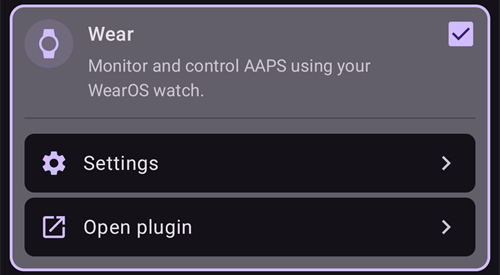

Use **Settings** to define which variables should be considered when calculating a bolus given through your watch (e.g. trend, COB...). If you want to bolus etc. from the watch, you need to enable "**Wear control**". See [Settings > Wear](#preferences-wear).

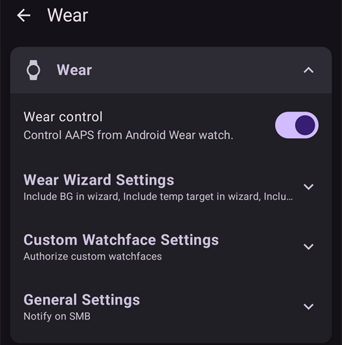

**Open plugin** shows the Wear screen:

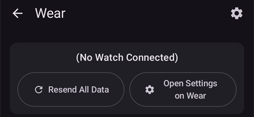

From this screen you can
* Resend all data.
Might be helpful if watch was not connected for some time and you want to push the information to the watch.
* Open settings on your watch directly from your phone.
* Choose which watchface **AAPS** installs on a **Wear OS 6** or newer watch (**Watchface installed on watch**: your custom watchface, or the complications watchface). See [the watchface AAPS installs](#wearos-aaps-v4-watchface).

(Config-Builder-autotune)=
### Autotune

You can enable Autotune, see [here](../AdvancedOptions/Autotune.md).

### Maintenance

Open the **menu** (☰) and select **Maintenance** to export / import settings and manage log files.

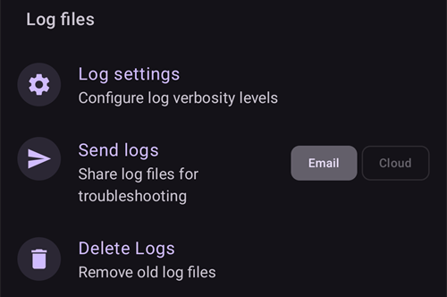

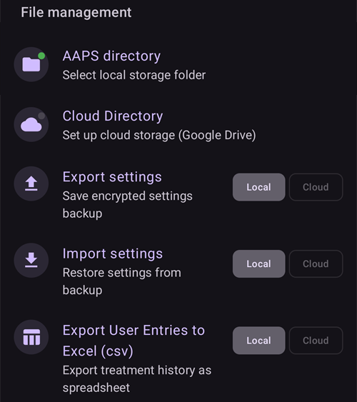

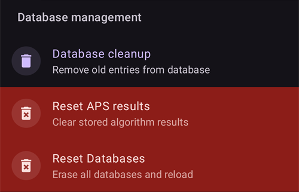

### Config Builder

Now called **Configuration**: this current page.