# AAPS Setup Wizard

```{contents} In this page
:backlinks: entry
:depth: 2
```

When you first start **AAPS** you are guided by the "**Setup Wizard**", to quickly setup all the basic configurations of your app in one go. **Setup Wizard** guides you, in order to avoid forgetting something crucial. For example, the **permission settings** are fundamental for setting up **AAPS** correctly.

However, it's not mandatory to get everything completely configured in the first run of using the **Setup Wizard** and you can easily exit the Wizard and come back to it later. There are three routes available after the **Setup Wizard** to further optimize/change the configuration. These will be explained in the next section. So, it's okay if you skip some points in the Setup Wizard, you can easily configure them later.

During, and directly after using the **Setup Wizard** you may not notice any significant observable changes in **AAPS**. To enable your **AAPS** loop, you have to follow the **Objectives** to enable feature after feature. You will start **Objective 1** at the end of the Setup Wizard. You are the master of **AAPS**, not the other way around.

```{admonition} Preview Objectives
:class: note
If you are keen to know the structure of the objectives, please read [Completing the objectives](../SettingUpAaps/CompletingTheObjectives.md) but then come back here to run the Setup Wizard first.

```

From previous experience, we are aware that new starters often put themselves under pressure to setup **AAPS** as fast as possible, which can lead to frustration as it is a big learning curve. 

So, please take your time in configuring your loop, the benefits of a well-running **AAPS** loop are huge.

```{admonition} Ask for Help
:class: note
If there is an error in the documentation or you have a better idea for how something can be explained, you can ask for help from the community as explained at [Connect with other users](../GettingHelp/WhereCanIGetHelp.md).
```
## Welcome message

When the Setup Wizard opens, it greets you with a short welcome message and immediately shows a "**Permissions Required**" panel at the bottom of the screen (see next section).

Once you have granted the permissions, the welcome screen shows a "**Next**" button. Press "**NEXT**" to continue:

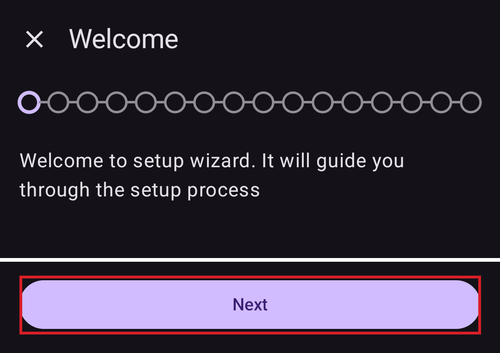

## Required permissions

**AAPS** needs a few permissions to operate correctly. The Wizard groups them on a single "**Permissions Required**" panel, each with its own "**Grant**" button. Grant them one by one — the icon next to each item turns into a tick once it is done.

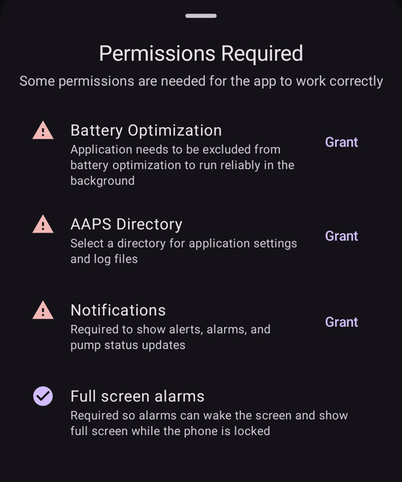

### Battery optimization

Battery consumption on smartphones is a consideration, as the performance of batteries is still quite limited. Therefore, the Android operating system on your smartphone is restrictive about allowing applications to run and consume CPU time, and therefore battery power.

However, **AAPS** needs to run regularly, _e.g._ to receive the glucose readings every few minutes and then apply the algorithm to decide how to deal with your glucose levels, based on your specifications. Therefore it must be excluded from battery optimization.

Press "**Grant**" next to "**Battery Optimization**", then select "**Allow**" on the "Let app always run in background?" dialog:

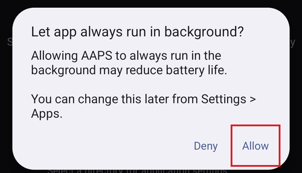

(SetupWizard-StoragePermission)=

### AAPS Directory

**AAPS** needs to store its settings and log information on the permanent storage of your smartphone. Permanent storage means that it will be available even after rebooting your smartphone. Other information is just lost, as it is not saved to permanent storage.

Press "**Grant**" next to "**AAPS Directory**". This opens the file system on your phone and lets you choose where **AAPS** stores its information.

```{tip}
Choosing the default AAPS directory is recommended.</br>
Do **not** select a subdirectory of AAPS.
```

The default directory is **AAPS**, but you can use any dedicated directory of your liking. Create the directory if necessary, enter it, choose "**USE THIS FOLDER**" and confirm with "**ALLOW**" that you wish to grant access to **AAPS** to the selected directory:

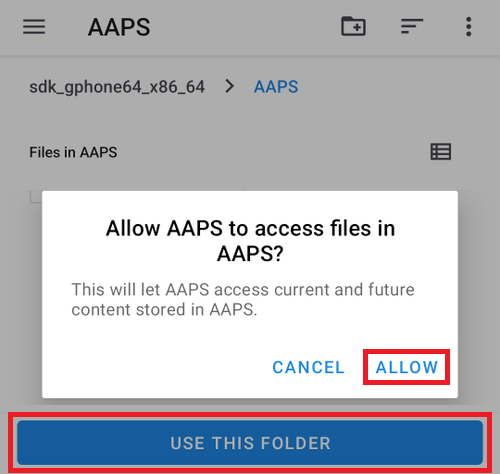

### Notifications

Android requires special permission for apps if they want to send you notifications.

While it is a good feature to disable notifications _e.g._ from social media apps, it is essential that you allow **AAPS** to send you notifications.

Press "**Grant**" next to "**Notifications**" and select "**Allow**" at the system prompt.

Once all three permissions show a tick, the "**Permissions Required**" panel is complete and you can press "**NEXT**" on the welcome screen to continue:

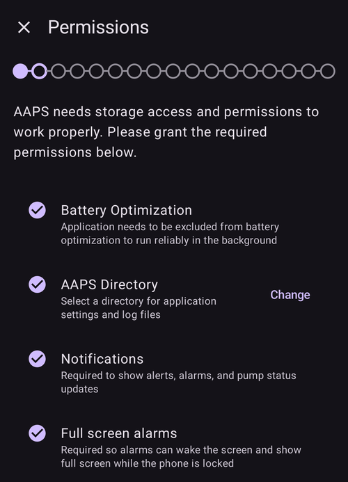

(setup-wizard-bluetooth-battery-optimisation)=
### Bluetooth battery optimization

```{admonition} Extra Android setting, not part of the Wizard
:class: note
The following is additional Android configuration done outside of the Setup Wizard. It is not one of the "Grant" buttons above, but it is important for a reliable pump connection.
```

Newer versions of Android have added battery optimization to the system Bluetooth application too.

As well as disabling battery optimization for **AAPS**, you will likely need to also disable this for the Bluetooth system app. Failure to do this may lead to pump connection dropouts and issues.

***NOTE: The xDrip documentation covers how to do this here: [xDrip documentation](https://navid200.github.io/xDrip/docs/BluetoothBatteryOpt.html)***

Follow these steps on Android 16; other versions will vary slightly from the provided screenshots:

1. Open Android settings and search for **Apps**, and open the Apps settings.

   

2. You will see the App settings, however we need to expand to see all apps, click on **See all apps** to expand.

   

3. As the Bluetooth app is a system app, it's hidden by default, so we need to show system apps. Click on the **three dots (hamburger)** on the top left (1). Then click on **Show System** (2).

   

4. Search for the `Bluetooth` app and click on `Bluetooth` and/or `Legacy Bluetooth` if both are present ensure the procedure is followed for both.  
   
   ***NOTE: It's safe to ignore the `Bluetooth MIDI Service` this is not used by AAPS***
   
       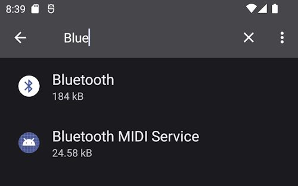    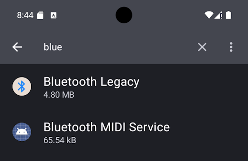   

   1. On Android 12 Click on `Battery`, Android 13+ Click on `App battery usage`,

   )   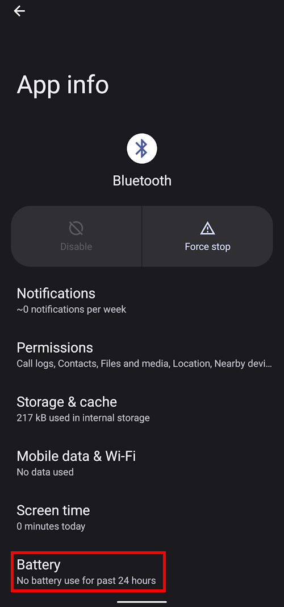

5. On Android 12+ select the `Unrestricted` option, on Android 15+ you need to expand the `Allow background usage` setting, click on the section highlighted in red to do this then follow step 6 to complete.

   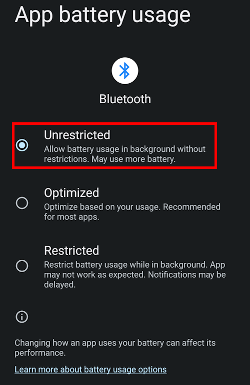    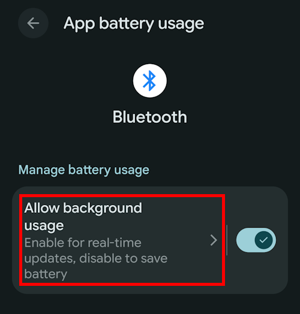

6. On Android 16 Select ``Unrestricted``

   

## License agreement

In the end user license agreement there is important information about the legal aspects of using **AAPS**. Please read it carefully.

If you don't understand, or can't agree to the end user license agreement please don't use **AAPS** at all!

If you understand and agree, please press the "**I UNDERSTAND AND AGREE**" button and follow the Setup Wizard:

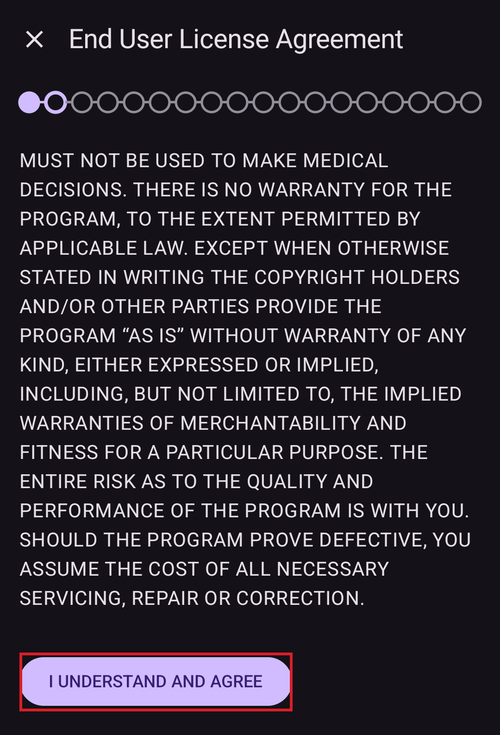

## Master password

As the configuration of **AAPS** contains some sensitive data (_e.g._ API_KEY for accessing your Nightscout server) it is encrypted by a password you set here.

The Wizard opens the "**Protection**" screen. Press "**Master password**" (shown as "Password not set"):

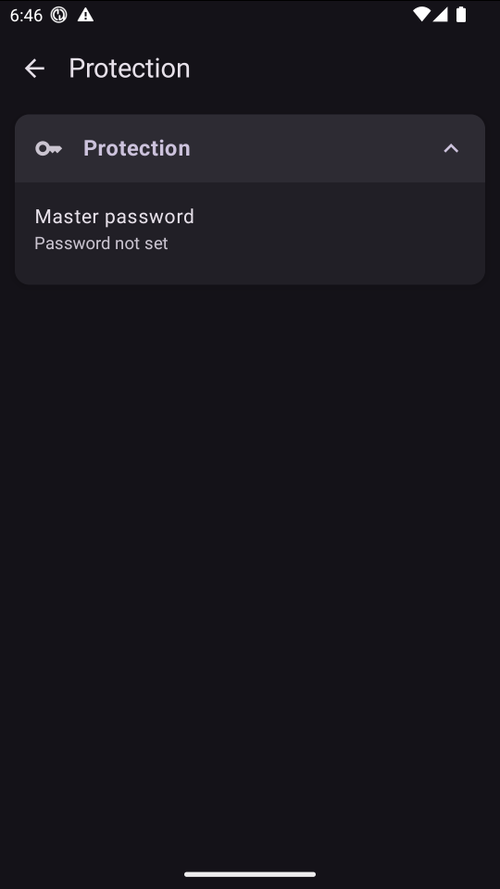

Enter the same password in both fields and press "**OK**":

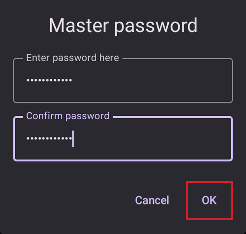

```{admonition} Do not lose your Master Password
:class: danger
Please **DO NOT LOSE YOUR MASTER PASSWORD**. Make a note of it _e.g._ on Google Drive, which is a good place as it is backed up by Google for you. Your smartphone or PC can crash and you may have no actual copy. If you forget your Master Password, it can be difficult to recover your profile configuration and progress through the **Objectives** at a later date.
```

When you are done, press "**NEXT**" to go to the next screen.

## Units (mg/dL <-> mmol/L)

Please select if your glucose values are in mg/dL or mmol/L, then press the "**NEXT**" button:

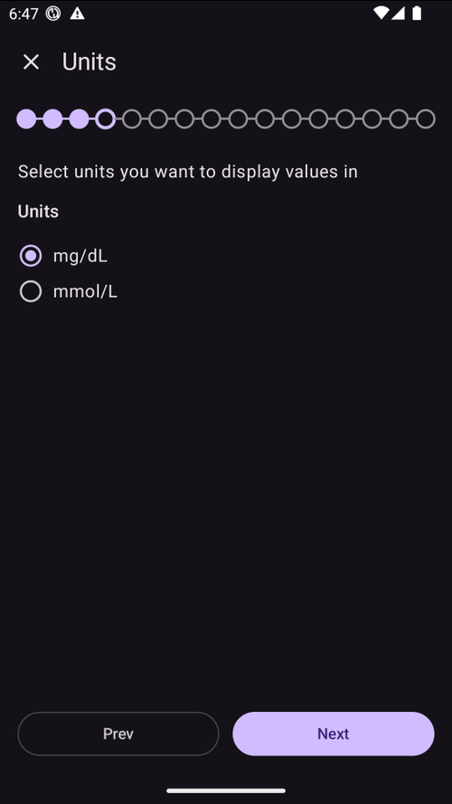

## Display Settings

Here you set the "**LOW mark**" and "**HIGH mark**" for the sensor glucose display. Glucose values between these two marks are shown as "in range". You can leave the default values (70 and 180 mg/dL) for now, and edit them later.

The values you choose only affect the graphical presentation of the diagram, and nothing else.

Your glucose target _e.g._ is configured separately in your profile.

Your range to analyze TIR (time in range) is configured separately in your reporting server.

Adjust the marks with the "−" / "+" buttons if needed, then press the "**NEXT**" button:

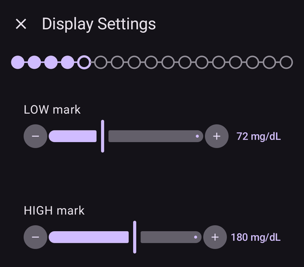

(SetupWizard-synchronization-with-the-reporting-server-and-more)=
## Communication

The "**Communication**" screen lists the plugins used to upload, synchronize and broadcast your data:

- **SMS Communicator** – remote control of **AAPS** using SMS commands
- **NSClientV3** – synchronizes your data with Nightscout using the v3 API
- **Tidepool** – uploads data to Tidepool
- **xDrip** – sends data to xDrip
- **Open Humans** – upload and donate your diabetes data to scientific projects
- **Wear** – monitor and control **AAPS** from a WearOS watch
- **External Companion Apps** – data broadcasting to various external apps
- **Garmin** – connection to a Garmin device

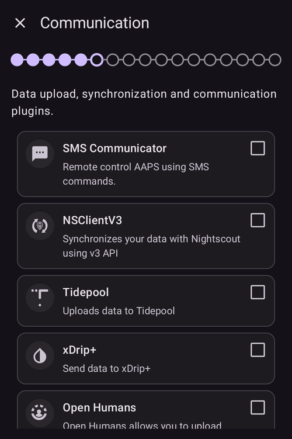

Scroll down to see the rest of the list:

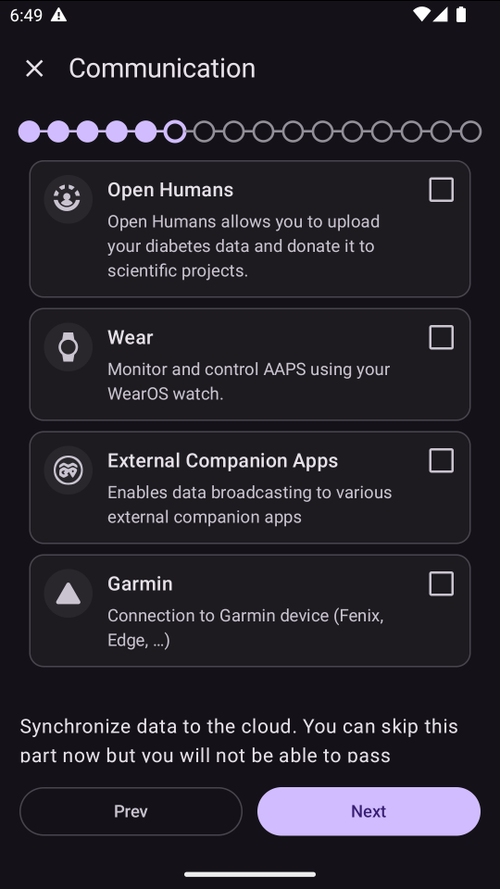

You could configure several of these now, but for the first run we will just focus on the reporting server. If you are not able to set it up at the moment, skip it for now — you can configure it later.

In this example we use Nightscout as reporting server. Tick the box on the right of "**NSClientV3**" to enable it. For Tidepool it is even simpler, as you only need your personal login information.

Once enabled, press "**Settings**" below NSClientV3 to configure it:

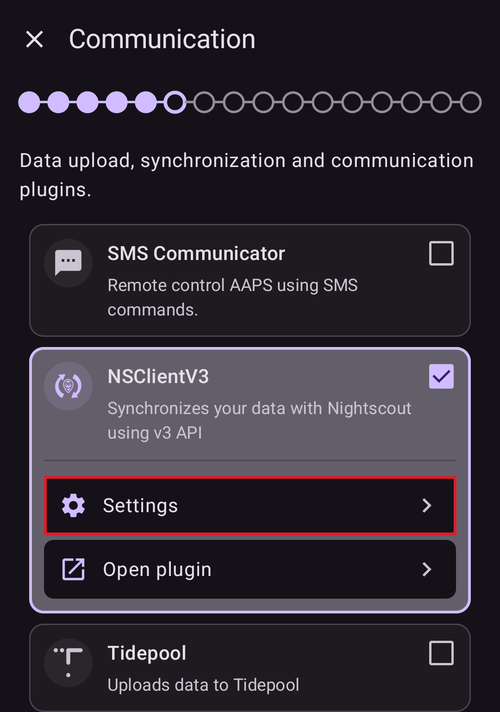

Here you configure the Nightscout reporting server. The NSClientV3 settings are shown as one scrollable page:

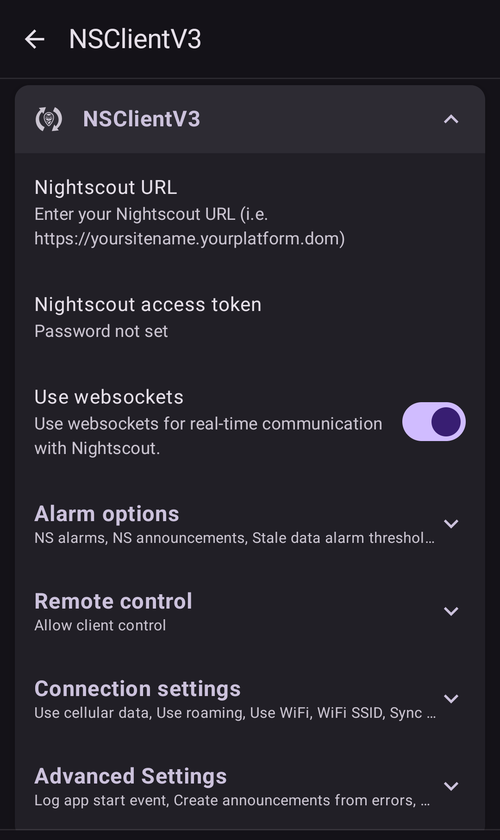

Press "**Nightscout URL**" and enter your personal Nightscout server address (the URL you set up yourself, or were given by your service provider). Confirm with "**OK**".

Press "**Nightscout access token**" and enter the access token for your Nightscout server. Without this token, access will not work. If you don't have it yet, please check the documentation for setting up the reporting server.

Leave "**Use websockets**" enabled for real-time communication with Nightscout.

The remaining sections can be left at their defaults for now. They are described here so you know where to find them later:

**Alarm options** — Nightscout alarms, announcements and stale-data thresholds. Leave the switches off for now; we only open them so you are aware of the options.

**Connection settings** — choose how data is transferred. Caregivers must enable "**Use cellular data**", otherwise the phone of the person they care for (_e.g._ a child) cannot upload outside Wi-Fi range, _e.g._ on the way to school. Other users can disable cellular transfer to save data or battery. If in doubt, leave everything enabled.

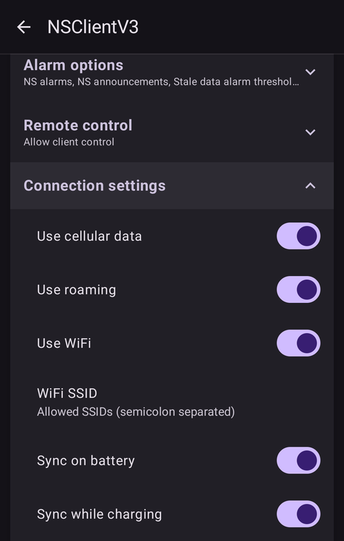

**Advanced Settings** — enable "**Log app start event**" if you want to see in Nightscout when the app restarts (useful for caregivers). Keep "**Create announcements from errors**" and "**Create announcements from carbs required**" enabled. Leave "**Use slow sync**" off; you would only use it if the Nightscout server is slow to process a large amount of data.

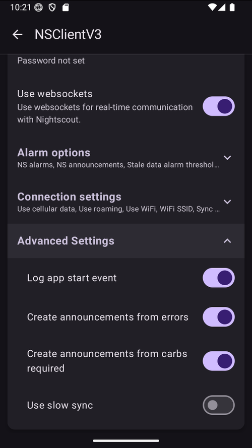

Go back to the list of plugins and press "**NEXT**" to go to the next screen.

## Name

Here you set a name to identify this **AAPS** instance. It is shown in reports and when synchronizing.

It can be anything. It's just for differentiating users.

Press "**NEXT**" to go to the next screen.

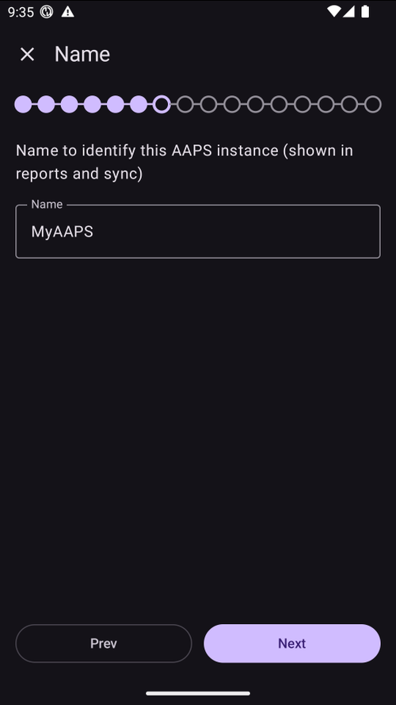

## Patient type

Here you select your "Patient type" which is important, as the **AAPS** software has different limits, depending on the age of the patient. This is important for security and safety reasons.

Here is where you also configure the **maximum allowed bolus** for a meal. That is, the largest bolus you need to give to cover your typical meals. It's a security feature to help avoid accidentally overdosing when you are bolusing for a meal.

The second limit is similar in concept, but relates to the max carbohydrate intake you expect.

After setting these values, press "**NEXT**" to go to the next screen:

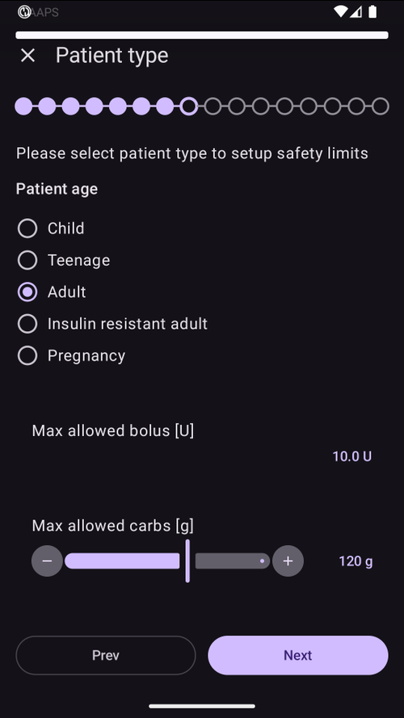

## Insulin

Here you configure the insulin used in your pump. New insulin profiles require a **DIA of at least 5 h** (a DIA of 5–6 h on a new profile is equivalent to a DIA of 3 h on the old insulin profiles).

Press the "**Insulin**" button to open the insulin editor:

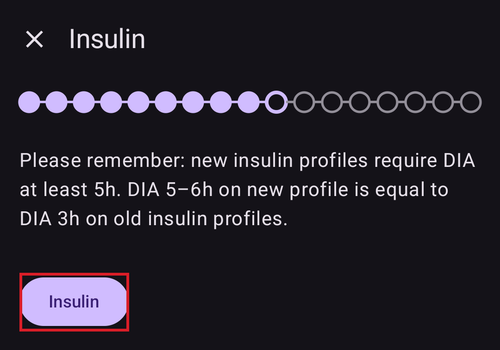

In the editor you can give the insulin a **nickname** and set its **Peak** (in minutes) and **DIA** (in hours). The quickest way is to load a preset with "**Load peak from**" — choose **Novorapid**, **Fiasp** or **Lyumjev** — and the peak is filled in for you. The graph at the bottom previews the resulting insulin activity curve.

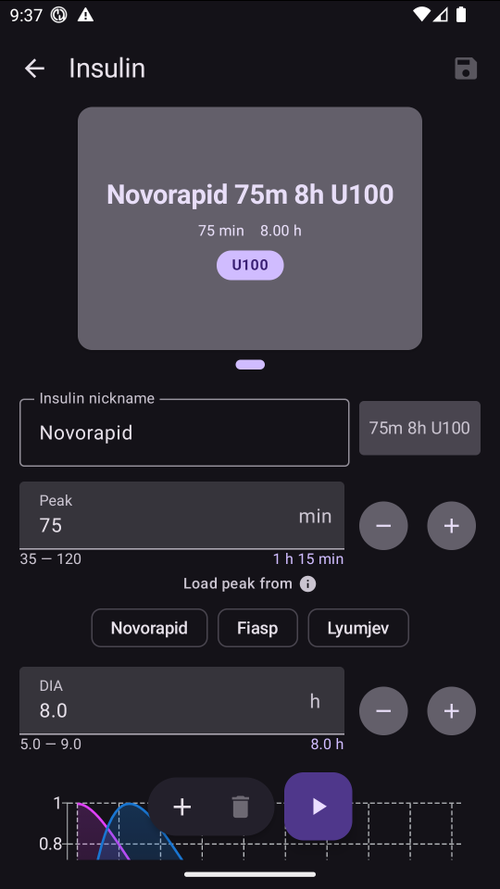

```{admonition} Don't change the peak unless you know what you are doing
:class: danger
For advanced users or medical studies it is possible to define a customized insulin activity profile. Please don't change the peak unless you are an expert — usually the preset values work well for each branded insulin.
```

Pick the preset that matches your insulin, for example **Fiasp**:

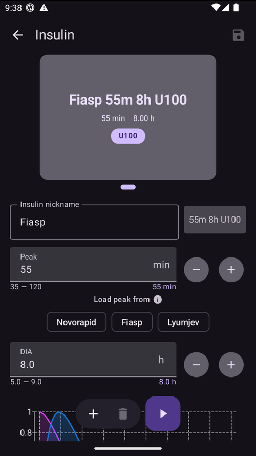

```{admonition} "Insulin configuration changed" dialog
:class: note
If a paired client (_e.g._ another phone) has changed the insulin configuration, a dialog appears. Press **OK** to load their changes, or **Cancel** to keep editing (your next save will overwrite theirs).
```

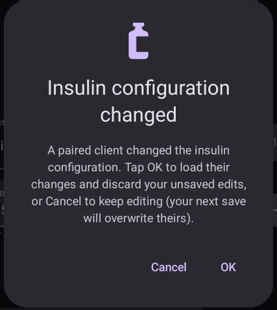

Press the save icon (top right), then press "**NEXT**" to go to the next screen.

## Blood sugar source

Here you select where **AAPS** gets its glucose data from. Please read the documentation for your [BG source](../Getting-Started/CompatiblesCgms.md).

Many sources are available — scroll through the list and select the one you use:

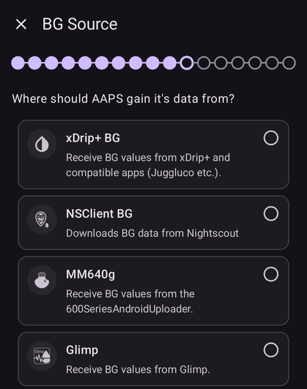

Once you select a source, a "**Settings**" button appears below it (when the source has settings to configure). Open it if you need to adjust how the data is received, _e.g._ to upload your glucose values to your reporting server:

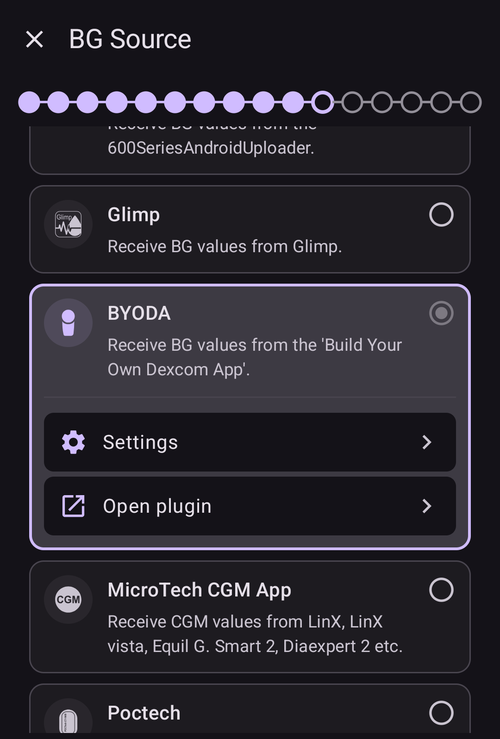

After making your selection, press "**NEXT**" to go to the next screen.

(setup-wizard-profile)=
## Profile

Now we are entering a very important part of the Setup Wizard.

Please read the documentation about [profiles](../SettingUpAaps/YourAapsProfile.md) before you try to enter your profile details on the following screen.

```{admonition} Working profile required - no exceptions here !
:class: danger
An accurate profile is necessary to control the safe action of **AAPS**.

It's required that you have determined and discussed your profile with your doctor, and that it has been proven to work by successful basal rate, ISF and IC testing!

If a robot has an incorrect input it will fail - consistently. **AAPS** can only work with the information it is given. If your profile is too strong, you risk hypoglycemia, and if it is too weak, you risk hyperglycemia. 
```

Press the "**Profile**" button to open the profile editor:

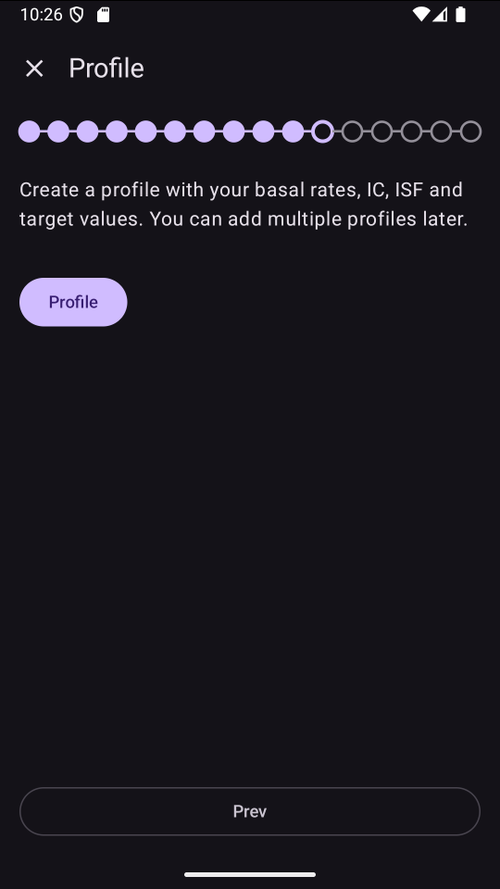

The editor opens empty ("No records available"). Press the "**+**" button at the bottom to create a new profile:

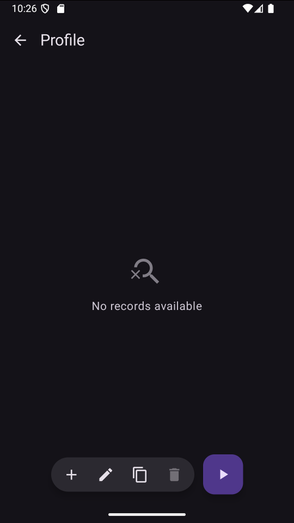

You can have several profiles in the long-term if needed. We only create one here.

```{admonition} Profile only for tutorial - not for your usage
:class: note
The example profile here is only to show you how to enter data.

It is not intended to be an accurate profile or something very well optimized, because each person's needs are so different.

Don't use it for actually looping!
```

The new profile (for example "**LocalProfile1**") has four tabs: **IC**, **ISF**, **BAS** and **TARG**. Press the pencil next to the profile name to rename it. Fill in every tab — a red error message is shown until a tab contains valid values.

Press "**IC**" and enter your [IC](#your-aaps-profile-insulin-to-carbs-ratio) values. Use the "**+**" button to add more time blocks:

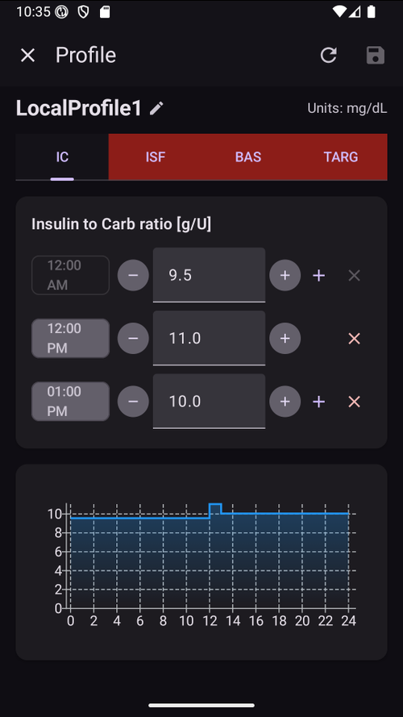

Press "**ISF**" and enter your [ISF values](#your-aaps-profile-insulin-sensitivity-factor):

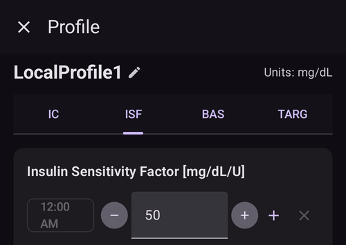

Press "**BAS**" and enter your [basal values](#your-aaps-profile-basal-rates):

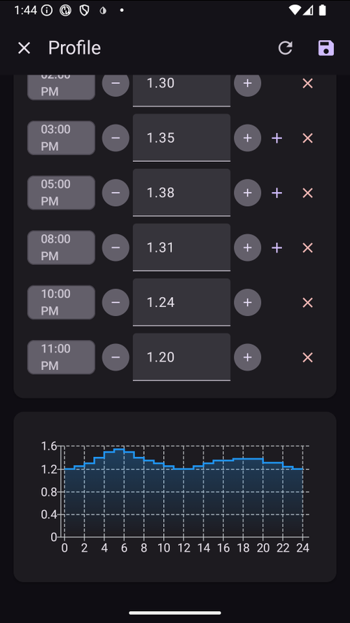

Press "**TARG**" and enter your blood sugar target values.

For open looping this target can be a wider range, as otherwise **AAPS** notifies you permanently to change the temporary basal rate or another setting, which can be exhausting.

Later, for closed looping, you will generally have only one value for top and bottom. That makes it easier for **AAPS** to hit the target and give you better overall diabetes control.

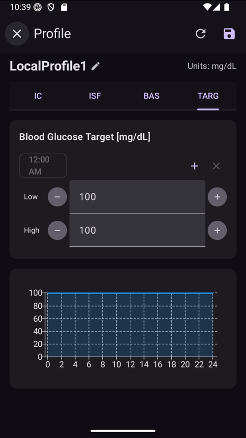

Save the profile with the **save icon** (top right). The profile summary then shows its name, units and the IC/ISF graphs:

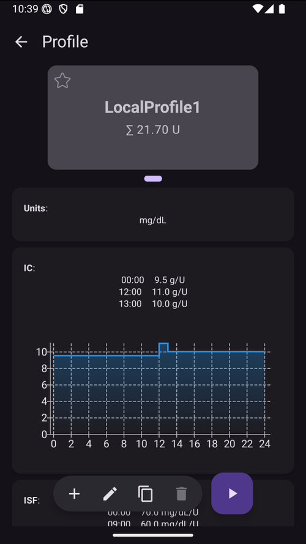

```{admonition} Several defined but only one active profile
:class: note
You can have several profiles defined, but only one activated profile running at any given time.
```

Press the "**▶**" (activate) button at the bottom right. On the "**Activate**" screen, leave the percentage at 100 % and press "**Activate**":

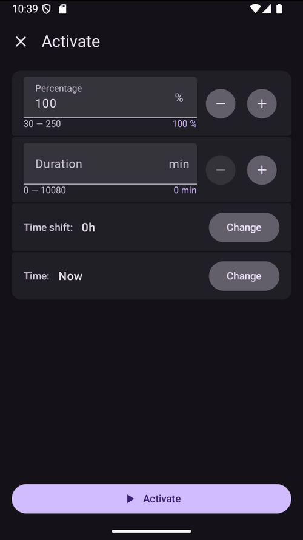

A profile switch dialog appears. In this case let it stay as preset and confirm with "**OK**":

```{admonition} Profile switch dialog
:class: note
You will learn later how to use this general dialog to handle situations like illness or sport, where you need to change your profile to suit the circumstances.
```

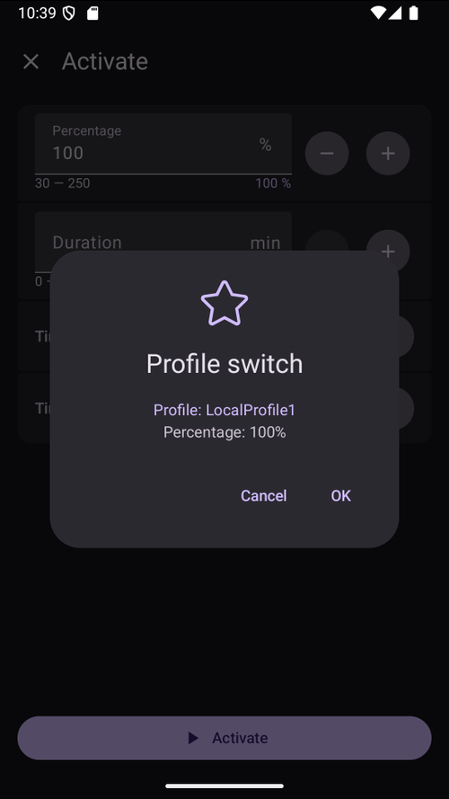

Your profile is now active. Press "**NEXT**" to go to the next screen.

## Insulin pump

Now you select your insulin pump. Please read the documentation for your [insulin pump](../Getting-Started/CompatiblePumps.md).

Scroll the list and select your pump. In this example we use the "**Virtual Pump**", which is useful while you are still learning and have not connected a real pump yet:

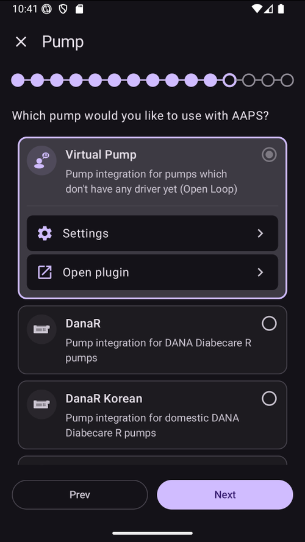

Many pumps are supported — scroll down to find yours:

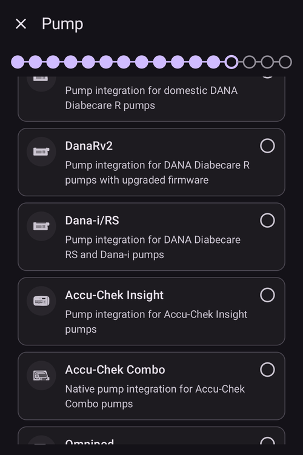

If the pump you select communicates over Bluetooth, **AAPS** asks for permission to connect to nearby devices once you finish the Wizard (see [Bluetooth permission](#bluetooth-permission)).

If you have already set up your profile and know how to connect your pump, feel free to connect it now. Otherwise leave it on **Virtual Pump** for the moment — you can change it anytime, or leave the Setup Wizard using the arrow in the top left corner and let **AAPS** first show you some blood glucose values.

Press "**NEXT**" to go to the next screen.

## APS algorithm

Use the OpenAPS SMB algorithm as your APS algorithm. Despite the name, the SMB feature of the algorithm is disabled until you are familiar with AAPS and have worked through the first objectives. OpenAPS SMB is newer and generally better than OpenAPS AMA anyway.

SMB is disabled at the start because the SMB feature reacts faster to a blood sugar increase, using a Super Micro Bolus instead of increasing the basal rate percentage. Because your profile is generally not as good in the beginning as it is after some experience, the feature is disabled at first.

```{admonition} Only use the older algorithm **OpenAPS AMA** if you know what you are doing
:class: note
OpenAPS AMA is the most basic algorithm which does not support micro boluses to correct high values. There might be circumstances where it is better to use this algorithm but it is not the recommendation.
```

Select "**OpenAPS SMB**", then press "**Settings**" to see the details:

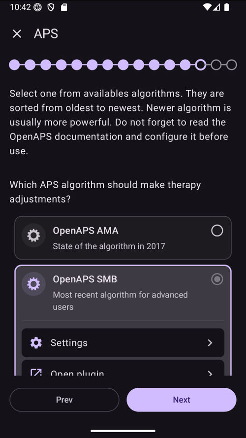

The only option here is "**Use dynamic sensitivity**". Leave it off and change nothing for now — just read the text.

Due to the limitations which are imposed by the **Objectives** you can't use either "closed loop" or "SMB features" at the moment anyway.

Go back and press "**NEXT**" to go to the next screen:

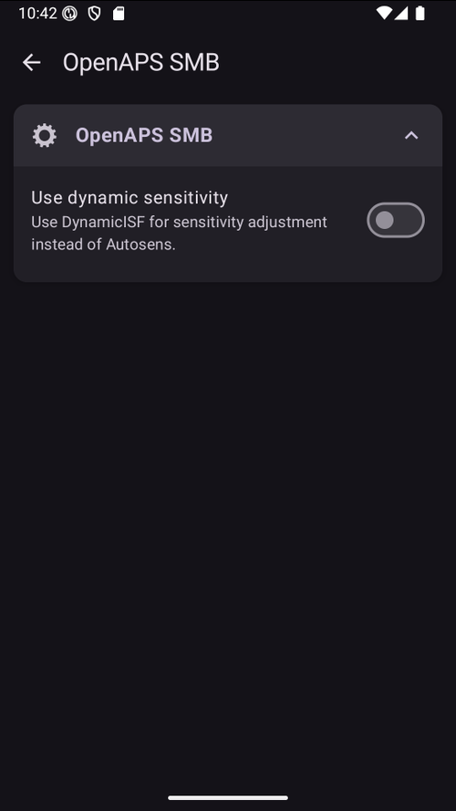

## Sensitivity detection

Leave "**Sensitivity Oref1**" selected as the standard sensitivity plugin:

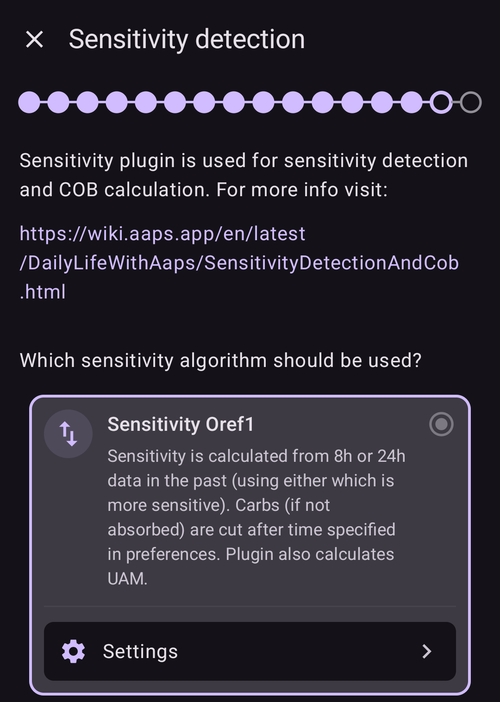

If you press "**Settings**" you can review the absorption settings; the defaults (_e.g._ a 6 h absorption cutoff) are fine for now.

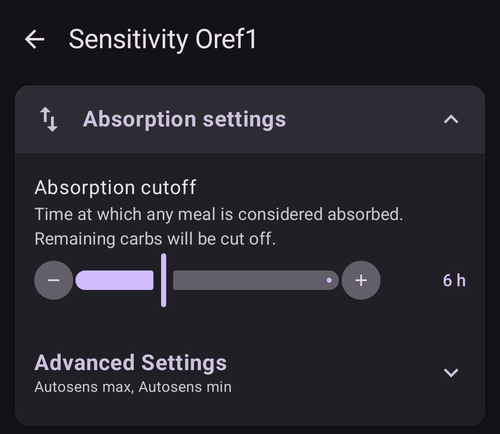

Press "**NEXT**" to go to the next screen.

## Start Objective 1

You are now entering the Objectives — the qualification for access to further **AAPS** features.

Press "**Open Objectives**":

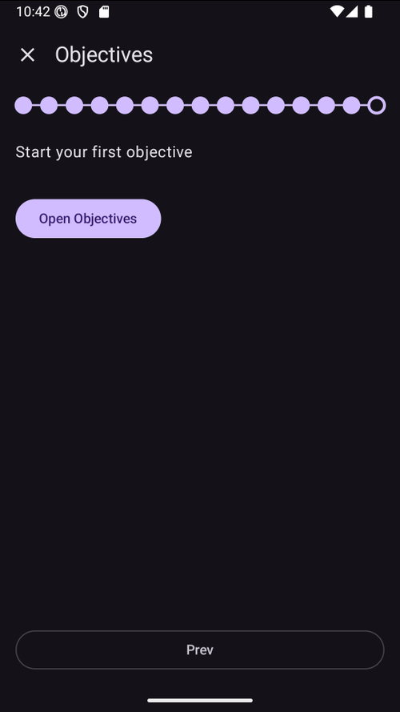

Here we start Objective 1, even if at the moment our setup is not completely ready to successfully complete this Objective. But this is the start.

Press the "**Start**" button next to "**1. Objective**":

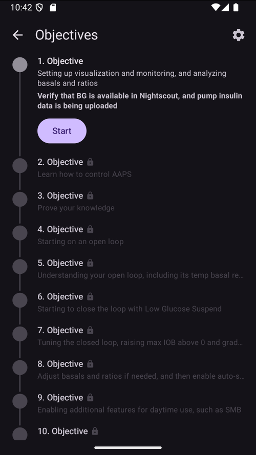

The objective expands to show its individual checks. You can see that you already made some progress, while other items are still to be done:

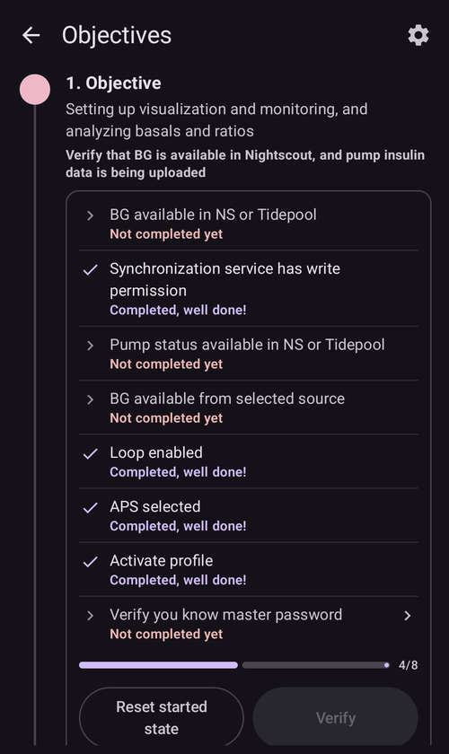

Go back, then press "**FINISH**" to complete the Setup Wizard:

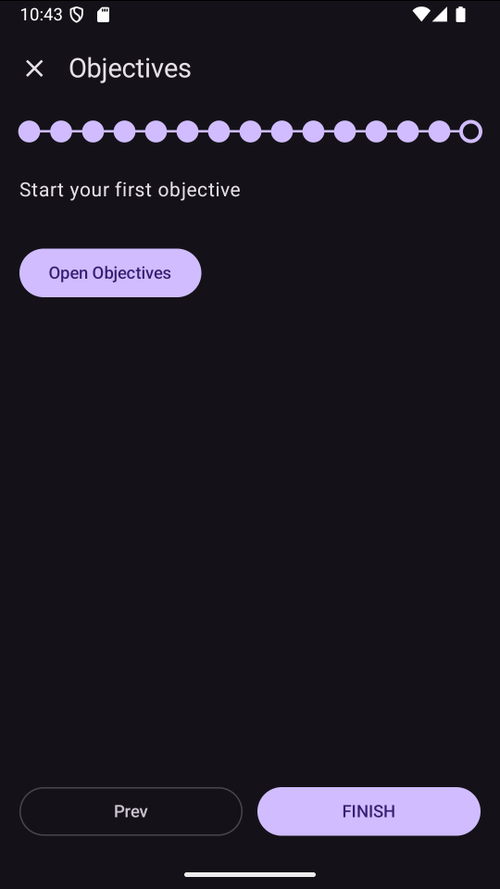

After pressing "**FINISH**" you arrive at the home screen of **AAPS**. You may see an information message confirming the profile switch you just made — tap "**SNOOZE**" to dismiss it.

If you accidentally leave the Setup Wizard at any point, you can either simply re-start the Wizard, or change the [configuration of the AAPS loop](../SettingUpAaps/ChangeAapsConfiguration.md) manually. 

## Bluetooth permission

If you select a pump that connects over Bluetooth (for example **Dash**), a banner reminds you that **AAPS** needs Bluetooth permission. You can press "**Dismiss**" for now — the permission is granted after you finish the Wizard:

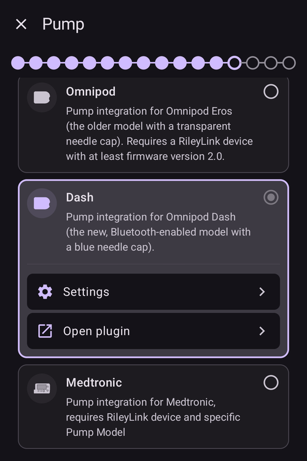

Once the Setup Wizard is finished, the **AAPS** home screen shows a "**Permissions Required**" panel. The first three permissions are already granted; press "**Grant**" next to "**Bluetooth**":

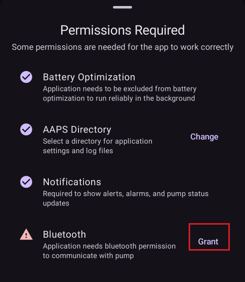

Select "**Allow**" so **AAPS** can find and connect to your pump:

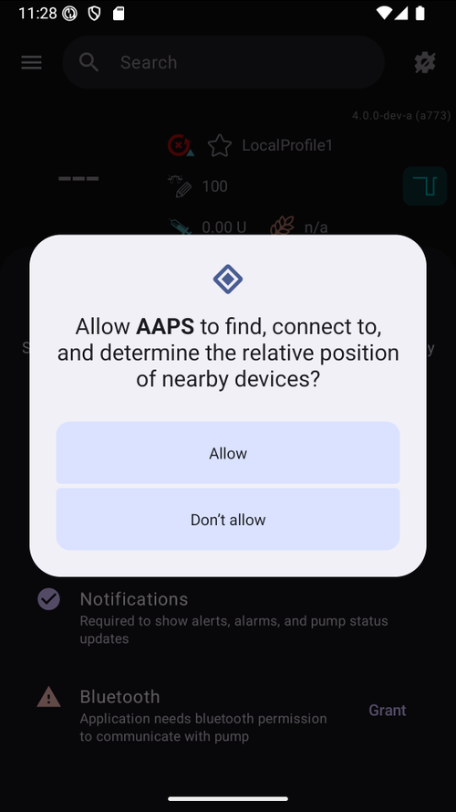

If your **AAPS** loop is now fully setup, please move on to the next section ["Completing the objectives"](../SettingUpAaps/CompletingTheObjectives.md).
