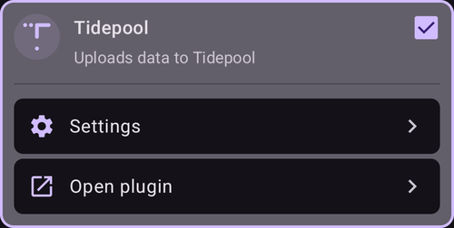
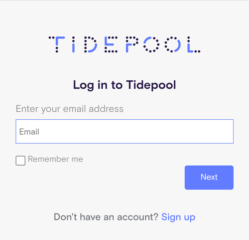
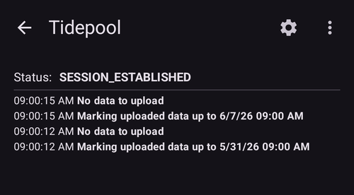

# Tidepool

Tidepool is a third party tool that collects data regarding BG, insulin and carbs and can be used to analyze and share this data with your clinical team. Since AAPS version 3.2 it can be used as an alternative to Nightscout for satisfying part of Objective 1. It can also be used in combination with Nightscout as an alternative reporting platform that integrates well with clinical settings. This may be the desired option for children using AAPS who want to have the remote monitoring and control capabilities of Nightscout, but want a reporting platform that their clinical team are more comfortable with.

It is important to understand that Tidepool is for reporting only. It is NOT a real-time follow app. If you need to have followers apart from the main AAPS phone, you must set up Nightscout as well.

Note: the Tidepool organization has brought the iOS Loop product to market with FDA approval. This effort has nothing to do with their data reporting platform or AAPS.

## Step 1 - Set up a Tidepool account

- Navigate to [tidepool.org](https://www.tidepool.org/)

- Select “Personal Sign Up” or “Sign Up”

- Create and document an email and password

- Select “Personal Account” and click “Continue”

- Complete the patient information section and accept the terms of use

- Verify your email address via the instructions received to your email

## Step 2 - Connect AAPS to Tidepool

- Open the **menu** (☰) in the top-left corner of the main screen and select "**Configuration**"

- Open the "**Communication**" category and enable "**Tidepool**":

- Tap "**Open plugin**" underneath Tidepool, then open the **⋮ menu** in the top-right corner and select "**Login**"

- A browser window opens on the Tidepool login page. Log in with the email address and password you created in Step 1 above:

- After a successful login the browser closes and the Tidepool screen shows the status "**SESSION_ESTABLISHED**"; the log below documents the data uploads. If the login fails, confirm your credentials are correct and that you have verified your email address with Tidepool.

- In the "**Settings**" of the Tidepool plugin, open "**Connection settings**" and set based on your personal preferences (Wi-Fi only, while charging, ...)

For more assistance on how to use your data once it is uploaded to Tidepool please visit: [https://www.tidepool.org/viewing-your-data](https://www.tidepool.org/viewing-your-data) 
