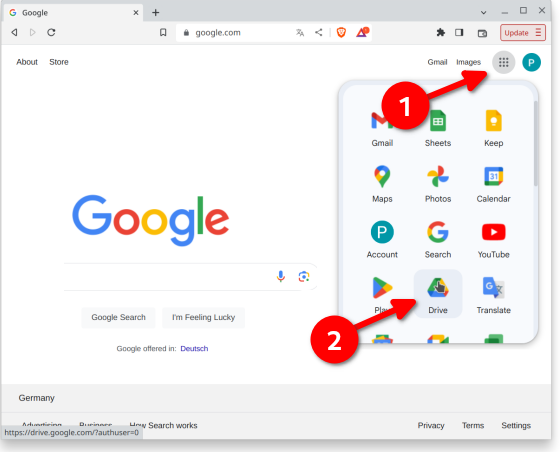
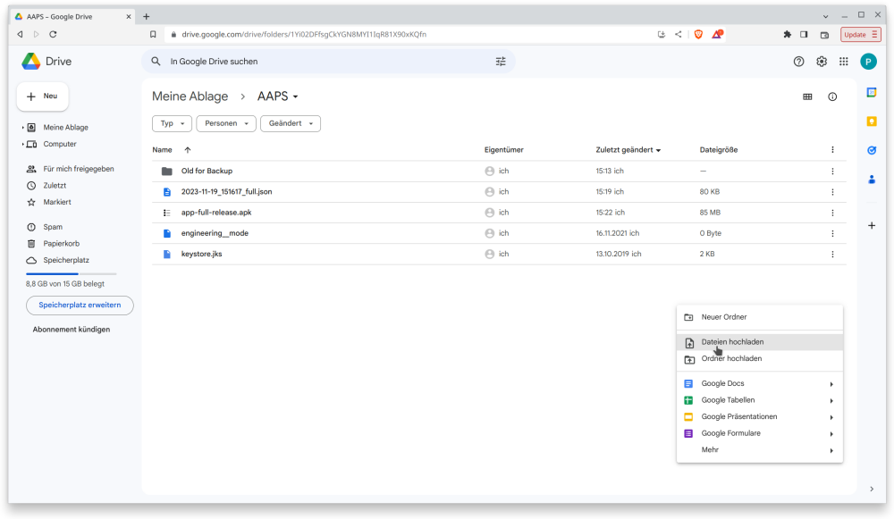
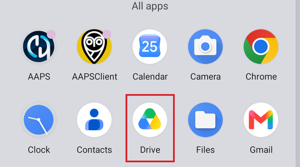
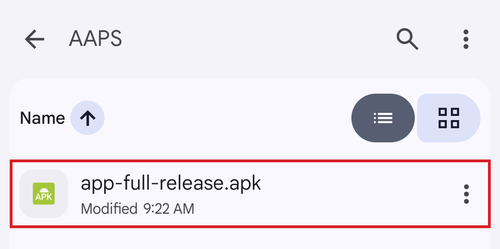
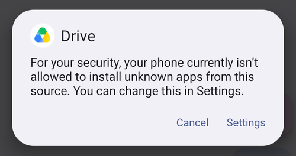
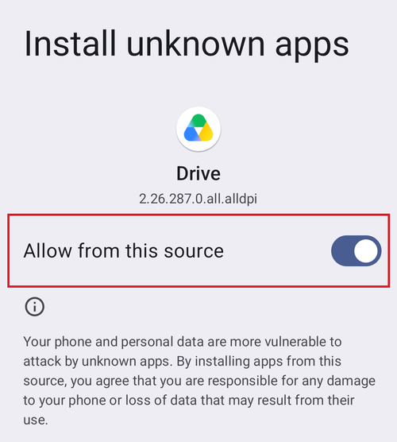

# Transferring and Installing AAPS on your smartphone

In the previous section, [building **AAPS**](../SettingUpAaps/BuildingAaps.md), you built the **AAPS** app (which is an .apk file) on a computer. 

The next steps are to **transfer** the **AAPS** APK file (as well as other apps you may need, like BYODA, xDrip or another CGM receiver app) to your Android smartphone, and then **install** the app(s). 

Following installation of **AAPS** on the smartphone, you will then be able to move onto [**configuring the AAPS loop**](../SettingUpAaps/SetupWizard.md).

There are several ways to transfer the **AAPS** APK file from your computer to the smartphone. Here we explain two different ways: 

* Option 1 -  Use your Google drive (Gdrive)
* Option 2 -  Use a USB cable

Please note that transfer by email might cause difficulties, and is discouraged.

```{admonition} Android developer verification
:class: warning
Google is rolling out [Android developer verification](#android-developer-verification) from September 2026 (starting in Brazil, Indonesia, Singapore and Thailand; worldwide in 2027). Where it is enforced, installing an APK by tapping the file — as described in both options below — is blocked. In that case, install with [ADB](#android-developer-verification-adb) or one of the other free methods explained on that page.
```

## Option 1. Use Google drive to transfer files

Open [Google.com](https://www.google.com/) in your web browser and login to your Google Account.

On the right upper side select the Drive app in the Google menu.



Right click in the free area below the files and folders in the Google Drive app and select "Upload File".



The apk file should now be uploaded on Google Drive.


### Use the Google Drive app to execute the apk file for installation

Switch to your mobile and start the Google Drive app. It is a preinstalled app and can be found where the other Google apps are located or with search for the name of the app.



Launch the apk installation by tapping the filename in the Google Drive App on the mobile.



In case you get a security notice that you are not allowed to install apps from Google Drive at the moment, tap "Settings" and allow it for that short moment, then disallow it afterwards, as it is a security risk to leave it enabled all the time.





After the installation finishes, you are done with this step.

You should see the **AAPS** icon and be able to open the app.

```{warning}
**IMPORTANT SAFETY NOTICE**
Did you remember to disallow the installation from Google Drive?
```

Please go on with [configuring the AAPS loop](../SettingUpAaps/SetupWizard.md).

## Option 2. Use a USB cable to transfer files
The second way to transfer the AAPS apk file is with a  [USB cable](https://support.google.com/android/answer/9064445?hl=en).

Transfer the file from its location on your computer to the "downloads" folder on the phone. 

On your phone, you will have to allow installation from unknown sources. Explanations of how to do this can be found on the internet (_e.g._ [here](https://www.expressvpn.com/de/support/vpn-setup/enable-apk-installs-android/) or [here](https://www.androidcentral.com/unknown-sources)).

Once you have transferred the file by dragging it across, to install it, open the "downloads" folder on the phone, press the AAPS apk and select "install". You can then proceed to the next step, [Setup Wizard](../SettingUpAaps/SetupWizard.md), which will help you set up the **AAPS** app and loop on your smartphone.

Please go on with [configuring the AAPS loop](../SettingUpAaps/SetupWizard.md).