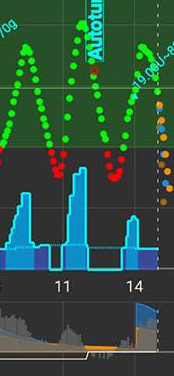
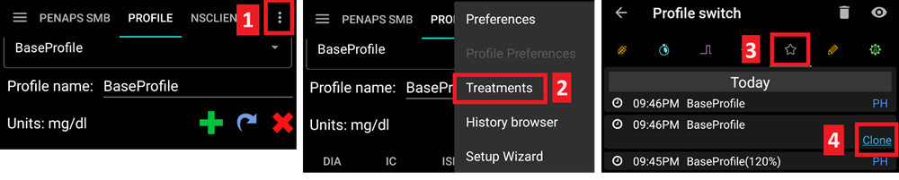
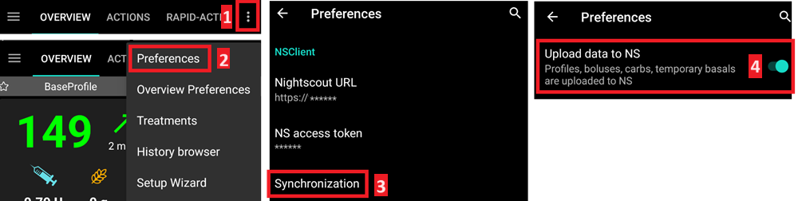

# Your AAPS profile

Your **AAPS Profile** is a set of five key parameters which define how **AAPS** should deliver insulin in response to your sensor glucose levels. **AAPS** has several _additional_ modifiable parameters (like SMB settings), but using these well relies on your underlying **Profile** being correct. The **Profile** incorporates: 
* [duration of insulin action](#duration-of-insulin-action-dia) (DIA),
* [glucose targets](#glucose-targets),
* [basal rates](#basal-rates) (BR),
* [insulin sensitivity factors](#insulin-sensitivity-factor-isf) (ISF) and
* [insulin-to-carb ratios](#insulin-to-carb-ratio-icr) (IC or ICR). 

The four last parameters can be set to different values, changing hourly if required, over a 24-hour period.
When working on your **Profile**, it is recommended to take the settings in the order they are presented here. Aim to get one setting right before changing another. Work in small steps rather than making large changes at once. Don't forget to activate the new profile after changing each change.

You can use [Autotune](https://autotuneweb.azurewebsites.net/) to guide your thinking, although it should not be followed blindly: it may not work well for you or in all circumstances. Note that settings interact with one another - you can have 'wrong' settings that work well together in some circumstances (e.g. if a too-high basal happens to be at the same time as a too-high CR) but do not in others. This means that you need to consider all the settings and check they work together in a variety of circumstances.

```{admonition} Your diabetes may vary
:class: information
Profiles vary significantly from person-to-person.

For the final three parameters, basal rates (BR), insulin sensitivity factors (ISF) and insulin-to-carb ratios (IC or ICR), the absolute values and trends in your insulin requirements vary significantly from person to person, depending on your biology, gender, age, fitness level etc. as well as shorter term factors like illness and recent exercise. For more guidance on this, the book [“Brights Spots and Landmines”](https://diatribe.org/bright-spots-and-landmines/) by Adam Brown is an excellent book to read.

```

Screenshots from **AAPS** of an _example_ profile are shown in below. Please note, this sample profile below shows a large number of timepoints. When you start out with **AAPS**, your profile is likely to be much simpler.

(your-aaps-profile-duration-of-insulin-action)=
## Duration of insulin action (DIA)

### Description

The length of time that insulin takes to decay to zero.

The duration of insulin action is set to a single value in **AAPS**, because your pump will continually infuse the same type of insulin. 


In combination with the [insulin type](#Config-Builder-insulin), this will result in the [insulin profile](#AapsScreens-insulin-profile), as shown in the image above. The important thing to note is that the decay has a **long tail**. If you have been used to manual pumping, you have probably been used to assuming that insulin decays over about 3.5 hours. However, when you are looping, the long tail matters as the calculations are far more precise and these small amounts add up when they are subjected to the recursive calculations in the **AAPS** algorithm. Therefore, **AAPS** uses minimum 5h as DIA.

Additional reading on the topic of duration of insulin action, and why it matters : 
* [Understanding the New IOB Curves Based on Exponential Activity Curves](https://openaps.readthedocs.io/en/latest/docs/While%20You%20Wait%20For%20Gear/understanding-insulin-on-board-calculations.html#understanding-the-new-iob-curves-based-on-exponential-activity-curves) on OpenAPS documentation.
* [Why we are regularly wrong in the duration of insulin action (DIA) times we use, and why it matters…](https://www.diabettech.com/insulin/why-we-are-regularly-wrong-in-the-duration-of-insulin-action-dia-times-we-use-and-why-it-matters/) on Diabettech.
* [Exponential Insulin Curves + Fiasp](https://web.archive.org/web/20220630154425/http://seemycgm.com/2017/10/21/exponential-insulin-curves-fiasp/) on See My CGM (archive).
* [Revised Humalog model in a closed loop](https://bionicwookiee.com/2022/04/13/revised-humalog-model-in-a-closed-loop/) and other articles on Bionic Wookie, recommending a DIA of 9h for Lyumjev, Fiasp, NovoRapid, Humalog.


### Impact

Too short DIA can lead to low BGs. And vice versa.

If DIA is too short, **AAPS** thinks too early that your previous bolus is all consumed, and, at still elevated glucose, will give you more. (Actually, it does not wait that long, but predicts what would happen, and keeps adding insulin). This essentially creates ‘insulin stacking’ that **AAPS** is unaware of.

Example of a too-short DIA is a high BG followed by **AAPS** over-correcting and giving a low BG.

### How to set it

The **figure below** shows an example of how the DIA set in an **AAPS** profile.


This is quite often set too short. Most people will want at least 5 hours, potentially 6 or 7 or more. See the additional reading mentioned above.

(profile-glucose-targets)=
## Glucose targets

### Description

Your **BG target** is a core value and all of **AAPS** calculations are based on it. It is different from the target range which you usually aim to keep your blood glucose values in. The target is used in **AAPS** calculations : if **AAPS** predicts that your **BG** will land outside the target range, then it will take action to take you back in said range.

The targets can be defined within those boundaries :

|         | _Low_ target           | _High_ target          |
|---------|------------------------|------------------------|
| Minimum | 4 mmol/l or 72 mg/dL   | 5 mmol/l or 90 mg/dL   |
| Maximum | 10 mmol/l or 180 mg/dL | 15 mmol/l or 225 mg/dL |

### Impact

A glucose target, particularly if it is only short-term (less than 4 hours in duration), does not need to be the *actual value* you expect or want your glucose level to get to, rather, it is a good way to tell **AAPS** to be more or less aggressive, while still keeping your glucose levels in range.

If your target is very wide (say, 3 or more mmol/l [50 mg/dl or more] wide), you will often find little **AAPS** action. This is because **BG** level is predicted to be somewhere in that wide range, and thus temporary basal rate changes are rarely suggested.

### How to set it

The **figure below** shows an example of how the target can be set in an **AAPS** profile.


Glucose targets are set according to your personal preferences. For example, if you are concerned about hypos at night, you may set your target slightly higher at 117 mg/dL (6.5 mmol/L) from 9 pm - 7am. If you want to make sure you have plenty of insulin on board (IOB) in the morning before bolusing for breakfast, you may set a lower target of 81 mg/dL (4.5 mmol/L) from 7 am - 8 am.

When In [Open Loop](#Preferences-pen-loop), especially when progressing through [the first objectives](../SettingUpAaps/CompletingTheObjectives.md), using a wide range target can be a good option while you are learning how **AAPS** behaves and adjusting your **Profile**.<br/>
When In [Closed Loop](#preferences-closed-loop) (starting at **[Objective 6](#objectives-objective6)**), it is recommended to reduce the range until you have a single target for each time of the day (_Low_ target = _High_ target), to make sure that **AAPS** reacts promptly to **BG** fluctuations.

## Basal rates

### Description

Your basal rate of insulin (Units/hour) provides background insulin, keeping your glucose levels stable in the absence of food or exercise. 

The insulin pump delivers small amounts of rapid acting insulin every few minutes, to keep the liver from releasing too much glucose, and to move glucose into body cells. Basal insulin usually makes up between 40 - 50% of your total daily dose (TDD), depending on your diet, and typically follows a circadian rhythm, with one peak and one valley in insulin requirements over 24 hours. For more information, chapter 23 of [“Think like a Pancreas”](https://amzn.eu/d/iVU0RGe) by Gary Scheiner is very useful. 

Most type 1 diabetes educators (and people with type 1 diabetes!) agree that you should work on getting your basal rates correct, before attempting to optimise your ISF and ICR. 

### Impact

Accurate basal rates enable you to wake up in range, and to skip meals - or eat - earlier or later in the day, without going high or low.

Too high basal rate can lead to low BGs. And vice versa.

**AAPS** ‘baselines’ against the default basal rate. If basal rate is too high, a ‘zero temp’ will count as a bigger negative IOB than it should. This will lead to **AAPS** giving more subsequent corrections than it should to bring IOB ultimately to zero.

So, a basal rate too high will create low **BGs** both with the default rate, but also some hours hence as AAPS corrects to target.

Conversely, a basal rate too low can lead to high BGs, and a failure to bring levels down to target.

### How to set it

The **figure below** shows an example of how the basal rates can be set in an **AAPS** profile.


Setting your basal rates right is done by trial and error. To test them, plan a fasting period during which you will observe your BG. Although you need to test your basals for the whole day, it is not recommended to fast during 24h straight : the body triggers mechanisms such as hormones to compensate. A recommended way is to fast 3 times for 8 hours.

You can either do it by :
* suspending the loop, and seeing how BG changes. If BG is dropping, basal rate is too high. And vice versa.
* keeping the loop running, and seeing how IOB changes. If IOB is negative, basal rate is too high. And vice versa. Beware that this method relies on ISF to correct BG, and thus depends on other variables to be set reasonably for it to be successful.

After doing this test, changes on your basal in the **Profile** should be done 1 hour before the rise/drop. Repeat the test while necessary.

## Insulin sensitivity factor (ISF)

### Description

The insulin sensitivity factor (sometimes called correction factor) is a measure of how much your blood glucose level will be reduced by 1 unit of insulin. 

**In mg/dL units:** 
If you have an ISF of 40, each unit of insulin will reduce your blood glucose by approx. 40 mg/dL (for example, your blood glucose will fall from 140 mg/dL to 100 mg/dL). 

**In mmol/L units:** 
If you have an ISF of 1.5, each unit of insulin will reduce your blood glucose by approx. 1.5 mmol/L (for example from 8 mmol/L to 6.5 mmol/L). 

From these examples you can see that the _smaller_ the ISF value, the less sensitive you are to insulin. So if you reduce your ISF from 40 to 35 (mg/dl) or 1.5 to 1.3 (mmol/L), this is often called strengthening your ISF. Conversely, increasing the ISF value from 40 to 45 (mg/dl) or 1.5 to 1.8 mmol/L) is weakening your ISF. 

### Impact

A **lower / stronger ISF** (i.e. 40 instead of 50) means insulin drops your BG less per unit. This leads to a more aggressive / stronger correction from the loop with **more insulin**. If the ISF is too strong (small value), this can lead to low **BGs**.

A **higher / weaker ISF** (i.e. 45 instead of 35) means insulin drops your BG more per unit. This leads to a less aggressive / weaker correction from the loop with **less insulin**. If the ISF is too weak (large value), this can lead to high **BGs**.

**Example:**
* BG is 190 mg/dL (10,5 mmol/L) and target is 100 mg/dL (5,6 mmol/L).
* So, you want a correction of `190 - 110 = 90 mg/dL` or `10,5 - 5,6 = 4.9 mmol/L`
* If `ISF = 30` -> `90 / 30 = 3` or `ISF = 1.63` -> `4.9 / 1.63 = 3`: 3 units of insulin
* If `ISF = 45` -> `90 / 45 = 2` or `ISF = 2.45` -> `4.9 / 2.45 = 3`: 2 units of insulin

An ISF that is too low (not uncommon) can result in ‘over corrections’, because **AAPS** thinks it needs more insulin to correct a high BG than it actually does. This can lead to ‘roller coaster’ BGs (esp. when fasting). In this circumstance you need to increase your ISF. This will mean **AAPS** gives smaller correction doses, and this will avoid over-correcting a high BG resulting in a low BG.

Conversely, an ISF set too high can result in under-corrections, meaning your BG remains above target – particularly noticeable overnight.

### How to set it

See the **figure below** for an example of how ISF values could be set in an **AAPS** profile.


A basic starting point for determining your daytime ISF is to base it on your total daily dose (TDD) using the 1,700 (94) rule. More detail is given in Chapter 7 of [“Think like a Pancreas”](https://amzn.eu/d/iVU0RGe) by Gary Scheiner.

    1700 (if measuring in mg/dl) or 94 (mmol/L)/ TDD = approx ISF.

    Example: TDD = 40 U
    Approx ISF (mg/dl) = 1700/40 = 43
    Approx ISF (mmol/L) = 94/40 = 2.4

Assuming correct basal, you can test this by suspending loop, checking IOB is zero, and taking a few glucose tablets to get to a stable ‘high’ level.

Then take an estimated amount of insulin (as per current 1/ISF) to get to your target BG.

Be careful as this is quite often set too low. Too low means 1 U will drop BG faster than expected.

## Insulin to Carb ratio (ICR)

### Description
  
The ICR is a measure of how many grams of carbohydrate are covered by one unit of insulin.

Some people also use I:C as an abbreviation instead of ICR, or talk about carb ratio (CR). 

For example, a 1-to-10 (1:10) insulin-to-carb ratio means that you take 1U of insulin for every 10 grams of carbs eaten. A meal of 25g carbs would need 2.5U of insulin.

If your ICR is weaker (higher value), perhaps 1:20, you would only need 0.5U of insulin to cover 10 g of carbs. A meal of 25g of carbs would need 25/20 = 1.25U of insulin.  

It is common to have different ICR at different times of day due to hormone levels and physical activity. Many people find they have their lowest/strongest ICR around breakfast time. So, for example, your ICR could be 1:8 for breakfast, 1:10 for lunch and 1:10 for dinner, but these patterns are not universal, and some people are more insulin resistant at dinner time, and require a stronger/smaller ICR then. 

> **NOTE:**
>
>In some European countries bread units were used for determination of how much insulin is needed for food. At the beginning 1 bread unit equal to 12g of carbs, later some changed to 10g of carbs.
>
> In this model the amount of carbs was fixed and the amount of insulin was variable. ("How much insulin is needed to cover one bread unit?")
>
> When using IC the amount of insulin is fixed and the amount of carbs is variable. ("How many g of carbs can be covered by one unit of insulin?")
>
> Example:
>
> Bread unit factor (BU = 12g carbs): 2,4 U/BU
> -> You need 2,4 units of insulin when you eat one bread unit.
>
> Corresponding IC: 12g / 2,4 U = 5,0 g/U
> -> 5,0g carbs can be covered with one unit of insulin.
>
> BU factor 2,4 U / 12g   ===>   IC = 12g / 2,4 U = 5,0 g/U
>
> Conversion tables are available online i.e. [here](https://www.mylife-diabetescare.com/files/media/03_Documents/11_Software/FAS/SOF_FAS_App_KI-Verha%CC%88ltnis_MSTR-DE-AT-CH.pdf).

### Impact

A **lower / stronger IC** means less food per unit, i.e. you are getting more insulin for a fixed amount of carbs. Can also be called ‘more aggressive’. If you IC is too strong, you are getting too much insulin, this can lead to low **BGs**.

A **higher / weaker IC** = more food per unit, i.e. you are getting less insulin for a fixed amount of carbs. Can also be called ‘less aggressive’. If you IC is too weak, you are getting less insulin than you need, this can lead to high **BGs**.

### How to set it

The **figure below** shows an example of how the ICR can be set in an **AAPS** profile. When entering these values, we just enter the final part of the ratio, so an insulin-to-carb ratio of 1:3.5 is entered simply as “3.5”.


If after meal has digested and IOB has returned to zero, your BG remains higher than before food, chances are IC is too high / weak. Conversely, if your BG is lower than before food, IC is too small / strong.

Assuming correct basal, you can test by checking IOB is zero and that you are in-range, eating exactly known carbs, and take an estimated amount of insulin based on current insulin to carb ratio. Best is to eat food your normally eat at that time of day and count its carbs precisely.

## About the importance of getting your profile right

**Why should I try to get my profile settings right? Can’t the loop just take care of it?**

A hybrid closed loop _can_ attempt to make insulin delivery adjustments to minimise poor glycemic control that results from having incorrect profile values. It can do this, for example, by withholding insulin delivery if you are going to hypo. However, you can achieve much better glycemic control if your profile settings are already as close as possible to what your body needs. This is one of the reasons that **AAPS** uses staged objectives to move from open loop pumping towards hybrid closed loop. In addition, there will be times when you need to open the loop (sensor warmups, sensor failure _etc._), sometimes in the middle of the night, and you will want to have your settings right for these situations. 

If you are starting with **AAPS** after using a different open or closed-loop pumping system, you will already have a reasonable idea of what values to use for basal rates (BR), insulin sensitivity factors (ISF) and insulin-to-carb ratios (IC or ICR). 

If you are moving from injections (MDI) to **AAPS**, then it is a good idea to read up on how to make the transfer from MDI to pump first, and plan and make the move carefully in consultation with your diabetes team. ["Pumping insulin"](https://amzn.eu/d/iaCsFa2) by John Walsh & Ruth Roberts and [“Think like a Pancreas”](https://amzn.eu/d/iVU0RGe) by Gary Scheiner are very useful.

## Common questions related to the Profile

#### What causes the loop to frequently lower my BG to hypoglycemic values without COB?
First of all, check your basal rate and make a no-carb basal rate test. If it is correct, this behavior is typically caused by a too low ISF. A too low ISF looks typically like this:



#### What causes high postprandial peaks in closed loop?
First of all, check your basal rate and make a no-carb basal rate test. If it is correct and your BG is falling to your target after carbs are fully absorbed, try to set an 'eating soon' temp target in AAPS some time before the meal or think about an appropriate prebolus time with your endocrinologist. If your BG is too high after the meal and still too high after carbs are fully absorbed, think about decreasing your IC with your endocrinologist. If your BG is too high while COB and too low after carbs are fully absorbed, think about increasing your IC and an appropriate prebolus time with your endocrinologist.

#### I'm stuck high and the loop does not bring me down
The possible reasons for the loop nod giving enough insulin are:
* ISF is not strong enough
* Basal might not be strong enough
* A security setting might kick in, such as maxIOB. Or SMB is disabled at this time, depending on your settings.

#### I have negative IOB, is this an issue ?
Negative IOB means the amount of absolute insulin (basal + bolus) in your body is less than the basal. It will cause **AAPS** to send more insulin as soon as the BG starts to rise, because it considers that insulin is missing, which can result in low **BG** later.

Here are some reasons why you may have negative IOB, and what action to take:
* a too strong basal: tweak your **Profile**
* too much bolus at the previous meal: tweak your **Profile** or check if you are bolusing at the right time.
* physical activity: next time, consider using a lower [Profile percentage](../DailyLifeWithAaps/ProfileSwitch-ProfilePercentage.md) during activity to account for increased sensitivity.

(YourAapsProfile_Clone-profile-switch)=

## Clone profile switch

You can easily create a new local profile from a profile switch. In this case timeshift and percentage will be applied to the new local profile.



1. Click 3-dots-menu in upper right corner.
2. Select ‘Treatments’.
3. Press star symbol to access profile switch page.
4. Select the desired profile switch and press “Clone”.
5. You can edit the new local profile in Local Profile (LP) tab or via the hamburger menu.

(YourAapsProfile_Profile-backup)=
## Profile backup

Being a core setting of your looping system, your profiles are highly sensitive and something you really don't want to lose.

* Your Profiles are stored in the **AAPS** database.
* If enabled, Profiles are also uploaded to Nightscout. The settings can be found in [NSClient Preferences > NSClient > Synchronization > Upload data to NS](#Preferences-nsclient).



* They are also part of [exported settings](../Maintenance/ExportImportSettings.md). So make sure to have a backup in a safe place.

## Editing Profiles from Nightscout

If enabled, profile changes made directly in Nightscout can  be received in **AAPS**. The settings can be found in [NSClient Preferences > NSClient > Synchronization > Receive profile store](#Preferences-nsclient).

This can be helpful when about to make major changes to a more extensive profile. They can be entered more easily via the web interface, _e.g._ to manually copy data from a spreadsheet.

To do this, however, it is important to clone the whole **database record** consisting of several profiles in the Nightscout editor (blue arrow on the screenshot below). The new database records then carries the current date. After saving, the changed/new profile can be activated in **AAPS** with a regular [Profile switch](../DailyLifeWithAaps/ProfileSwitch-ProfilePercentage.md).


## Profile Helper

The [Profile Helper](../SettingUpAaps/ProfileHelper.md) can help you:
* build a profile from scratch for a kid
* compare two profiles
* clone a profile