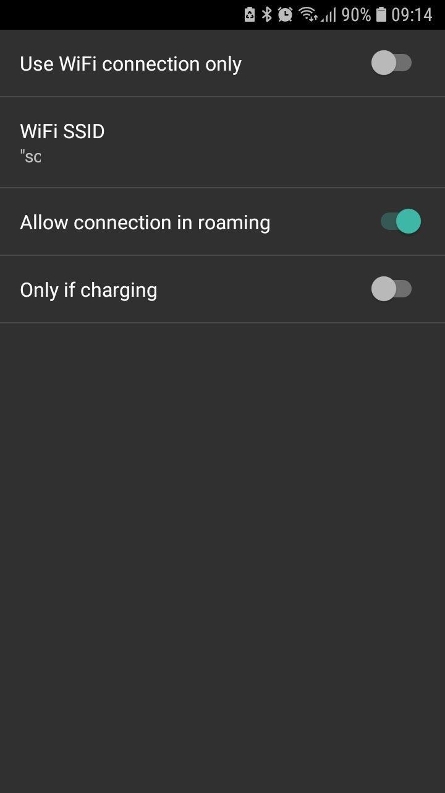

# Automation

As AndroidAPS is a hybrid closed loop system, some user interaction is necessary though (e.g. tell the loop that you are walking, eating soon, lying on the sofa...). Frequent manual user inputs can be automated via external tools like Automate or IFTTT to extend the recent AndroidAPS functionality. 

## Android Automate App
The free Android™ application Automate lets you automate various tasks on your smartphone. Create your automations with flowscharts, make your device automatically change settings like Bluetooth, Wi-Fi, NFC or perform actions like sending SMS, e-mail, based on your location, the time of day, or any other “event trigger”. You can automate almost everything on your device, Automate even support plug-ins made for Tasker and Locale.

Using this tool you can easily create workflows to auto-treat your diabetes based on several conditions according to the principle of 'if this... and this... not this..., then do that... and that...'. There are thousands of possibilities you can configure.

Until now it is **necessary to loop via Nightscout Profile**, as Automate executes the commands via HTTP-request directly in your nightscout website that subsequently syncs it to your AndroidAPS app. 

**Offline looping (direct communication between Automate and AnroidAPS app) is not supported yet**, but technologically possible. Maybe there will be a solution in future. If you have figured out a way to do this, please add it to this documentation or contact a developer.

### Basic requirements

#### Automate App
Download Android Automate in Google Play Store or at [https://llamalab.com/automate/](https://llamalab.com/automate/) and install it on your smartphone where AndroidAPS runs.

Go to smartphone system settings > Apps > Automate > Tap on the gear on the upper right of the screen > Check 'Run on system startup'. This will automatically run your workflows on system startup. 

#### AndroidAPS
In AndroidAPS NSClient, tap on the gear at the upper right screen and go to Connection settings > Uncheck 'Use WiFi connection only' and 'Only if charging' as the automated treating does only work when AndroidAPS has an actual nightscout connection.

In AndroidAPS NSClient, tap on the gear at the upper right screen and go to Advanced Settings > Uncheck 'NS upload only (dosable sync)' and 'No upload to NS'

### Workflow examples

#### If activity (e.g. walking or running) is detected, then set a high TT. And if activity ends, then wait 20 minutes and then cancel TT

[http://www.sha1-online.com/](http://www.sha1-online.com/)

#### If xDrip+ alerts a BG high alarm, then set a low TT for ... minutes. 
This workflow will listen to the xDrip+ notification channel. If there is triggered a user specified high BG alert, then Automate will set a user specified low temprorary target for the user specified time. After time, another possibly alert will extend the duration of the low TT. 

[http://www.sha1-online.com/](http://www.sha1-online.com/)

## If this, then that (IFTTT)
...
