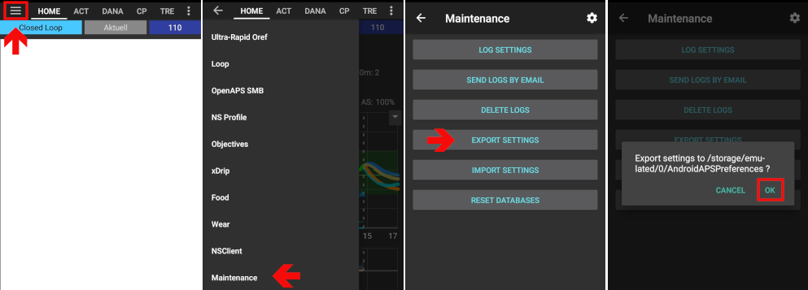

Export & import settings
**************************************************
When should I export settings?
==================================================
Be prepared for the unforeseen. You might change important settings by accident and have problems to undo the changes. Your phone might break or get stolen. To easily return to status you've been at, settings should be exported on a regular basis.

Best practice is to export after change of settings or completing an objective. 

Exported settings should be copied to a cloud storage or your computer. So you are prepared for loss or damage of your AAPS phone and do not have to start from zero.

On a Windows 10 computer it looks like this:
  
.. image:: ../images/SmartphoneRootLevelWin10.png
  :alt: AndroidAPS Preferences phone connected to computer

Exported information
==================================================
Among others the following information is part of the settings export:

* `Automation <../Usage/Automation.html>`_ events
* `Config builder <../Configuration/Config-Builder.html>`_ settings
* `Local profile <../Configuration/Config-Builder.html#local-profile-recommended>`_ settings
* `Objectives <../Usage/Objectives.html>`_ status incl. `exam results <../Usage/Objectives.html#objective-3-proof-your-knowledge>`_
* `Preferences <../Configuration/Preferences.html>`_ incl. `NS Client settings <../Configuration/Preferences.html#ns-client>`_

Encrypted backup format
==================================================
Settings backup is encrypted by a master password that can be set in `Preferences <../Configuration/Preferences.html#master-password>`_ .

Export settings
==================================================
* Hamburger menu (top left corner of screen)
* Maintenance
* Export settings
* Date and time of export will be added to the file name automatically and displayed together with the path.
* Click OK.
* Enter `master password <../Configuration/Preferences.html#master-password>`_ and click OK.
* Successful export will be promted at bottom of the screen.

**********************************************************************
** NEUE BILDER
**********************************************************************

Import settings
==================================================
* Hamburger menu (top left corner of screen)
* Maintenance
* Import settings

**********************************************************************
** NEUE BILDER + Ergänzen
**********************************************************************

* **Note for Dana RS users:**

  * As pump connection settings are also imported AAPS on your new phone will already "know" the pump and therefore not start a bluetooth scan. Please pair new phone and pump manually.
  
**********************************************************************
** Transfer
**********************************************************************

