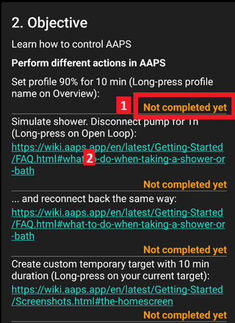
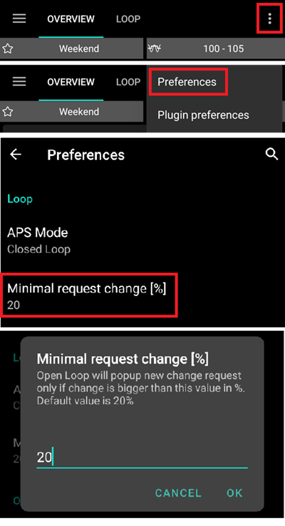
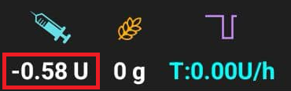
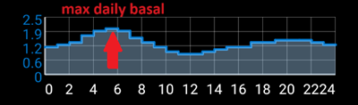

# Completing the Objectives

**AAPS** has a series of **Ojectives** required to be completed to help progress from basic open looping to hybrid closed looping and full **AAPS** functionality. Completing the **objectives** aims to ensure:

* You have configured everything correctly in your **AAPS** setup
* You have learned about the essential features of **AAPS** 
* You have a basic understanding of what your system is doing, and therefore why you can trust it.

When **AAPS** is installed for the first time, each objective will have to be completed before moving on to the next one. New features will gradually be unlocked as progress is made through each objective.

**Objectives 1 to 8** will guide you from configuring **AAPS** on your smartphone to “basic” hybrid closed looping. This will take about 6 weeks to complete. You can proceed up to **Objective 5** using a virtual pump (and using some other method of insulin delivery in the meantime). **Objectives 9 to 11** are designed to test more advanced **AAPS** features with the aim of better control of your diabetes, they will take 3 more months to complete. For further details on an estimated breakdown of time, see here: [How long will it take?](../preparing.md#how-long-will-it-take-to-set-everything-up)

As well as progressing through the **objectives**, if required, you can also remove your progress and [go back to an earlier objective](#go-back-in-objectives).

### Backup your settings

```{admonition} Note
:class: note

Regularly export your **AAPS** settings is recommended after completing each **objective**!
```

It is strongly recommended that you [export your settings](../Usage/ExportImportSettings.md) after completing each objective to avoid losing any progress made in **AAPS**. This exporting process creates a **settings file** (.json) which should be backed-up in one or more safe places (e.g. Google Drive, hard disk, email attachment _etc._). This ensures that any progress made in **AAPS** is saved. If your phone is lost or if you accidentally delete your progress, the json file can be re-loaded to **AAPS** by importing a recent settings file. Having a backup **settings file** is also required if you want to change your **AAPS** smartphone for any reason (upgrading/lost/broken phone _etc._)

The **settings** file will save not only your progress through the objectives, but also all your **AAPS** settings such as **max bolus** _etc._  

If you do not have a backup copy of your **settings**, if anything happens to your **AAPS** smartphone you will need to start the **objectives** from the beginning again. As described above, progressing through the **objectives** takes time, and having to re-complete them because for example you lost your smartphone, is a situation to be best avoided.

## Objective 1: Setting up visualization and monitoring, analyzing basals and ratios

Objective 1 requires the user to set up  their basic technical setup in AAPS. No progress can be made until this step has been completed.

- Select the correct CGMS/FGMS in [Config Builder](../Configuration/Config-Builder.md). See [BG Source](../Configuration/BG-Source.md) for more information.
- Select the correct Pump in [Config Builder](../Configuration/Config-Builder.md) to ensure your pump can communicate with **AAPS**. Select **virtual pump** if you are using a pump model with no **AAPS** driver for looping, or if you want to work through the early **objectives** while using another system for insulin delivery. See [insulin pump](../Getting-Started/Pump-Choices.md) for more information.
- If using Nightscout: 
  - Follow instructions in [Nightscout](../Installing-AndroidAPS/Nightscout.md) page to ensure **Nightscout** can receive and display **AAPS** data.
  - Note that URL in **NSClient** must be **_without_ "/api/v1/"** at the end - see [NSClient settings in Preferences](../Configuration/Preferences.md#nsclient).
- If using Tidepool: 
    - Follow instructions in [Tidepool](../Installing-AndroidAPS/Tidepool.md) page to ensure **Tidepool** can receive and display **AAPS** data.

Note - *You may need to wait for the next sensor glucose reading to arrive before **AAPS** will recognise it.*

## Objective 2: Learn how to control AAPS

Objective 2 requires several ‘tasks’ to be actioned as shown in the screenshot below
Click on the orange text "Not completed yet" to access the to-dos.
Links will be provided to guide you, in case you are not familiar with a specific action yet.


  
Tasks to complete **Objective 2** are:
- Set your **Profile** to 90% for a duration of 10 min.
  - _Hint_: Long press your Profile name on the OVERVIEW screen. More information in [Profile switch & Profile Percentage](Profiles.md#profile-switch--profile-percentage)
  - _Note_: **AAPS** does not accept basal rates below 0.05U/hr. If your Profile includes any rates 0.06U/hr or lower you will need to create a temporary **Profile** with higher basal rates before completing this task. Switch back to your normal **Profile** after completing this task.
- Simulate "taking a shower" by [disconnecting your pump](../Getting-Started/Screenshots.md#section-c---bg--loop-status) in **AAPS** for a duration of 1h. 
  - _Hint_: press the loop icon on the OVERVIEW screen to open the Loop dialogue
- End "taking a shower" by reconnecting your pump.
  - _Hint_: press the "disconnected"-icon to open the loop dialog
- Set a custom [**Temporary Target**](temptarget.md) with a duration of 10 min.
  - _Hint_: press the target bar on the OVERVIEW screen to bring up the temporary target dialog
- Activate the **Actions** plugin in [**Config Builder**](../Configuration/Config-Builder.md) to make it appear on the top scrollable menu bar.
  - _Hint_: Go to **Config Builder** and scroll down to 'General"
- Display the **Loop** plugin's content.
- [Scale the BG-Chart](../Getting-Started/Screenshots.md#section-f---main-graph) to be able to look at larger or smaller time frames: toggling between 6h, 12h, 18h 24h of past data.
  - _Hint_: Long press on the chart or use the arrow at the top right.

## Objective 3: Prove your knowledge

Objective 3 requires the user to pass a multiple-choice exam which is designed to test your **AAPS** knowledge.

Some users find **Objective 3** to be the most difficult objective to complete. Please read the **AAPS** documents in conjunction with the questions. If you are genuinely stuck after researching the **AAPS** documents, please search the [Facebook](https://www.facebook.com/groups/AndroidAPSUsers) group for "Objective 3" (because it is likely that your question has been asked - and answered - before). If you are still stuck, ask in a post on either the [Facebook](https://www.facebook.com/groups/AndroidAPSUsers) or [Discord](https://discord.gg/4fQUWHZ4Mw) group. These groups can provide friendly hints, or redirect you to the relevant part of the **AAPS** documents.

In the meantime : 
- To reduce the number of notifications / decisions you are asked to make (temporary basal rates) while in Open Loop, set a wide target range in your **Profile** _e.g._ 90 - 150 mg/dl or 5.0 - 8.5 mmol/l.
- You might want to set a wider upper limit, or even disable Open Loop, at night.

To proceed with **Objective 3**, click on the orange text “**Not completed yet**” to access the relevant question. Please read each question carefully and select your answer(s).

For each question, there may be more than one answer that is correct! If an incorrect answer is selected, the question will be time-locked for 1 hour before you can go back and answer the question again. Be aware that the order of the answers may have changed when you next try to answer, this is to make sure you read them carefully and really understand the validity (or not) of each response.

```{admonition}  __What happens if new question(s) are added to an Objective when I update to a newer version of AAPS?__
:class: Note
From time to time, new features are added to **AAPS** which may require a new question to be added to the Objectives, particularly Objective 3. As a result, any new question added to **Objective 3** will be marked as “incomplete” because **AAPS** will require you to action this. Do not worry, as each **Objective** is independent, you will **not lose the existing functionality of AAPS**, providing the other Objectives remain completed.
```

## Objective 4: Starting on an open loop

The purpose of **Objective 4** is to recognise how often **AAPS** will evaluate the user's basal rate against glucose levels, and recommend temporary basal rate adjustments. As part of this **objective**, you will activate open looping for the first time, and will perform 20 proposed temporary basal rate changes, and if required, apply these manually on your pump. Furthermore, you will observe temporary targets' impact. If you are not familiar with setting a temporaty basal rate change in **AAPS** yet, please refer to the [**Actions** tab](../Getting-Started/Screenshots.md#action-tab). 

The minimal time to complete this objective: **7 days**. This is a mandatory wait time. It is not possible to proceed to the next **Objective**, even if all basal rate changes are enacted already.

- Select Open Loop either from the [Preferences](../Configuration/Preferences.md) menu or by pressing and holding the Loop icon on the top left of the **Overwiew** screen.
- Walk through the [Preferences](../Configuration/Preferences.md) to set it up for you (scroll down to "Loop/APS Mode" and select "Open Loop".
- Manually enact at least 20 of the temporary basal rate suggestions over a period of 7 days; key them into your (physical) pump and confirm in AAPS that you have accepted them. Ensure these basal rate adjustments show up in **AAPS** and Nightscout.
- Use [temp targets](../Usage/temptarget.md) when necessary. After treating a hypo, use the predefined "hypo temp target" to prevent the system from overcorrecting upon the bounce back.

To reduce the number of proposed basal rate changes while in Open Loop, you can still use the tips described in [Objective 3](#objective-3-prove-your-knowledge).
Additionally, you can change the minimum percentage for recommended basal rate changes. The higher the value, the fewer change notifications you will receive.

  

```{admonition} Note
:class: Note

You don't need to action each and every system recommendation!
```

## Objective 5: Understanding your open loop, including its temp basal recommendations

As part of **Objective 5** you will start to understand how temporary basal recommendations are derived. This includes the [determination of basal logic](https://openaps.readthedocs.io/en/latest/docs/While%20You%20Wait%20For%20Gear/Understand-determine-basal.html), analyzing the impact by observing [prediction lines in **AAPS Overview**](../Getting-Started/Screenshots.md#section-f---main-graph) (or Nightscout) and looking at detailed calculations shown on your **OpenAPS** tab. 

Estimated time to complete this objective: **7 days**.

This Objective requires you to determine and set your “Max U/h a temp basal can be set to” (max-basal) value as described in [OpenAPS-features](Open-APS-features.md#max-uh-a-temp-basal-can-be-set-to-openaps-max-basal). This value can be set in Preferences > OpenAPS.
If you are still using a virtual pump, make sure this safety setting is set in both **AAPS** and your insulin pump. 

You might wish to set your BG target higher than usual until you are comfortable with **AAPS**' calculations and settings. 

**AAPS** allows:

- a _low_ target to be a minimum of 4 mmol/l (72 mg/dl) or maximum of 10 mmol/l (180 mg/dl)
- a _high_ target to be a minimum of 5 mmol/l (90 mg/dl) and maximum of 15 mmol/l (225 mg/dl)
- a temporary target as a single value can be anywhere in the range of 4 mmol/l to 15 mmol/l (72 mg/dl to 225 mg/dl)

Your **BG target** is a core value and all of **AAPS** calculations are based on it. It is different from a target range which you usually aim to keep your blood glucose values in. If your target is very wide (say, 3 or more mmol/l [50 mg/dl or more] wide), you will often find little **AAPS** action. This is because **BG** level is predicted to be somewhere in that wide range, and thus temporary basal rate changes are rarely suggested.

You may wish to experiment with adjusting your targets being in a tighter range (say, 1 or less mmol/l [20 mg/dl or less] wide) and observe the resulting behavior.

You can adjust (widen or tighten) the graph’s green area, representing your target range, by entering different values in [Preferences](../Configuration/Preferences.md) > Overview > Range for Visualisation.


```{admonition} If you have been using a virtual pump, change to a real insulin pump now!
:class: note

If you are open looping with a virtual pump **stop here**. Only click verify at the end of this **Objective** once you have changed to using a "real" pump which delivers insulin.

```


## Objective 6: Starting to close the loop with Low Glucose Suspend


```{admonition}  Closed loop will not correct high BG values in objective 6 as it is limited to **Low Glucose Suspend** only!
:class: Note
You will still need to correct high BG values by yourself (manually with corrections by pump or pen)!
```

As part of **Objective 6** you will close the loop and activate its **Low Glucose Suspend** (LGS) mode while [max IOB](Open-APS-features.md#maximum-total-iob-openaps-cant-go-over-openaps-max-iob) is set to zero. You have to remain in LGS mode for 5 days to complete this objective. You should use this time to check if your **Profile** settings are accurate and LGS events are not triggered too often. 

Minimal time to complete this objective: **5 days**. This is a mandatory wait time. You cannot proceed to the next **Objective** before this time is up.

It is crucial that your current **Profile** (basal, ISF, IC) is well tested before you close your loop in Low Glucose Suspend mode. Incorrect **Profile** settings might force you into hypo situations which have to be treated manually. An accurate profile will help to avoid needing low glucose treatments during the 5 days period. 

**If you still observe frequent or severe low glucose episodes consider refining your DIA, basal, ISF and carb ratios.** Please refer to the [Facebook](https://www.facebook.com/groups/AndroidAPSUsers) or [Discord](https://discord.gg/4fQUWHZ4Mw) group which has much discussion on this. 


During **Objective 6**, **AAPS** will override the maxIOB setting to zero. **This override will be end when moving to Objective 7.**

This means that when you are on Objective 6, if sensor glucose levels are dropping, **AAPS** will reduce your basal insulin delivery for you. But, if sensor glucose levels are rising, **AAPS** will  increase the basal rate above your **Profile** value only if basal IOB is negative as a result of  a previous **Low Glucose Suspend**. Otherwise, **AAPS** will not increase basal above your current profile value, even if glucose levels are rising. This caution is to avoid hypos as you are learning to use **AAPS**. 

**As a consequence, you have to handle high glucose values with manual insulin bolus corrections.**

- If your basal IOB is negative (see screenshot below) a temporary basal rate (TBR) > 100% can be triggered in objective 6.



- Set your target range slightly higher than you usually would aim at, just to be safe and to add a safety buffer.
- Enable 'Low Glucose Suspend' mode by pressing and holding the Loop icon at the top right corner of the OVERVIEW screen and selecting the Loop - LGS mode icon.
- Watch active temporary basals by looking at the turquoise basal text on the OVERVIEW screen or the turquoise basal render as part of the OVERVIEW graph.
- You may temporarily experience spikes following treated hypos without being able to increase basals on the rebound.

## Objective 7: Tuning the closed loop, raising maxIOB above 0 and gradually lowering BG targets

To complete **Objective 7** you have to close your loop and raise your [maxIOB](Open-APS-features.md#maximum-total-iob-openaps-cant-go-over-openaps-max-iob). maxIOB was zeroed out automatically in **Objective 6**. This is now reverted. **AAPS** will start to use your defined maxIOB value to correct high glucose values. 

Minimal time to complete this objective: **1 day**. This is a mandatory wait time. You can’t proceed to the next **Objective** before this time is up.

- Select **Closed Loop** either from [Preferences](../Configuration/Preferences.md) or by pressing and holding the Loop icon at the top right corner of the **Overview** screen. Stay in **Closed Loop** over a period of 1 day.

- Slowly raise your 'Maximum total IOB OpenAPS can’t go over' (in OpenAPS called 'max-iob') above 0, until you find the settings that work best for you.
 
The default recommendation for this setting is “**average meal bolus + 3x max daily basal**”, where “max daily basal” is the maximum hourly value in any time segment of the day.

  
  
This recommendation should be seen as a starting point. If you set it to the 3x and you are seeing AAPS giving too much insulin as glucose levels rise, then lower the "Maximum total IOB OpenAPS can’t go over" value. Alternatively, if you are very resistant, raise this value very cautiously.

Once confident on how much IOB suits your looping patterns, lower your **BG targets** to your desired level.

## Objective 8: Adjust basals and ratios if needed, and then enable Autosens

As part of this objective you will revisit your profile's performance and will use [Autosens](../Usage/Open-APS-features.md) functionality as an indicator for wrong settings. 

Minimal time to complete this objective: **7 days**. This is a mandatory wait time. You can’t proceed to the next **Objective** before this time is up.

- You can use [Autotune](https://openaps.readthedocs.io/en/latest/docs/Customize-Iterate/autotune.html) as a one off to check your basals remain accurate or do a traditional basal test.
- Enable [Autosens](../Usage/Open-APS-features.md) over a period of 7 days and watch [**Overview**'s graph white line](../Getting-Started/Screenshots.md#section-g---additional-graphs) showing your insulin sensitivity rising or falling due to exercise or hormones etc. Keep an eye on the OpenAPS report tab which shows **AAPS** adjusting the sensitivity, basals and targets accordingly.

## Objective 9: Enabling additional oref1 features for daytime use, such as super micro bolus (SMB)

In this **Objective** you will tackle and use "Super Micro Bolus (SMB)" as one core functionality. After working through the mandatory readings you will have a good understanding of what SMBs are, how these work, and why basal is set to zero temporarily after SMBs are given (zero-temping).

Minimal time to complete this objective: **28 days**. This is a mandatory wait time. You can’t proceed to the next Objective before this time is up.

- The [SMB section in this documentation](Open-APS-features.md#super-micro-bolus-smb) and [oref1 coverage in the openAPSdocs](https://openaps.readthedocs.io/en/latest/docs/Customize-Iterate/oref1.html) are must-reads to understand SMB and the concept of zero-temping.
- Once done, you can [raise maxIOB](Open-APS-features.md#maximum-total-iob-openaps-cant-go-over-openaps-max-iob) to get SMBs working more effectively. maxIOB now includes all IOB, not just accumulated basal. This threshold pauses SMBs until IOB drops below this value (_e.g._ maxIOB is set to 7U and a bolus of 8U is given to cover a meal: SMBs will be paused and not given unless IOB drops below 7U).
A good start is setting maxIOB = **average mealbolus + 3x max daily basal** where "max daily basal" is the maximum hourly value in any time segment of the day - see [objective 7](#objective-7-tuning-the-closed-loop-raising-maxiob-above-0-and-gradually-lowering-bg-targets) as reference)
- Evaluate your carb absorption rate and consider changing the “min_5m_carbimpact”-parameter (Preferences > Absorption settings > min_5m_carbimpact) if you find it too slow or too fast. Read more about this setting [here](../Configuration/Preferences.md#min_5m_carbimpact). 

## Objective 10: Automation

Automations become available when **Objective 10** is started.

Minimal time to complete this objective: **28 days**. This is a mandatory wait time. You can’t proceed to the next Objective before this time is up.

Read the documentation page [Automation](../Usage/Automation.md) first.

Set-up the most basic automation rule; for example trigger an Android notification in a few minutes:
- Select the notification tab
- From the top right 3 dots menu, select add rule
- Give a task name "My first automation notification"
- "edit"  "condition"
   - click the "+" symbol to add the first trigger
   - select "Time"  & "OK", it will create a default entry AT TODAY HOUR:MINUTE
   - click the MINUTE portion to edit the time such that it triggers in a few minutes. Then click ok to close
   - click "ok"  to close the Triggers screen
 - "ADD" an "Action"
   - select "Notification", "OK"
   - click "Notification" to edit the message, enter something like "My first automation"
 - Wait until the time triggers the notification (note that depending on your phone, it can be a few minutes late)
 
You can then experiment with setting up a more useful automation.
The documentation page gives a few examples, and you can search for "automation" screenshots on the [Facebook](https://www.facebook.com/groups/AndroidAPSUsers) group. There is also a dedicated channel in the [Discord](https://discord.gg/4fQUWHZ4Mw) community.

For example, if you eat the same thing for breakfast at the same time every morning before school/work, you can create an automation such as "before-breakfast-target" to set a slightly lower temporary target 30 minutes before having breakfast. In such case, your condition is likely to include "recurring time" which consists of selecting specific days of the week (Monday, Tuesday, Wednesday, Thursday, Friday) and a specific time (06:30 am). The action will consist of "Start temp target" with a lower than usual target value and a 30 minutes duration. 


## Objective 11: Enabling additional features for daytime use, such as Dynamic Sensivity plugin (DynISF).

Minimal time to complete this **Objective**: **28 days**. This is a mandatory wait time. You can’t proceed to the next **Objective** before this time is up.

- Ensure that SMB is functioning properly
- Read the documentation concerning Dynamic ISF [here](../Usage/DynamicISF.md)
- Search the [Facebook](https://www.facebook.com/groups/AndroidAPSUsers) and [Discord](https://discord.gg/4fQUWHZ4Mw) groups for discussions around Dynamic ISF and read about other users' experiences and recommendations. 
- Enable the **DynamicISF plugin** and identify the appropriate calibration for your body's uniqueness. It is advisable to begin with a value lower than 100% for safety reasons.


### Go back in objectives

If you wish to go back in **Objectives** for whatever reason you can do so by clicking at "clear finished".

