..
	Omnipod image aliases resource file for referencing images by name in the Omnipod RST documentation file

..
	Interface Icons

..
	Omnipod (POD) Overview Tab

.. |ack_alerts|                    image:: ICONS/omnipod_overview_ack_alerts.png
.. |pod_management|                image:: ICONS/omnipod_overview_pod_management.png
.. |refresh_pod_status|            image:: /docs/EN/images/omnipod/ICONS/omnipod_overview_refresh_pod_status.png
.. |resume|               	   image:: ICONS/omnipod_overview_resume.png
.. |set_time|                      image:: ICONS/omnipod_overview_set_time.png
.. |suspend|                       image:: ICONS/omnipod_overview_suspend.png

..
	Pod Management Tab

.. |activate_pod|                  image:: ICONS/omnipod_overview_pod_management_activate_pod.png
.. |deactivate_pod|                image:: ICONS/omnipod_overview_pod_management_deactivate_pod.png
.. |discard_pod|                   image:: ICONS/omnipod_overview_pod_management_discard_pod.png

.. |pulse_log|                     image:: ICONS/omnipod_overview_pod_management_pulse_log.png
.. |reset_rileylink_config|        image:: ICONS/omnipod_overview_pod_management_reset_rileylink_config.png
.. |rileylink_stats|               image:: ICONS/omnipod_overview_pod_management_rileylink_stats.png

..
	Instructional Section Images
	
..
	Hardware and Software Requirements
.. |OrangeLink|				image:: OrangeLink.png	
	
..
		Acknowledge Alerts
.. |Acknowledge_Alerts_1|               image:: Acknowledge_Alerts_1.png
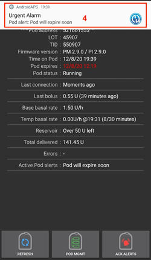
.. |Acknowledge_Alerts_3|               image:: Acknowledge_Alerts_3.png
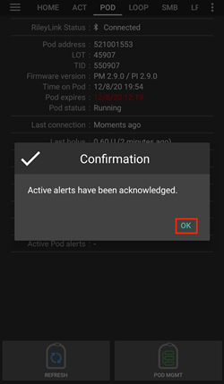
.. |Acknowledge_Alerts_5|               image:: Acknowledge_Alerts_5.png

..
	Actions Tab
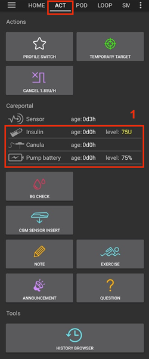

..
	Activate Pod
.. |Activate_Pod_1|                     image:: Activate_Pod_1.png
.. |Activate_Pod_2|                     image:: Activate_Pod_2.png
.. |Activate_Pod_3|                     image:: Activate_Pod_3.png
.. |Activate_Pod_4|                     image:: Activate_Pod_4.png
.. |Activate_Pod_5|                     image:: Activate_Pod_5.png
.. |Activate_Pod_6|                     image:: Activate_Pod_6.png
.. |Activate_Pod_7|                     image:: Activate_Pod_7.png
.. |Activate_Pod_8|                     image:: Activate_Pod_8.png
.. |Activate_Pod_9|                     image:: Activate_Pod_9.png
.. |Activate_Pod_10|                    image:: Activate_Pod_10.png
.. |Activate_Pod_11|                    image:: Activate_Pod_11.png
.. |Activate_Pod_12|                    image:: Activate_Pod_12.png
.. |Activate_Pod_13|                    image:: Activate_Pod_13.png
.. |Activate_Pod_14|                    image:: Activate_Pod_14.png
.. |Activate_Pod_15|                    image:: Activate_Pod_15.png

..
	Deactivate Pod
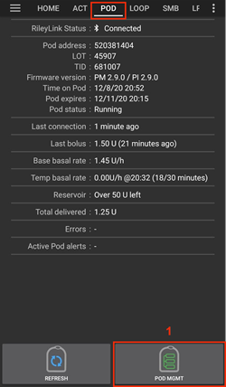
.. |Deactivate_Pod_2|                   image:: Deactivate_Pod_2.png
.. |Deactivate_Pod_3|                   image:: Deactivate_Pod_3.png
.. |Deactivate_Pod_4|                   image:: Deactivate_Pod_4.png
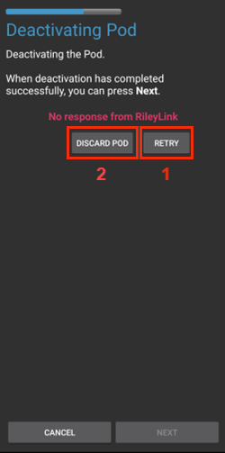
.. |Deactivate_Pod_6|                   image:: Deactivate_Pod_6.png
.. |Deactivate_Pod_7|                   image:: Deactivate_Pod_7.png
.. |Deactivate_Pod_8|                   image:: Deactivate_Pod_8.png
.. |Deactivate_Pod_9|                   image:: Deactivate_Pod_9.png
.. |Deactivate_Pod_10|                  image:: Deactivate_Pod_10.png

..
	Enabling the Omnipod Driver in AAPS
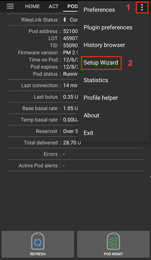
.. |Enable_Omnipod_Driver_2|            image:: Enable_Omnipod_Driver_2.png
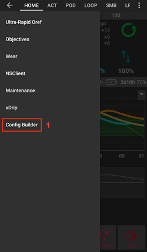
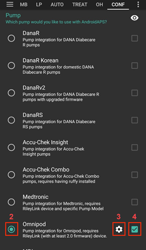
.. |Enable_Omnipod_Driver_5|            image:: Enable_Omnipod_Driver_5.png

..
	Optimally Positioning the RileyLink and Omnipod pod
.. |Omnipod_pod_and_RileyLink_Position|	image:: Omnipod_pod_and_RileyLink_Position.png
.. |Toroid_w_CS|                  		image:: Toroid_w_CS.png

..
	Omnipod Settings
.. |Omnipod_Settings_1|                 image:: Omnipod_Settings_1.png
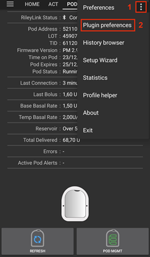
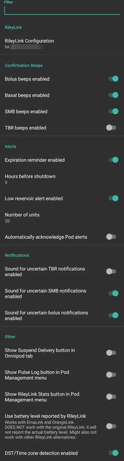

..
	Omnipod Tab
.. |Omnipod_Tab|                  	image:: Omnipod_Tab.png
.. |Omnipod_Tab_Pod_Management|         image:: Omnipod_Tab_Pod_Management.png

..
	Pod History
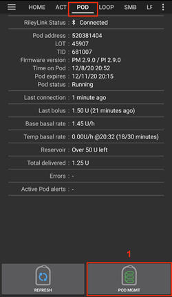
.. |Pod_History_2|                  	image:: Pod_History_2.png
.. |Pod_History_3|                  	image:: Pod_History_3.png
.. |Pod_History_4|                  	image:: Pod_History_4.png

..
	Resume Insulin Delivery
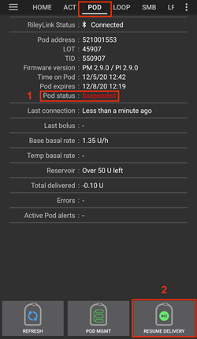
.. |Resume_Insulin_Delivery_2|          image:: Resume_Insulin_Delivery_2.png
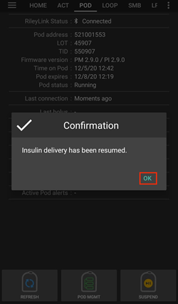
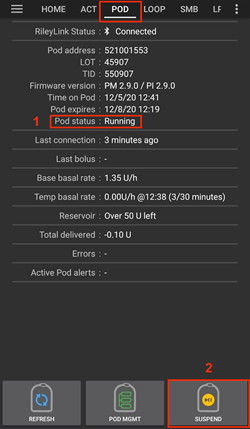

..
	RileyLink Bluetooth Reset
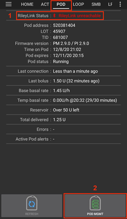
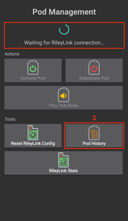
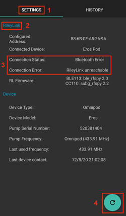
.. |RileyLink_Bluetooth_Reset_4|        image:: RileyLink_Bluetooth_Reset_4.png
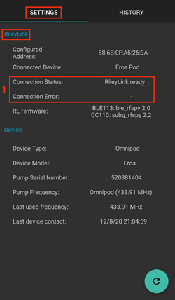

..
	RileyLink Setup
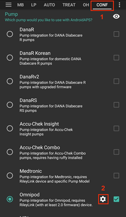
.. |RileyLink_Setup_2|                  image:: RileyLink_Setup_2.png
.. |RileyLink_Setup_3|                  image:: RileyLink_Setup_3.png
.. |RileyLink_Setup_4|                  image:: RileyLink_Setup_4.png
.. |RileyLink_Setup_5|                  image:: RileyLink_Setup_5.png

..
	RileyLink Statistics History
.. |RileyLink_Statistics_History_1|     image:: RileyLink_Statistics_History_1.png
.. |RileyLink_Statistics_History_2|     image:: RileyLink_Statistics_History_2.png
.. |RileyLink_Statistics_History_3|     image:: RileyLink_Statistics_History_3.png

..
	RileyLink Statistics Settings

.. |RileyLink_Statistics_Settings_2|    image:: RileyLink_Statistics_Settings_2.png
.. |RileyLink_Statistics_Settings_3|    image:: RileyLink_Statistics_Settings_3.png

..
	Suspend Insulin Delivery
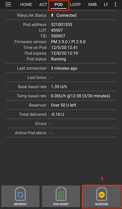
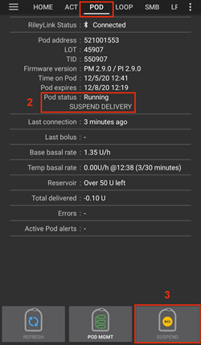
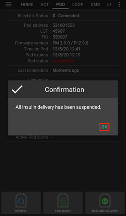

Omnipod image aliases resource reference test

Icon Table Layouts

.. table:: 

   ====================  ===========================================
   |refresh_pod_status|  **REFRESH:** 
   			 
			 Sends a refresh command to the active pod to update communication
			 
			 * Use to refresh the pod status and dismiss status fields that contain the text (uncertain).
			 * See the `Troubleshooting section <#troubleshooting>`__ below for additional information.

   |pod_management|   	 **POD MGMT:**

			 Navigates to the Pod management menu
   |ack_alerts|		 **ACK ALERTS:**
   			 
			 When pressed this will disable the pod expiration beeps and notifications. 
			 
			 * Button is displayed only when pod time is past expiration warning time
			 * Upon successful dismissal, this icon will no longer appear.
			 
   |set_time|		 **SET TIME:**
   
			 When pressed this will update the time on the pod with the current time on your phone.
   |suspend|  		 **SUSPEND:**
   
			 Suspends the active pod
   |resume| 		 **RESUME DELIVERY:**
   
			 Resumes the currently suspended, active pod
   ====================  ===========================================
 

Pod Management Icons

.. table:: 

   =========================  ===========================================
   |activate_pod|	      **Activate Pod**
   
   			      Primes and activates a new pod

   |deactivate_pod|	      **Deactivate Pod**
 
 			      Deactivates the currently active pod.
			 
		   	      *  A partially paired pod ignores this command.
			      *  Use this command to deactivate a screaming pod (error 49).
			      *  If the button is disabled (greyed out) use the Discard Pod button.

   |play_test_beep| 	      **Play test beep**
 
 			      Plays a single test beep on the pod when pressed.

   |discard_pod|	      **Discard pod**

			      Deactivates and discards the pod state of an unresponsive pod when pressed.
			      
			      Button is only displayed when very specific cases are met as proper deactivation is no longer possible:

			      * A **pod is not fully paired** and thus ignores deactivate commands.
			      * A **pod is stuck** during the pairing process between steps
	 		      * A **pod simply does not pair at all.**

   |pod_history| 	      **Pod history** 
   
   			      Displays the active pod activity history

   |rileylink_stats| 	      **RileyLink stats:**
   
   			      Navigates to the RileyLink Statistics screen displaying current settings and RileyLink Connection history

			      * **Settings** - displays RileyLink and active pod settings information
			      * **History** - displays RileyLink and Pod communication history

   |reset_rileylink_config|   **Reset RileyLink Config** 
   
   			      When presssed this button resets the currently connected RileyLink configuration. 
			      
			      * When communication is started, specific data is sent to and set in the RileyLink 
			      
			        - Memory Registers are set
				- Communication Protocols are set
				- Tuned Radio Frequency is set
				
			      * See `addtional notes <#reset-rileylink-config-notes>`__ at the end of this table

   |pulse_log|		      **Read pulse log:** 
    
    			      Sends the active pod pulse log to the clipboard
   =========================  ===========================================			    

*Reset RileyLink Config Notes*
~~~~~~~~~~~~~~~~~~~~~~~~~~~~~~

* The primary usage of this feature is when the currently active RileyLink is not responding and communication is in a stuck state.
* If the RileyLink is turned off and then back on, the **Reset RileyLink Config** button needs to be pressed, so that it sets these communication parameters in the RileyLink configuration.
* If this is NOT done then AAPS will need to be restarted after the RileyLink is power cycled.

Interface Icons

Omnipod (POD) Overview Tab

|ack_alerts|                  
|pod_management|              
|refresh_pod_status|          
|resume|             
|set_time|                    
|suspend|                     

Pod Management Tab

|activate_pod|                
|deactivate_pod|              
|discard_pod|                 
|play_test_beep|              
|pod_history|                 
|pulse_log|                   
|reset_rileylink_config|      
|rileylink_stats|             

Instructional Section Images

Hardware and Software Requirements
|OrangeLink|

Acknowledge Alerts

|Acknowledge_Alerts_1|              
|Acknowledge_Alerts_2|              
|Acknowledge_Alerts_3|              
|Acknowledge_Alerts_4|              
|Acknowledge_Alerts_5|              

Actions Tab

|Actions_Tab|                  		

Activate Pod

|Activate_Pod_1|                    
|Activate_Pod_2|                    
|Activate_Pod_3|                    
|Activate_Pod_4|                    
|Activate_Pod_5|                    
|Activate_Pod_6|                    
|Activate_Pod_7|                    
|Activate_Pod_8|                    
|Activate_Pod_9|                    
|Activate_Pod_10|                   
|Activate_Pod_11|                   
|Activate_Pod_12|                   
|Activate_Pod_13|                   
|Activate_Pod_14|                   
|Activate_Pod_15|                   

Deactivate Pod

|Deactivate_Pod_1|                  
|Deactivate_Pod_2|                  
|Deactivate_Pod_3|                  
|Deactivate_Pod_4|                  
|Deactivate_Pod_5|                  
|Deactivate_Pod_6|                  
|Deactivate_Pod_7|                  
|Deactivate_Pod_8|                  
|Deactivate_Pod_9|                  
|Deactivate_Pod_10|                 

Enabling the Omnipod Driver in AAPS

|Enable_Omnipod_Driver_1|           
|Enable_Omnipod_Driver_2|           
|Enable_Omnipod_Driver_3|           
|Enable_Omnipod_Driver_4|           
|Enable_Omnipod_Driver_5|           

Optimally Positioning the RileyLink

|Omnipod_pod_and_RileyLink_Position|
|Toroid_w_CS|                  		

Omnipod Settings

|Omnipod_Settings_1|                
|Omnipod_Settings_2|                
|Omnipod_Settings_3|                

Omnipod Tab

|Omnipod_Tab|                  		
|Omnipod_Tab_Pod_Management|        

Pod History

|Pod_History_1|                  	
|Pod_History_2|                  	
|Pod_History_3|                  	
|Pod_History_4|                  	

Resume Insulin Delivery

|Resume_Insulin_Delivery_1|         
|Resume_Insulin_Delivery_2|         
|Resume_Insulin_Delivery_3|         
|Resume_Insulin_Delivery_3|         

RileyLink Bluetooth Reset

|RileyLink_Bluetooth_Reset_1|       
|RileyLink_Bluetooth_Reset_2|       
|RileyLink_Bluetooth_Reset_3|       
|RileyLink_Bluetooth_Reset_4|       
|RileyLink_Bluetooth_Reset_5|       

RileyLink Setup

|RileyLink_Setup_1|                 
|RileyLink_Setup_2|                 
|RileyLink_Setup_3|                 
|RileyLink_Setup_4|                 
|RileyLink_Setup_5|                 

RileyLink Statistics History

|RileyLink_Statistics_History_1|    
|RileyLink_Statistics_History_2|    
|RileyLink_Statistics_History_3|    

RileyLink Statistics Settings

|RileyLink_Statistics_Settings_1|   
|RileyLink_Statistics_Settings_2|   
|RileyLink_Statistics_Settings_3|   

Suspend Insulin Delivery

|Suspend_Insulin_Delivery_1|        
|Suspend_Insulin_Delivery_2|        
|Suspend_Insulin_Delivery_3|        
|Suspend_Insulin_Delivery_4|        
