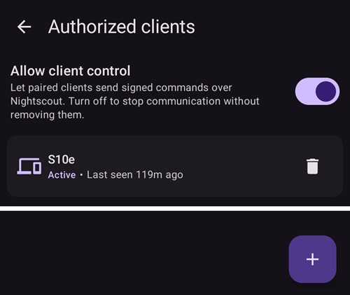
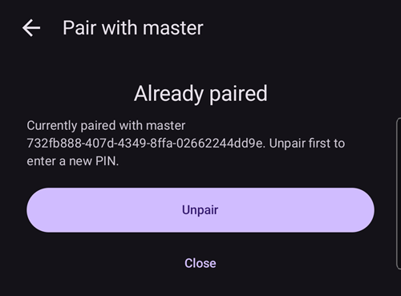
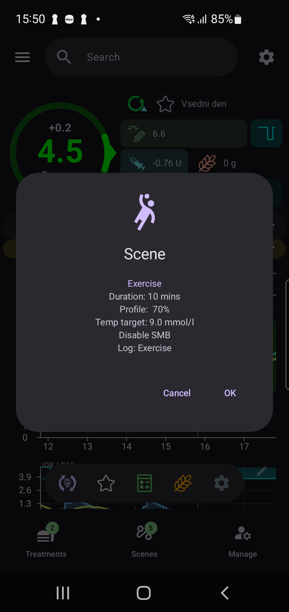
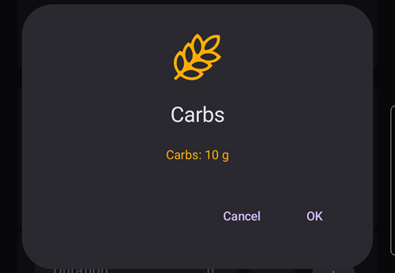
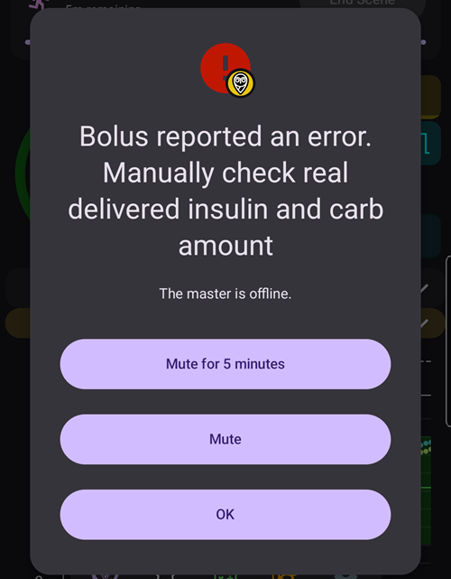
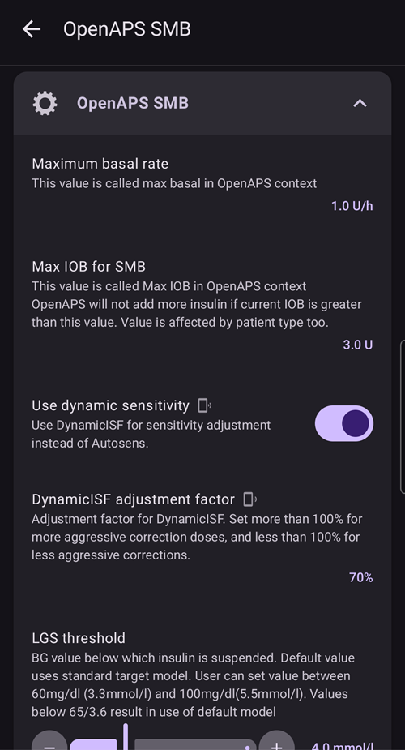

# Master ↔ Client control (signed remote control)

From **AAPS** version 4, a follower phone running **AAPSClient** can do much more than *announce* treatments through Nightscout: once it has been **paired** with the main phone, it can send **signed commands** that the main phone (the **master**) checks, confirms and executes — including delivering an **insulin bolus** on the master's pump.

This page explains how remote control worked in **AAPS** v3, what changed in v4, and how to set it up and use it.

```{contents} Table of contents
:depth: 2
:local: true
```

```{admonition} Wording used on this page
:class: note
- **Master** = the main **AAPS** phone that owns the pump and runs the loop (the `full` app).
- **Client** = an **AAPSClient** phone with no pump that follows and now also *controls* the master.
- Both phones must be connected to the **same Nightscout** site. All communication still travels through Nightscout — no direct connection between the phones is needed.
```

---

## How it worked before (AAPS v3)

In v3, remote control from **AAPSClient** (or from the Nightscout web/app) was done by writing **care-portal treatments** to Nightscout. The master's **NSClient** then picked those entries up during synchronization and applied them, provided the *“accept commands”* options were enabled in the NSClient preferences (see [Remote control](../RemoteFeatures/RemoteControl.md)).

This worked, but had important limitations:

- **No insulin.** You could *announce* a “correction bolus” (which only changed IOB) but you could **not actually deliver a bolus** from a client.
- **Limited set of actions** — temporary target, profile switch, carbs, BG check, and the various care-portal *notes/announcements*.
- **Unsigned and unconfirmed.** Anything able to write to your Nightscout could inject a treatment; there was no cryptographic proof that the command came from *your* client, no preview of what the master would actually do, and no confirmation step on the master.
- **Fire-and-hope.** The client did not know whether the master was online, whether the command had been applied, or whether it had failed.

---

## What's new in AAPS v4

v4 introduces a dedicated **Client-Control** channel. It still rides on your Nightscout site (in the `settings` collection), but every message is **cryptographically signed** with a secret that is exchanged once, during **pairing**, and never leaves the devices in clear text.

The guiding principle is **the master is in charge**:

1. The client sends an *intent* (“bolus 2 U”, “start the Exercise scene”, “set this temp target”…).
2. The **master** re-computes and **caps** the action against its **own** live data (profile, IOB, COB, current temp target, pump), and **authors the exact confirmation** the user will see.
3. The client (or watch) shows the **master's** confirmation text — it never builds its own.
4. On confirmation the master **executes once** and reports the result back to the client.

Headline changes versus v3:

| | AAPS v3 (Nightscout care-portal) | AAPS v4 (signed Client-Control) |
|---|---|---|
| Channel | Care-portal treatments on Nightscout | Signed commands on Nightscout `settings` |
| Authentication | None (anyone who can write to NS) | Per-client pairing secret + HMAC signature |
| Replay/expiry protection | None | Monotonic counter + command time-to-live |
| Insulin bolus from a client | ❌ Not possible | ✅ Master delivers it on its pump |
| Confirmation | None / client-side only | **Master-authored** lines shown on the client |
| Capping / safety | Client or none | Always done on the **master** |
| Knows if the master is online | ❌ | ✅ Actions blocked with a clear message when offline |
| Live bolus progress on the client | ❌ | ✅ Mirrored from the master |
| Revoke a follower | Change NS secret | One tap (per client) or a master kill-switch |

Actions that can be triggered from a client in v4: **bolus**, **carbs / eCarbs**, **temporary target** (set & cancel), **profile switch**, **loop / running-mode** change, **temp basal** (set & cancel), **extended bolus** (set & cancel), **insulin selection**, and **[scenes](Scenes.md)**. A subset of bidirectional **preferences** is also kept in sync between master and clients.

---

## Roles and prerequisites

```{admonition} Before you start
:class: important
- The **master** runs the normal `full` **AAPS** build and is connected to your pump.
- The **client** runs **AAPSClient** (or **AAPSClient2** for a second patient — see [AAPSClient vs AAPSClient2](../RemoteFeatures/RemoteControl.md#about-aapsclient-and-aapsclient2)).
- **Both** phones use **NSClientV3** pointed at the **same** Nightscout, and are showing *connected*. Enabling **websockets** on **both** is strongly recommended for fast, near-instant round-trips.
```

Pairing and synchronization are two different things:

- **Synchronization** (data: BG, treatments, profile) is set up exactly as before — see [Synchronization](../RemoteFeatures/RemoteControl.md#2-aapsclient).
- **Pairing** (control: the signed command channel described here) is the new step below.

---

## Setting it up

(client_master_master_setup)=
### 1. On the master — enable control and add a client

On the master, open the **Manage** screen and choose **Authorized clients**.

Turn on **Allow client control**. This is the master kill-switch: with it off, no client can send commands, but your paired clients are kept so you can turn it back on later.



Tap the **+** button to add a client. Enter a **device name** (so you can recognize it in the list); the master then displays a short **pairing PIN**. This PIN is **one-time** and **expires after about two minutes**.

<!-- 📷 SCREENSHOT NEEDED: master pairing screen showing the PIN.
     Use a DEMO/expired PIN only — it protects the pairing secret and must not be a live one. -->

```{admonition} The pairing PIN is a secret
:class: warning
The PIN protects the pairing secret that is exchanged through Nightscout. Share it only with the device you are pairing, do not post it publicly, and let it expire if you do not use it. A fresh PIN can always be generated by tapping **+** again.
```

(client_master_client_setup)=
### 2. On the client — pair with the master

On the client, open **Manage → Pair with master**, then **enter the PIN** shown on the master. The client uses the PIN to securely retrieve the pairing offer through Nightscout and complete pairing.

<!-- 📷 SCREENSHOT NEEDED: client "Pair with master" screen in the UNPAIRED state,
     showing the enter-PIN entry. (The screenshot below shows the already-paired state.) -->

Once a client is paired it sends a **Hello** to the master and appears in the master's **Authorized clients** list as **Active**, with a *“last seen”* time. A client can be paired with **one** master at a time; to pair with a different master, **Unpair** first.



### 3. Managing clients

From the master's **Authorized clients** screen you can, at any time:

- **Revoke** a single client — tap the **trash** icon next to it. The client can no longer send commands until it is paired again.
- **Stop all control** without losing the pairings — turn off **Allow client control**.

---

## Using remote control

### Triggering an action from the client

Use the client exactly as you would the phone itself: open **Carbs**, **Insulin**, **Temp Target**, **Profile**, **Scenes**, the **Manage** sheet, etc., and fill in the values.

When you confirm, the client briefly shows **“Contacting master…”**, the **master** computes and caps the action, and the client then displays the **master's own confirmation** — the exact lines, values and colors the master would show on its own screen. Review them and tap **OK** to go ahead.



The same applies to a simple carbs entry — the amount shown for confirmation is the one the master computed:



After you confirm, the master executes the action once and the result is reflected back on the client.

### Insulin bolus from a client

This is the main new capability in v4. A bolus started on a client is **delivered by the master on its pump**; the master caps it against its own constraints, and the client shows **live delivery progress** while it runs (and an alarm if the pump reports a failure).

```{admonition} Boluses are always confirmed and capped on the master
:class: note
A client never decides the delivered amount on its own. The master recomputes and caps it, you confirm the master-authored amount, and only then is it delivered.
```

### When the master is offline

If the master is not reachable (its phone is off/asleep, not connected to Nightscout, or websockets are down), control actions on the client are **blocked before anything is sent**, and you get a clear message. Nothing is half-applied.



The client re-checks reachability automatically and re-enables control once the master is back online.

### Wear OS (watch) on a client

A watch paired to a **client** phone relays its actions through the client to the master (watch → client → master). The watch shows the **master's** confirmation lines and the real result, just like the phone. Setting up the watch is unchanged — see [Wear OS](../WearOS/WearOsSmartwatch.md).

<!-- 📷 SCREENSHOT NEEDED (optional): watch confirmation screen relayed from the master,
     and/or the "Contacting master" state on the watch. Requires a paired Wear OS device. -->

---

## Changing configuration and preferences

Pairing does more than relay one-off actions — it also keeps the **configuration** and many **preferences** aligned between the master and its clients.

### Configuration (which plugins are active)

The active **plugins** (APS algorithm, sensitivity, smoothing, …) are chosen on the **master** and **mirrored** to every paired client. On a client these selections are marked with a small **mobile icon** in the [Configuration](Configuration.md#configuration_sync_icon) screen — change them on the master and the clients follow automatically and vice versa.

In the example below the mobile icon appears on *Smoothing*, *Calibration*, *Sensitivity detection* and *APS* (synced from the master), but not on *Communication* or *General*:


Connection details that are unique to each device — most importantly the **NSClient Nightscout URL / access token** — are *not* synced and are set on each phone individually.

### Preferences

A subset of **preferences** is **bidirectional**: you can change them on the **master or on a paired client**, and the change is synchronized to the other side. When you change such a preference on a client, it is sent to the master over the signed channel, applied there, and the authoritative value is sent back — so what you see on the client is always what the master stored. If the same preference is changed on two devices at almost the same time, the **most recent edit wins**.

Inside a plugin's settings, the same small **mobile icon** marks the individual preferences that are synced. In the example below *Use dynamic sensitivity* and *DynamicISF adjustment factor* are synced (mobile icon), while device-local settings such as *Maximum basal rate* and *Max IOB for SMB* are not:



```{admonition} The master must be online to change synced settings from a client
:class: note
Because the master is the authority for the stored value, editing a master-controlled configuration item or a bidirectional preference from a client requires the master to be **reachable**. When the master is offline those controls are disabled on the client (see [When the master is offline](#when-the-master-is-offline)).
```

---

## Security notes

```{admonition} How the channel is protected
:class: tip
- **Pairing secret** is exchanged once during PIN-based pairing and stored encrypted on each device; it never travels through Nightscout in clear text (it is protected by the PIN).
- **Every command is signed** (HMAC). The master rejects anything whose signature does not match a paired client.
- **Replay is prevented** by a per-client monotonic counter, and every command **expires** after a short time-to-live.
- **You stay in control**: revoke a client with one tap, or disable everything with **Allow client control**.
```

```{admonition} After restoring a backup
:class: warning
If a client is restored from a backup that rolls its command counter backwards, the master will reject its next commands as replays. Simply **unpair and pair again** to recover.
```

---

## Troubleshooting

| Symptom | What to check |
|---|---|
| Client says the **master is offline** | Master phone awake and running **AAPS**; both phones connected in **NSClientV3**; **websockets** enabled on both; same Nightscout site. |
| Client says it is **not paired** | Pair again from **Manage → Pair with master**. Confirm the client is **Active** in the master's **Authorized clients** list. |
| Command **rejected** by the master | The master re-validates against its current state — e.g. the chosen profile no longer exists, or the pump type does not match. Re-check on the master. |
| Commands work but are **slow** | Enable **websockets** on both phones (otherwise the apps fall back to slower polling). |
| Nothing happens after pairing | Make sure **Allow client control** is ON on the master. |

For Nightscout / synchronization problems first see [Troubleshooting NSClient](../GettingHelp/TroubleshootingNsClient.md).

---

<!-- =====================================================================
     SCREENSHOTS STILL TO ADD (placeholders marked inline above):
       1. Master pairing screen: PIN  (use a demo/expired PIN!)
       2. Client "Pair with master" in the UNPAIRED state (enter PIN)
       3. (optional) Wear OS confirmation relayed from the master
     Already included (captured from real master + client devices):
       - authorized_clients_master.png       (master: Authorized clients list)
       - pair_with_master_client.png         (client: pairing screen, paired state)
       - confirmation_master_authored.png    (client: master-authored scene confirmation)
       - carbs_confirmation_client.png       (client: master-authored carbs confirmation)
       - master_offline_error.png            (client: master-offline message)
     Maintainers: relocate page + images and fix cross-links as needed.
     ===================================================================== -->
