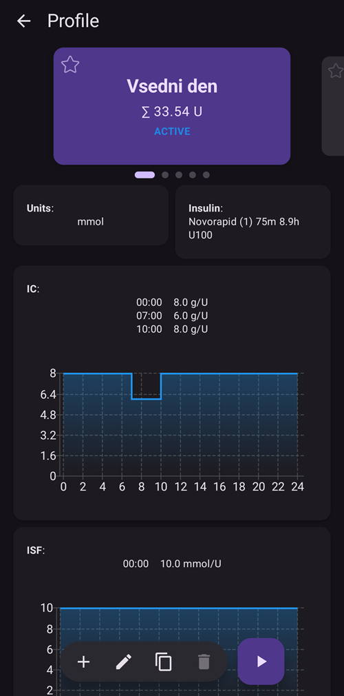
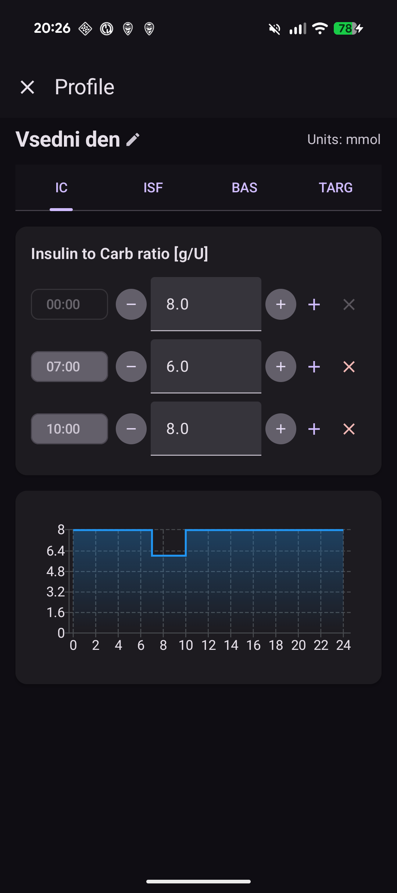
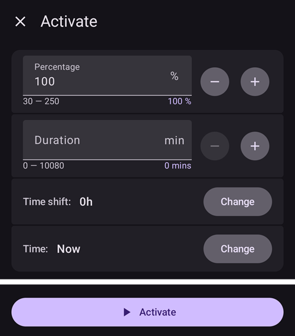

# Profiles (management and activation)

A **profile** holds your therapy settings on a 24-hour schedule: **basal** rates, **insulin sensitivity factor (ISF)**, **insulin-to-carb ratio (IC)** and **target**. In **AAPS** v4 profiles are created, edited and activated from **Manage → Profile**.

```{contents} Table of contents
:depth: 2
:local: true
```

---

## Opening profiles

Open the **Manage** screen (bottom navigation) and choose **Profile** (*“Manage and activate profiles”*).

---

## Managing profiles

The Profile screen shows your profiles as a **swipeable card carousel**. The card of the running profile is marked **ACTIVE** and shows its total daily basal (e.g. *∑ 33.54 U*). Below the selected card you see that profile's details — **Units**, **Insulin** type, and the **IC**, **ISF**, **basal** and **target** schedules with graphs.



The action bar at the bottom acts on the **selected** profile:

- **➕ Add** — create a new profile.
- **✏️ Edit** — edit the profile.
- **⧉ Clone** — duplicate it as a starting point for a new one.
- **🗑️ Delete** — remove it.
- **▶ Activate** — make it the running profile (see [Activating a profile](#activating-a-profile-profile-switch)).

### Editing a profile

Tapping **✏️ Edit** opens the editor. Set the profile **name** and **units**, then fill in the four schedules using the tabs:

- **IC** — insulin-to-carb ratio (g/U)
- **ISF** — insulin sensitivity factor
- **BAS** — basal rates
- **TARG** — target range



Each schedule is a list of **time blocks**: add a block, set its start time and value. Save when you are done.

---

## Activating a profile (profile switch)

Select a profile and tap **▶ Activate**. A **profile switch** dialog lets you tailor how it is applied:



- **Percentage** (30–250 %) — scale the whole profile. 100 % uses it as-is; for example 70 % reduces basal and the calculated insulin dose (both meal boluses and corrections) by 30 %. It does not change your glucose targets or carb absorption.
- **Duration** — how long the switch lasts. **0 = indefinite** (until you switch again); a non-zero value reverts to the previous profile when it ends.
- **Time shift** — move the schedule forward/back in time (useful for shift work or travel).
- **Time** — when the switch takes effect (normally *Now*).

Tap **Activate**. The running profile then carries the **ACTIVE** badge on its card.

```{admonition} Percentage and time shift make one profile go a long way
:class: note
Rather than building many similar profiles, keep one base profile and apply it at a different **percentage** or **time shift** for recurring situations (illness, exercise, travel). This is exactly what [scenes](Scenes.md) automate.
```

---

## Other ways to switch profile

A profile switch is not limited to this screen. The same switch can be triggered from:

- a **Wear OS watch** (the **Profile switch** menu item),
- a paired **client** — see [Master ↔ Client control](ClientMasterCommunication.md),
- a **[scene](Scenes.md)** (its *Profile switch* action), or
- an **Automation** rule (*Change profile to* / *Start profile … for … min*).

---

<!-- =====================================================================
     Screenshots captured from a real master device:
       - profile_manage.png   (Manage → Profile: carousel, details, action bar)
       - profile_editor.png   (profile editor: IC / ISF / BAS / TARG tabs)
       - profile_activate.png (profile switch dialog: percentage/duration/time shift/time)
     No profile switch was actually applied (the dialog was canceled).
     Maintainers: relocate page + images and fix cross-links as needed.
     ===================================================================== -->
