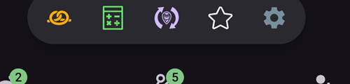
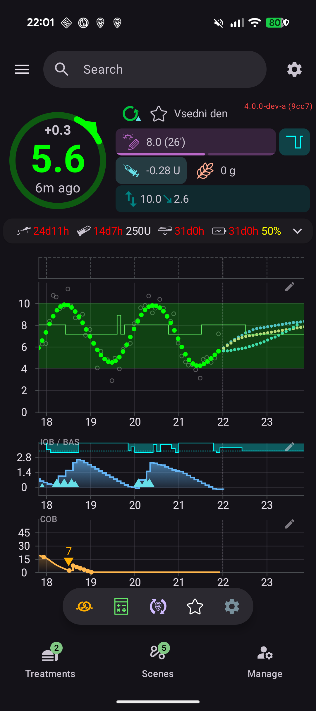
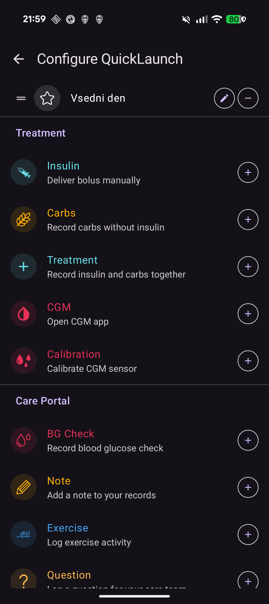
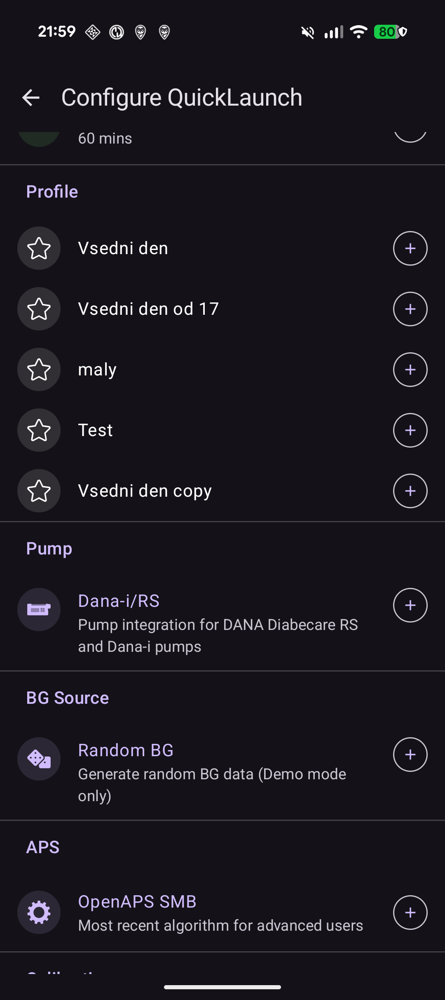
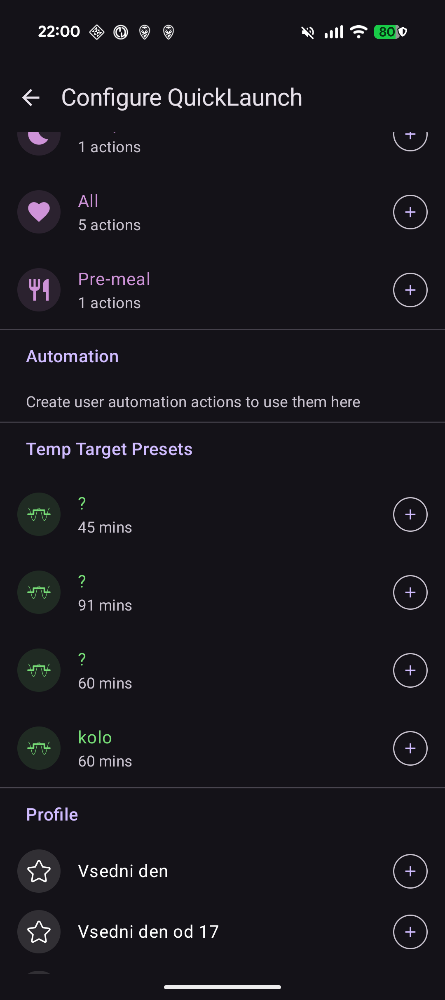

# QuickLaunch (overview quick-action toolbar)

**QuickLaunch** is the small **quick-action toolbar** that floats at the bottom of the **AAPS** overview, just above the bottom navigation. It is a customizable row of one-tap buttons: you decide which actions live there, in which order, so the things you do most often are always one tap away on the main screen.

```{contents} Table of contents
:depth: 2
:local: true
```



---

## Using the toolbar

The toolbar sits on the **overview**, between the graphs and the bottom navigation:



- **Tap** an icon to run its action — exactly as if you had opened it from its normal screen (a bolus or treatment still shows its usual confirmation first).
- **Long-press** an icon to see a **tooltip** with the action's name and a short description.
- If you add **more buttons than fit** on screen, the extra ones move into an **overflow menu** (the **⋮** button at the end of the toolbar).
- Each icon keeps its action's **color** (e.g. insulin, carbs, temp target), so it is recognizable at a glance.

```{admonition} The toolbar is always there
:class: note
The last button is always **Configure QuickLaunch** (the **⚙️** gear). It cannot be removed, so you can always reach the configuration screen straight from the toolbar. By default the toolbar contains just two buttons — the **Bolus wizard** and this gear.
```

---

## Configuring QuickLaunch

Tap the **⚙️** gear on the toolbar (or open **[Configuration](Configuration.md) → … → Configure QuickLaunch**) to open the **Configure QuickLaunch** screen (*“Customize quick-action buttons on overview”*).



The screen has two parts:

- **Selected actions** (at the top) — the buttons currently on your toolbar, in toolbar order.
- A **catalog** below it — every action you can add, grouped by category. Each catalog entry has a **➕** button to add it.

### Selected actions — reorder, edit, remove

Each selected action has:

- a **⠿ drag handle** — press and drag to **reorder** the buttons (the order here is the order on the toolbar),
- a **−** button — **remove** it from the toolbar,
- and, for a **Profile** shortcut only, a **✏️** button to edit its percentage/duration (see [Profile shortcuts](#profile-shortcuts)).

Changes take effect **immediately** — there is no separate *Save*. Adding an action drops it at the end of the toolbar; reorder it from there.

---

## The action categories

The catalog groups everything you can add into the following categories, in this order. Categories that have nothing to offer (e.g. you have no scenes) are simply not shown.

### Treatment

The everyday treatment and CGM dialogs:

- **Insulin** — deliver a bolus manually.
- **Carbs** — record carbs without insulin.
- **Bolus wizard** — open the bolus calculator.
- **Treatment** — record insulin and carbs together.
- **Insulin** *(management)* — manage and activate insulin configurations.
- **CGM** — open your CGM app (e.g. xDrip).
- **Calibration** — calibrate the CGM sensor.

### Care Portal

The care-portal events and device-maintenance records:

- **BG Check**, **Note**, **Exercise**, **Question**, **Announcement**,
- **Sensor Insert**, **Pump Battery Change**, **Pump Site Change**, **Prime/Fill**, **Site Rotation**.

These are the same entries you would otherwise reach through the **[Treatments](BehavioralChanges.md#treatments-enter-and-deliver)** and **[Manage](BehavioralChanges.md#manage-manage-and-activate)** sheets — QuickLaunch just puts the ones you use on the overview.

### Quick Wizard

Each of your **[QuickWizard](QuickWizards.md)** presets can be added as a button, so a recurring meal is one tap from the overview. The button carries the preset's name and shows the carbs/insulin amount; tapping it runs the QuickWizard with its usual confirmation.

### Scenes

Each enabled **[scene](Scenes.md)** can be added as a button. Tapping it asks for confirmation, then activates the scene (the same bundle of actions you would get from the Scenes screen). This category appears only if you have at least one scene.

### Automation

Your **user-action** automation rules (the ones you trigger by hand) can be added as buttons. Tapping one asks for confirmation, then runs that rule's actions.

```{admonition} Automation buttons run on the master
:class: note
Automation executes on the **master**, so automation shortcuts are offered and run only on the master. They are not available on a paired **[client](ClientMasterCommunication.md)**.
```

### Temp Target Presets

Each of your **[Temp Target](TempTargets.md)** presets can be added as a button (its name and duration are shown). Tapping it asks for confirmation, then starts that temp target.

(profile-shortcuts)=
### Profile

Every **[profile](Profiles.md)** can be added as a **shortcut** that performs a **profile switch** in one tap. Unlike most shortcuts, a Profile shortcut carries its own **percentage** and **duration**, which you set after adding it with the **✏️** button:

- **Percentage** (50–200 %) — scale the profile when it is applied. 100 % uses it as-is.
- **Duration** (0–600 min) — how long the switch lasts. **0 = Permanent** (until you switch again).



This lets you keep several buttons for the **same** profile at different strengths — for example *“Profile 100 %”* and *“Profile 70 % for 2 h”* — and apply either with a single tap. (You can add the same profile more than once with different settings.)

### Plugins

Finally, any **enabled plugin** that has its own screen can be added as a shortcut to open it directly. These are grouped by plugin type — **Pump**, **BG Source**, **APS**, **Sensitivity detection**, **Smoothing**, **Calibration**, **Constraints**, **Communication** and **General** — so you can, for instance, jump straight to your pump or loop screen from the overview.



---

## QuickLaunch and Master/Client

Unlike most of your settings, the **QuickLaunch toolbar is configured per device** — it is stored **locally and is not synced** between your master and paired clients, so each device keeps its own set of buttons. (It *is* included in a settings **backup/export**, so a restore brings it back on the same device.)

What each device can put on its toolbar still depends on what it has: QuickWizards, scenes, temp-target presets and profiles all sync, so a client's catalog offers the same items — you simply choose them per device. A few details to know:

- Buttons whose target no longer exists (a deleted QuickWizard, scene or preset, a disabled rule) are **skipped automatically**.
- **Automation** shortcuts are offered and run only on the **master** (automation executes on the master). Scene, QuickWizard, temp-target and profile buttons are available on a client.
- When you tap a button on a client that must run on the master (a bolus, temp target, profile switch or scene), the **master** carries it out and authors the confirmation. See [Master ↔ Client control](ClientMasterCommunication.md).

---

<!-- =====================================================================
     Screenshots captured from a real master device:
       - quicklaunch_toolbar.png    (cropped close-up of the overview toolbar pill)
       - quicklaunch_overview.png   (full overview showing the toolbar in place)
       - quicklaunch_config.png     (Configure QuickLaunch: Selected actions + Treatment + Care Portal)
       - quicklaunch_dynamic.png    (catalog: Quick Wizard / Scenes / Automation / Temp Target Presets)
       - quicklaunch_categories.png (catalog: Profile shortcuts + plugin categories)
     No QuickLaunch action was actually run (nothing delivered; only scrolled).
     Maintainers: relocate page + images and fix cross-links as needed.
     ===================================================================== -->
