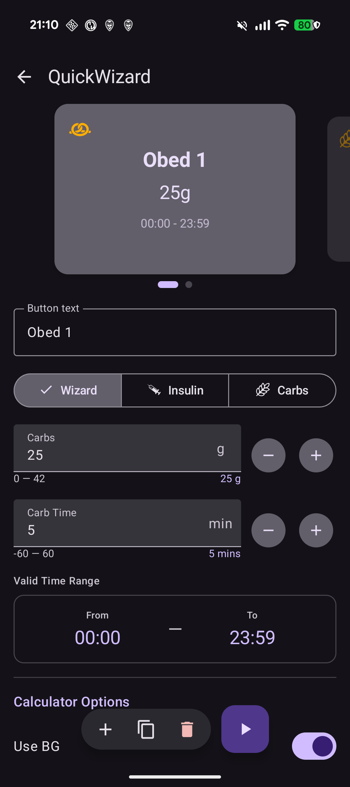
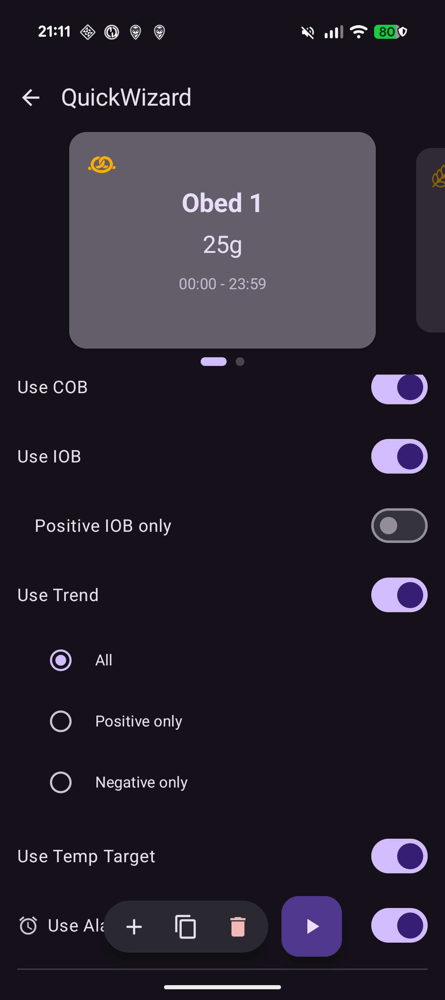
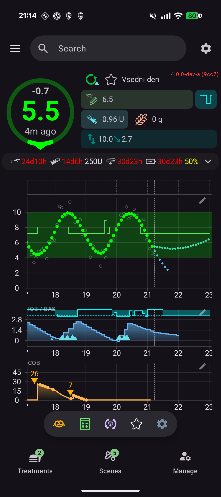

# QuickWizards (one-tap boluses)

A **QuickWizard** is a saved one-tap button for a recurring meal or situation. It carries a fixed amount of **carbs** (and how to dose for them), so you can deliver a bolus — or just log carbs — with a single tap and a confirmation, instead of opening the full bolus calculator every time.

```{contents} Table of contents
:depth: 2
:local: true
```

---

## Opening QuickWizards

Open the **Manage** screen (bottom navigation) and choose **QuickWizard** (*“Manage quick wizard presets”*).

---

## Managing QuickWizards

Your QuickWizards are shown as a **swipeable card carousel** (each card shows the button text, carbs and valid time range). The editor below configures the **selected** one; the bottom action bar has **➕ add**, **⧉ clone**, **🗑️ delete** and a **▶** button to run the selected QuickWizard.



The editor's main fields are:

- **Button text** — the label shown on the button.
- **Carbs** and **Carb Time** — the carb amount and its time offset.
- **Valid Time Range** — see [Validity](#validity-when-the-button-appears).
- **Calculator Options** and **Device Selection** — see below.

---

## The three modes

The selector at the top of the editor — **Wizard / Insulin / Carbs** — decides **what the button does** when tapped:

- **Wizard** — runs the full **bolus calculator** for the configured carbs, using your current **BG, IOB, COB and trend** (per the *Calculator Options* below). It delivers the *calculated* bolus and records the carbs. This is the classic quick wizard.
- **Insulin** — delivers a **fixed, preset insulin amount** that you set — no calculation.
- **Carbs** — records the configured **carbs only**, with **no bolus**.

---

## Calculator Options (Wizard mode)

For a **Wizard**-mode button you choose which inputs the calculation uses:

- **Use BG**, **Use COB**, **Use IOB** (with *Positive IOB only*), **Use Trend** (*All / Positive only / Negative only*), **Use Temp Target**, **Use Alarm**.
- **Bolus percentage** — scale the calculated bolus.
- **Add eCarbs** — also schedule extended carbs.



---

## Validity — when the button appears

(quickwizard_validity)=
The **Valid Time Range** (*From / To*) controls **when** a QuickWizard is shown and usable. A button set to, say, **06:00–10:00** only appears in the morning — so a *Breakfast* QuickWizard does not clutter your screen (or get tapped by mistake) at dinner. Outside its window the button is hidden.

---

## Invocation points — where you use it

The **Device Selection** toggles decide where each QuickWizard appears:

- **Show on Phone** — it appears as a **quick-action button on the overview** (and is also offered in *QuickLaunch*).
- **Show on Watch** — it appears on the **Wear OS QuickWizard tile**.



A paired **client** (**AAPSClient**) can also trigger a QuickWizard — the **master** computes and delivers it (see [Master ↔ Client control](ClientMasterCommunication.md)).

Wherever it is triggered, tapping a QuickWizard always shows a **confirmation** (the master-authored confirmation, when triggered from a client or watch) before anything is delivered.

---

## Adding and removing

- **➕ Add** — create a new QuickWizard.
- **⧉ Clone** — duplicate one as a starting point.
- **🗑️ Delete** — remove one.

QuickWizards are part of the synced configuration, so they are shared across your master and paired clients.

---

<!-- =====================================================================
     Screenshots captured from a real master device:
       - quickwizard_editor.png   (Manage → QuickWizard: carousel, mode, carbs, carb time, valid time range)
       - quickwizard_options.png  (Calculator Options, Bolus percentage, Device Selection)
       - quickwizard_overview.png (the QuickWizard quick-action button on the overview)
     Optional to add later: the Wear OS QuickWizard tile.
     No QuickWizard was actually run (no bolus delivered).
     Maintainers: relocate page + images and fix cross-links as needed.
     ===================================================================== -->
