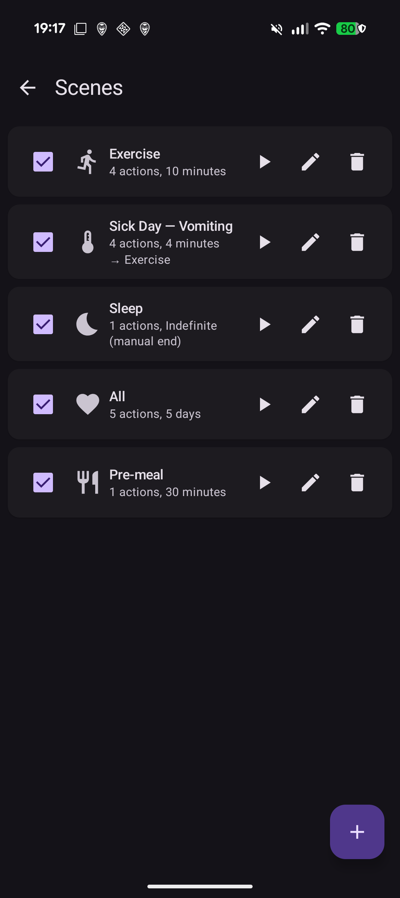
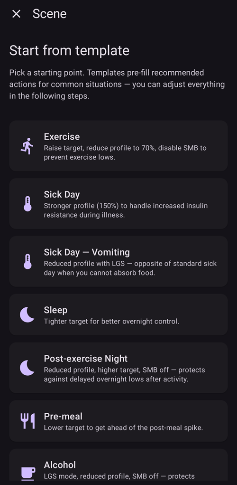
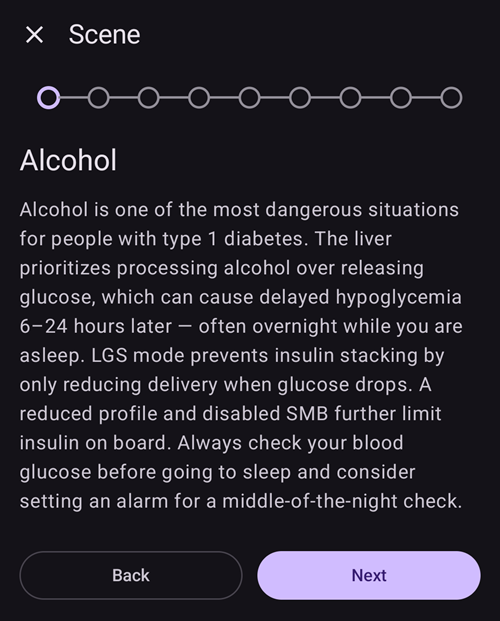
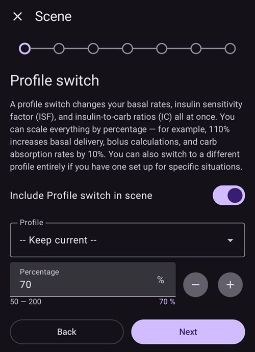
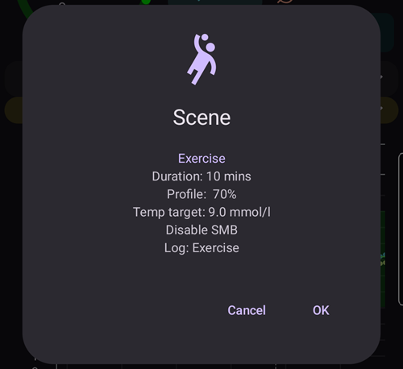
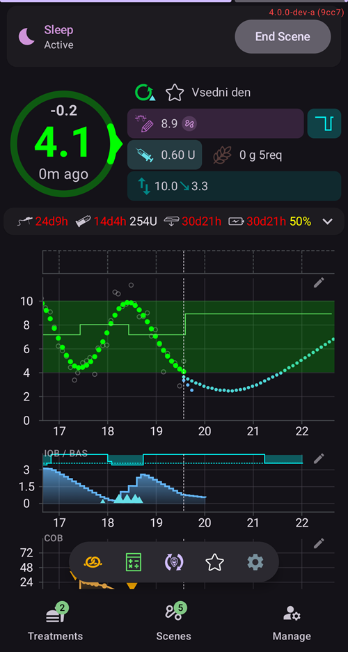
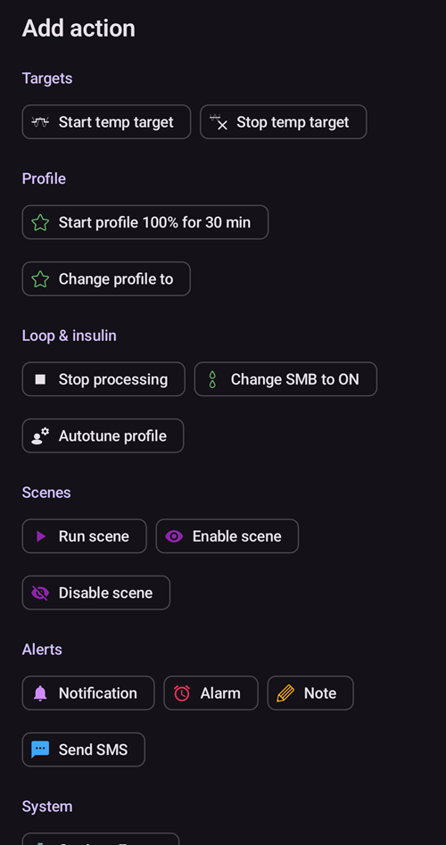
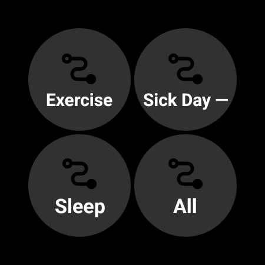
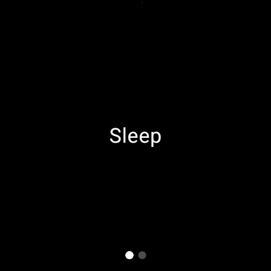

# Scenes (situation presets)

A **scene** is a named preset that applies a **bundle of actions at once** — for example a *Sleep*, *Exercise* or *Sick Day* preset that switches your profile, sets a temporary target, toggles SMB and adds a care-portal note with a single tap, optionally for a set duration.

```{contents} Table of contents
:depth: 2
:local: true
```

---

## What is a scene

Instead of changing several things by hand every time a recurring situation comes up, you set them up once as a scene and activate it with one tap. A scene can bundle any of these actions:

- **Profile switch** — switch profile and/or scale it by percentage (e.g. 70 %).
- **Temporary target** — set a temp target (e.g. *Activity*, *Eating soon*, or a custom value).
- **SMB on/off** — enable or disable super-micro-boluses while the scene is active.
- **Loop mode** — change the running mode (e.g. to a more conservative mode).
- **Care-portal note** — log an event (e.g. *Exercise*, *Sickness*) so it shows on the graph and in Nightscout.

A scene also has a **duration** — a fixed time (minutes/hours/days) or *Indefinite (manual end)* — and an **end action** that runs when it finishes: either a **notification**, or it can **chain** into another scene (for example *Sick Day → Exercise*).

---

## Managing scenes

Open **Manage → Scenes** to see, create, edit, enable/disable and reorder your scenes.



Each scene card shows:

- a **checkbox** to enable/disable the scene,
- an **icon** and **name**,
- a summary — *“N actions, duration”*, and the **→ chained scene** if it chains into another one,
- and three buttons: **▶ activate**, **✏️ edit**, **🗑️ delete**.

Tap the **+** button to create a new scene.

---

## Creating or editing a scene

### Start from a template

To **create** a scene, tap the **+** button on the Scenes screen. The first step is **Start from template**: pick a ready-made scene for a common situation — *Exercise*, *Sick Day*, *Sick Day — Vomiting*, *Sleep*, *Post-exercise Night*, *Pre-meal*, *Alcohol*, … Each template **pre-fills the recommended actions** and you can adjust everything in the following steps.



After you pick a template, its purpose is explained — *when* and *why* to use it — before you continue:



### Step through the actions

The rest of the editor is a short **step-by-step** wizard. Each step is one action type with an *“Include … in scene”* switch — turn it on only for the actions you want this scene to perform, and leave the rest off.



Work through the steps with **Next**/**Back**: *Profile switch*, *Temporary target*, *SMB*, *Loop mode*, *Care-portal note*, then the scene's **name/icon**, **duration** and **end action**. Save when you are done. (To **edit** an existing scene, tap its **✏️** button — you go straight into these steps.)

---

## Activating a scene

Activate a scene from the **Scenes** list (the **▶** button) or from the **Scenes** entry in the bottom navigation.

Before anything is applied you get a **confirmation** that lists exactly what the scene will do, so you can review it:



After you confirm, the actions are applied and the **active scene** is shown at the top of the overview with an **End Scene** button:



The scene's actions stay in effect until:

- its **duration** ends (the **end action** runs — a notification, or it chains into the next scene), or
- you tap **End Scene** to end it manually.

Ending a scene **reverts** the changes it made (for example the profile switch and temp target it started).

---

## Triggering scenes from Automation

A scene does not have to be started by hand — **Automation** can run it for you. When you add an action to an automation rule (**Manage → Automation**), the action picker has a **Scenes** category:

- **Run scene** — activate a scene when the rule's triggers fire (for example at a set time, when you arrive somewhere, or when glucose crosses a threshold).
- **Enable scene** / **Disable scene** — make a scene available (or unavailable) without activating it.



Automation can also **react to** a scene: the trigger list includes a **Scene** trigger, so a rule can run only while a particular scene is active. Combined with a scene's **end action** (revert, notify, or chain into another scene), this lets scenes start, follow on and finish automatically.

---

## Scenes with Master/Client and a watch

The **currently active scene is synchronized** across all of your paired devices — activate it on one phone and the others show it too.

A paired **client** (**AAPSClient**) can also activate or end a scene: the request is sent to the **master**, which authors the confirmation and applies the scene on its own state. See [Master ↔ Client control](ClientMasterCommunication.md) for how that works.

### From a Wear OS watch

Scenes are available on a **Wear OS watch** as a **Scene tile**. Swipe to the **Scene** tile in the watch's tile carousel (add it from the carousel's tile list first if it isn't there yet) and tap the scene you want to start:



The watch then shows a confirmation — tap **✓** to activate, or swipe back to cancel:



Just like on a client, the **master authors the confirmation and runs the scene**; the watch only relays the request (via the client phone, if the watch is paired to a client).

---

<!-- =====================================================================
     Screenshots captured from a real master device:
       - scenes_list.png        (Manage → Scenes management list)
       - templates_picker.png   (create: "Start from template" picker)
       - template_explanation.png (create: chosen template's explanation)
       - scene_editor.png       (scene editor, Profile switch step)
       - scene_confirmation.png (scene activation confirmation — also used on the Client/Master page)
       - scene_active_banner.png (overview active-scene banner with the End Scene button)
       - automation_scene_action.png (Automation action picker — Scenes category)
       - scene_watch_tile.png    (Wear OS Scene tile)
       - scene_watch_confirm.png (Wear OS scene confirmation)
     Maintainers: relocate page + images and fix cross-links as needed.
     ===================================================================== -->
