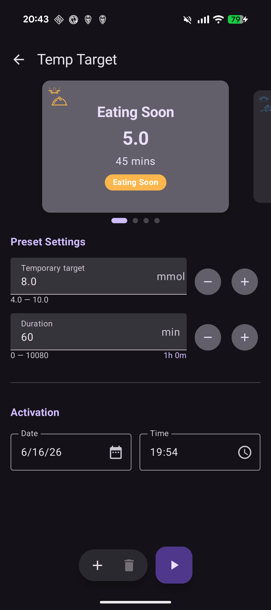

# Temporary targets (management and activation)

A **temporary target (TT)** overrides your glucose target for a while — for example raise it before/around **exercise**, lower it before a **meal** (*eating soon*), or raise it to recover from a **hypo**. In **AAPS** v4 you manage your TT **presets** and set a temporary target from **Manage → Temp Target**.

```{contents} Table of contents
:depth: 2
:local: true
```

---

## Opening temporary targets

Open the **Manage** screen (bottom navigation) and choose **Temp Target** (*“Manage and set temporary targets”*).

---

## The Temp Target screen



The screen has three parts:

1. **Preset carousel** (top) — swipe through your TT presets. Each card shows the preset's **name**, **target** and **duration**; the currently running TT is highlighted.
2. **Editor** (middle) — the **Temporary target** and **Duration** that will actually be applied, plus an **Activation** date/time.
3. **Action bar** (bottom) — **➕ add**, **🗑️ delete** and the **▶ activate** button.

Selecting a preset card loads its **target** and **duration** into the editor.

```{admonition} Built-in vs custom presets
:class: note
The built-in presets — **Eating Soon**, **Activity** and **Hypo** — always exist and **cannot be deleted** (you can change their values and save, though). Any presets you create yourself are **custom** and can be edited or deleted freely.
```

---

## Activating a temporary target

Swipe to the preset you want (its values load into the editor), optionally adjust the **target**/**duration** in the editor, then tap **▶ Activate**. The temporary target starts immediately (or at the chosen **Activation** time) and runs for the set **duration**.

```{admonition} Editing the numbers is a one-off — it does not change the preset
:class: important
The **target** and **duration** in the editor are the values **Activate** will use *right now*. If you change them, that change is **temporary**: it applies only to this activation and **does not modify the saved preset**. This lets you "tweak and activate" a one-off TT (for example activate *Activity* at a slightly different target today) without permanently altering the preset.
```

---

## Saving changes to a preset

If you *do* want to keep an edited value, **Save** it: when the editor differs from the selected preset, a **Save** icon appears in the top toolbar. Tapping it stores the current **target** and **duration** (and name, for custom presets) back into the selected preset.

So the rule of thumb is:

- **Activate** → use the numbers **once** (preset unchanged).
- **Save** → make the numbers the preset's **new defaults**.

---

## Adding and removing presets

- **➕ Add** — create a **new custom preset** from the current editor values. The new card appears in the carousel.
- **🗑️ Delete** — remove the selected **custom** preset. Built-in presets (*Eating Soon*, *Activity*, *Hypo*) cannot be deleted.

Your presets are part of the synced configuration, so they are shared across your master and paired clients.

---

## Other ways to set a temporary target

A temporary target can also be set without opening this screen:

- from a **Wear OS watch** (the **Temp Target** menu item / tile),
- from a paired **client** — see [Master ↔ Client control](ClientMasterCommunication.md),
- as part of a **[scene](Scenes.md)** (the *Temporary target* action), or
- from an **Automation** rule (*Start temp target* / *Stop temp target*).

---

<!-- =====================================================================
     Screenshot captured from a real master device:
       - tt_management.png  (Manage → Temp Target: carousel, editor, action bar)
     In the captured shot the editor (8.0 mmol / 60 min) deliberately differs from the
     selected "Eating Soon" preset (5.0 / 45 min) to show a temporary, unsaved override.
     No temporary target was actually activated or saved (the screen was backed out of).
     Optional to add later: a shot with the Save icon visible in the toolbar.
     Maintainers: relocate page + images and fix cross-links as needed.
     ===================================================================== -->
