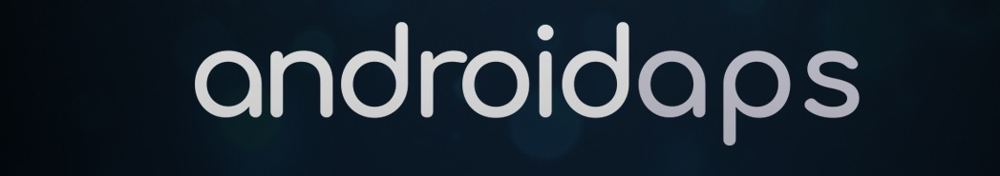

# AndroidAPS

.. toctree::
   :maxdepth: 1
   :caption: AndroidAPS documentation
   :glob:
   
   English </EN/index>
   Българска </BG/index>
   Deutsch </DE/index>
   Español </ES/index>
   
.. toctree::
   :maxdepth: 1
   :glob:
   :caption: How to edit these docs

   Instructions to edit the wiki </make-a-PR>
