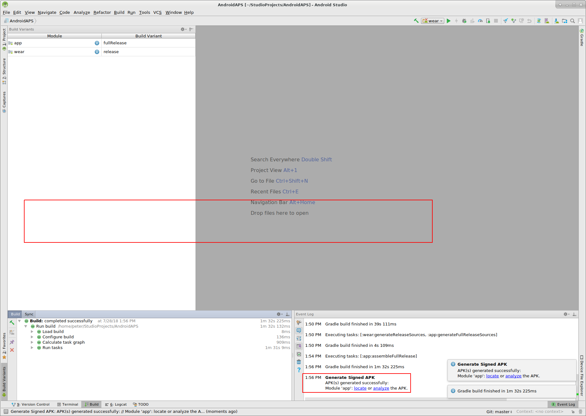
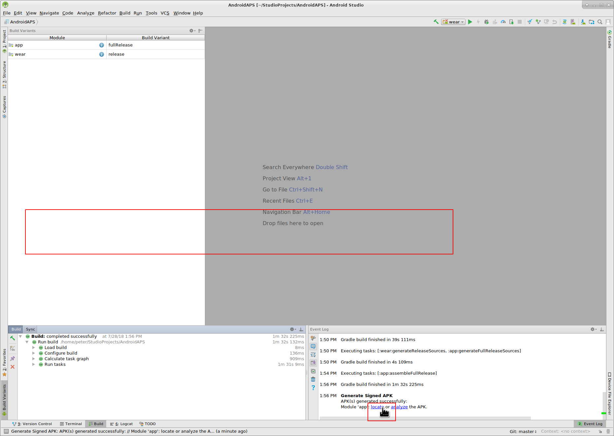
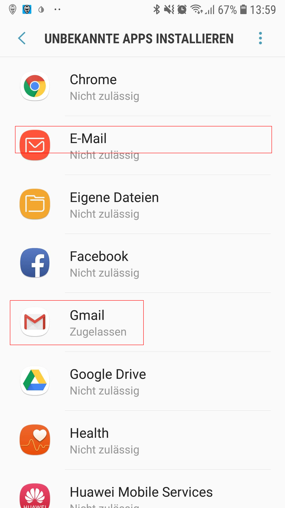

# Инсталиране на AndroidAPS - създаване на АРК
Това ръководство се състои от две части:
* В част Основи ще Ви обясним, кои са основните стъпки, които трябва да предприемете за да създадете APK файл.
* В указанията стъпка-по-стъпка ще откриете екрани с конкретна инсталация. Поради това че Android Studio ( софтуерната система, която използваме за създаване на АРК ) се променя доста бързо, тези екрани няма да са абсолютно точни, но ще Ви дадат повече яснота относно процеса. Друга особеност е, че понеже Android Studio може да бъде статиран на Windows, Mac OS X или Linux, то може да има разлики в начина, по-който изглежда. Ако откриете някаква грешка или неточност влезте в групата AndroidAPS Users във Facebook и ни информирайте за нея.

## Основи

Това са основните стъпки, които трябва да изпълните, за да компилирате APK файл.

* Инсталирайте git
* Инсталирайте и настройте Android Studio.
* Използвайте git да клонирате кода от централното хранилище в Github (където разрабтчиците слагат последния код на програмата).
* Отворете клонирания проект в Android Studio като активен.
* Създайте подписан АРК (signed APK).
* Прехвърлете подписаният АРК файл във Вашия телефон.

## Указания Стъпка-по-стъпка

Ето ги и стъпките по създаването на АРК файл в повече детайли.

* Инсталирайте git
  * [за Windows](https://gitforwindows.org/)
  * [за Mac OS X](http://sourceforge.net/projects/git-osx-installer/)
  * за Linux - просто информирайте git чрез пакетния мениджър на Вашата дистрибуция
* Инсталирайте [Android Studio](https://developer.android.com/studio/install.html).
* Настройки на Android Studio при първото стартиране

Изберете "Do not import settings" , понеже не сте използвали до сега.

Изберете "Next".

Изберете "Standard" като тип инсталация и натиснете "Next".

Изберете "Intellij" за UI (интерфейс) тема и натиснете "Next".

Натиснете "Next" в прозореца "Verify Settings".

Добавката Android emulator (чиято идея е да емулира смартфон във Вашият компютър) не се използва за създаването на АРК.
Можете да изберете "Finish" за да приключите инталацията и да прочетете документацията по-късно (при желание).

Android Studio ще започне да сваля доста допълнителни компоненти, които са необходими за работата му.
Можете да натиснете бутона "Show Details" за да разгледате какво се случва, но това изобщо не е от значение.

След като приключат всички сваляния натиснете бутона "Finish".

* Поздравления, приключихте с инсталацията на Android Studio и можете да започнете със следващата стъпка - Клонирането на кода на AndroidAPS. 

* Използвайте git clone в Android Studio както е показано в екраните по-долу.
Изберете "Check out project from Version Control" с "Git" като система за контрол на обновяването(version control system).

Попълнете адреса(URL) на главното AndroidAPS хранилище ("https://github.com/MilosKozak/AndroidAPS") и натиснете "clone".

Android Studio ще стартира клонирането. Не натискайте "Background" понеже това ще забави и усложни нещата.

Завършете тази част, като отворите сваления проект чрез натискане на "Yes".

Използвайте стандартния "default gradle wrapper" и натиснете "OK".

Read and the close the "Tip of Day" screen of Android Studio by pressing "Close".

* Браво, вече си имате собствено копие на кода и можете да започнете със създаването на АРК.
* Отдолу ще се появи и първото съобщение за грешка. За щастие Android Studio ще ни помогне с решението.

Натиснете "Install missing platform(s) and sync project" понеже Android Studio се нуждае да инсталира допълнителни компоненти.

Приемете лицензиозното споразумение като натиснете "Accept", а след това "Next".

Ще се наложи да изчакате да приключи изтеглянето, както е посочено в следващия прозорец.

Вече е готово, натиснете "Finish".

Аааааах, пак грешка, но Android Studio отново предлага решение.
Изберете "Install Build Tools and sync project", с което Android Studio ще свали липсващите компоненти.

Ще се наложи да изчакате да приключи изтеглянето, както е посочено в следващия прозорец.

Когато приключи, натиснете "Finish".

Още една грешка, с която трябва да се справим, понеже Adroid Studio отново трябва да сваля лисващи компоненти.
Натиснете "Install missing platform(s) and sync project".

Ще се наложи да изчакате да приключи изтеглянето, както е посочено в следващия прозорец.

Когато приключи, натиснете "Finish".

Изберете "Install Build Tools and sync project" понеже Adroid Studio трябва да свали и тях.

Ще се наложи да изчакате (отново) да приключи изтеглянето, както е посочено в следващия прозорец.

Свърши се. Натиснете "Finish".

Най-после няма съобщения за грешки и първото компилиране е започнало (gradle build). Можете спокойно да пийнете нещо докато изчакате.

Android Studio ще ни препоръча да обновим gradle до версия 4.4. Ако създавате версия на AndroidAPS преди (RC) версия 2.0 не приемайте тази препоръка, понеже ще объркате ВСИЧКО и няма да можете да създадете АРК. Gradle системата е част от Android Studio, коятоо се използва за контролиране на процеса по компилация. За AndroidAPS няма проблеми да използвате и по-стара версия на gradle и няма да има разлики в APK файла накрая. Ако създавате APK на AndroidAPS 2.0 можете спокойно да ъпгрейднете gradle system до 4.4.
Изберете "Remind me tomorrow"!
[Screenshot 32](../../images/Installation_Screenshot_32.png)

Компилацията ще продължи.

Ура, първата компилация е успешна, но още не сме приключили.

Изберете менюто "Build", а след това "Generate signed APK..."(Генерирай подписан АРК).
Подписването тук има значение близко до подписването на документ в реалния живот, но в дигиталния свят се свежда до това, че генерираната апликация ще съдържа съдържа вашия отпечатък. Това е от значение, понеже Android има правило да стартира само програми с гарантиран произход с цел сигурност. Повече по тази тема можете да прочетете [тук](https://developer.android.com/studio/publish/app-signing.html#generate-key) but security is a deep and complex topic and you don't need this now.

Изберете "app" и натиснете "Next".

Натиснете "Create new..." за да създадете вашо хранилище за ключове(keystore). В нашия случай хранилището не е нищо повече от файл в който се пази информацията за подписването. Хранилището е криптирано и защитено с парола. Препоръчваме Ви да запазите този файл в домашната папка и да запомните добре паролата, защото ако го загубите ще трябва да създадете нов, но можете да си спестите тези неприятности като просто запомните локацията на файла и паролите.

* Попълнете информацията в следващия диалогов прозорец.
  * Key store path: е пътя до файла с хранилището за ключове
  * Полетата password са за паролата на хранилището и са две за да се избегне грешка.
  * Alias е името на ключа. Можете да го оставите по подразбиране или да сложите нещо по Ваше желание.
  * Двете полета password под ключа са за неговата парола и както обикновено са двойка, за да се избегнат грешки в изписването.
  * Оставете валидността на стойността по подразбиране - 25 години.
  * Задължително е да попълните малкото си име (firstname) и фамилия (lastname), но можете да попълните и всички останали полета при желание.
Като сте готови натиснете "OK".

Попълнете информацията и в следващия диалогов прозорец и натиснете "Next".

Изберете "full" от списъка с Flavors.
Изберете V1 "Jar Signature" (V2 е опция) и натиснете "Finish".
Следващата информация може да Ви е полезна.
* 'Release' трябва да е Вашият избор за "Build Type", 'Debug' е само за програмисти.
* От списъка build type изберете това, което Ви пасва. 
  * full (пълна функционалност на AndroidAPS)
  * openloop (дава предложения, които трябва да въвеждате в помпата ръчно)
  * pumpcontrol (действа като дистанционно за помпата)
  * nsclient (ако този телефон е за само за следене на друг потребител и въвеждане на данни в careportal)

В прозореца event log ще видите съобщението Signed APK was generated successfully.

Изберете "locate".

Ще се отоври прозорерц с Вашия файлов мениджър. Може да изглежда различно, понеже аз съм с Linux. Под Windows ще бъде File Explorer, а про Mac OS X ще е Finder. При всички варианти в този прозорец ще са изброени папките с генерирания APK файл. За съжаление това е неправилния файл понеже "wear-release.apk" не е подписаният "app" APK, който ни трябва.

Сменете директорията на AndroidAPS/app/full/release за да видите файл "app-full-release.apk". Прехвърлете този файл във вашия Android смартфон. Можете да го направите по няколко нячина, например чрез bluetooth или ел. поща. Аз използвам Gmail в този пример, понеже е доста лесно за мен. Правя го така, защото да инсталирам тази апликация трябва да кажем на Android в нашия смартфон, да извърши тази инсталация дори когато файлът е получен по чрез Gmail, което обикновено е забранено в настройките. Ако използвате друг метод, процедирайте според конкретния случай.

В Settings на Вашия смартфон има секция "unknown apps install", където трябва да позволите на Gmail да инсталира APK получени чрез Gmail.

Изберете "Allow from this source".

Последната стъпка е да натиснете върху APK файла в Gmail и да инсталирате апликацията. Ако АРК не се инсталира и имате инсталиран по-стара версия на AndroidAPS, която е подписана с друг ключ, то ще се наложи първо да е премахнете и едва тогава да инсталирате новата. В този случай винаги първо направете експорт на настройките в самия AndroidAPS преди премахването и импорт след инсталацията на новата.
Браво, вече имате инсталиран AndroidAPS можете да започнете с конфигурацията му според вашите нужди (CGM, инсулинова помпа и т.н.)
